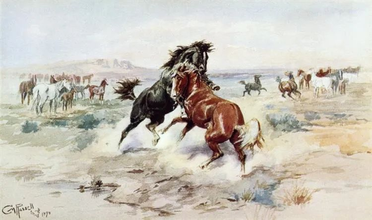

  

Charles M. Russell，The Challenge  

  

连叔：

  

您好。我是一名高三的学生。我有一些关于问题想询问一下您。我希望能从您的阅历里，汲取您的一些智慧。   

  

连叔，我感觉我的状态不对劲，我觉得我甘于平凡，享受平平淡淡，觉得与清风，鸟语相伴就很舒服。

  

因为今天要上学去了，我想找到那种冲锋的劲头，我不想我以后那么悲惨，但我又不知道，如果我真的落榜了，我的悲惨到底又会是怎样的。

  

看到一个北大学生说，世界那么大 ，安安分分，循规蹈矩的过一生太可惜了。但我很多时候甘于平凡，我不知道我的格子外是怎样的一个世界，它又为什么值得我去拼搏？

  

我又看到高考生不想让他们的亲人失望，他们拼尽全力去学习。看到他们和家人间的情感，我很羡慕，我也不知道我的落榜对于我家人又会有怎样的影响，至少我认为他们也可安逸得过活。

  

从表面上看，我觉得他们的拼搏很棒，但我又不知道那是一种怎样切切实实的感觉。人们都很感谢高三这段时光，但我对我高三的时光却是无感的。

  

我觉得我是无知的佛系。连叔，你看到这些话从一个即将考试的高三生口中说出来觉得很可笑吧。我觉得我彻彻底底被无知包被着，我觉得我的青春是死亡的。连叔，希望您能跟我分享一些您的看法，我不希望我自己亲手将自己“杀死”（我不是想不开，是说我怕我把自己的生命给虚无消耗，成为一个社会蛀虫。）连叔，希望您能看到我的来信，能分享您的看法给我这个无知的高三生。     

  

谢谢您。

  

一个高三生

  

* * *

  

一个高三生：

  

浪费一生的感觉是很糟糕的，你现在有这个怕，我觉得未尝不是一件好事，它可以成为你的精神源泉之一。因为青年中年的这种怕，威力是现在的十倍百倍。

  

我们分析问题，有个好办法，把摆在面前的概念理清楚，它到底指什么？思维能力弱的人，这个技能终身没有掌握，老是会在一堆定义不清楚的概念中迷失，别人说句漂亮话，生造出一个概念，他不加思索地接受，最后付出的成本极高。甚至浪费半生一生。

  

先来看那个北大生打动你的话：“世界那么大 ，安安分分，循规蹈矩的过一生太可惜了。”这句话当然不算错，但我觉得你可能理解错了，不想读书，愿与清风鸟语舒服为伴，这肯定属于不安分，不守规矩。可是这么做的后果是世界变小了，只有清风鸟语。要知道，人家可是考上北大才发这个感慨的，他在高三时，一定是安安分分的规矩学生，才能把功课学好。

  

安分与规矩，并不容易做到，是人的基本功。无论你是什么身份，现在是高三学生，以后是大学生，与人恋爱，成为父母，在各种社会角色中，按规矩做事是第一位的。人生到达自由状态，并非靠不守规矩，而是孔夫子所说的“从心所欲不逾矩”，吃透规矩后达到大自在。

  

人生说难也难，说易也易。遵守一些简单的规矩，就可以用容易的方法完成艰难的任务。这些简单的规矩就是所谓的天理人情：诚实、信用、勤奋。高三剩余的这几个月要不要勤奋？这其实是一个信用问题，父母资助我们读书，我们不勤奋、不尽力，是一个违约行为。这和拿了工资不完成工作，收了货款不交货一样。

  

离高考还有不到100天，并不长，按照老师的安排，每天完成任务就行了，遵守这个简单的规矩能安抚你的情绪。别以为有更高明的计划，尤其是你自己想不出更高明的计划，胡思乱想只想得到“清风鸟语”。能在100天内尽力去做一件事，即使这次高考不顺利，得到这份专注力与执行力，也能让你升级，你明年的任务就容易得多，无论你是大学生，还是高四学生，甚至是一个职场新人。

  

你说到佛系，我觉得我也佛系。佛系的理解不是无所作为，就地躺倒，佛系是更注重本质性的规矩，克制自己不在细枝末节上浪费能量。正如打坐是佛系，打瞌睡却不是。专注当下，你今天专注于学习，我专注写这篇文章，这才是佛系。我们管不住自己，空耗今天，那是魔系。

  

高考是个巨大的压力，高考也未必一定成功，但人生经历这样的挑战是有价值的，我们因此知道，一切空想，一切华而不实，一切投机取巧，都帮不了自己，只有遵守学习的规矩，一道道题刷，一天天熬，信心与实力才能慢慢增长。

  

祝开心。

  

连岳

  

推荐：[成熟度提升等于对抗度下降](http://mp.weixin.qq.com/s?__biz=MjM5NDU0Mjk2MQ==&mid=2651633245&idx=1&sn=922af7bc972354e771a8e3a3d6d4d898&chksm=bd7e32438a09bb553811f36cebca5262fdca191fe601d6a1e880ca8df00cc965a5d4e4abe4e2&scene=21#wechat_redirect)  

上文：[仅要健康不够，还要信心和生产](http://mp.weixin.qq.com/s?__biz=MjM5NDU0Mjk2MQ==&mid=2651638215&idx=1&sn=eb600ff15e6d3f0333ed83bf5bd12c01&chksm=bd7e4dd98a09c4cf5280dbbc9f14d11e19528cefa25f431d5322cce184b3b6a6680f8b7895a9&scene=21#wechat_redirect)
