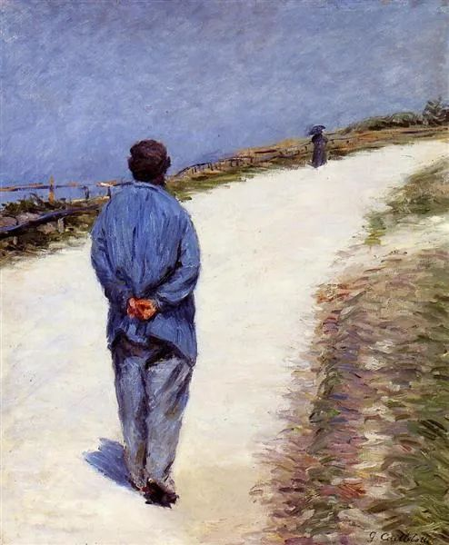

  

Gustave Caillebotte，On the Road

  

人常说，爱一个人就会爱他的全部。

  

这是对的，不过这也难理解。错误、不幸、疾病、死亡也是人的一部分，难道要爱这些？当然不是。你是爱他能修正错误，能走出不幸，能战胜疾病，是爱他因此展现的意志与力量。虽说他赢不了死亡，但他在死亡限定的有限时空里，展现了更多的美，就像明日花之凋谢增加了今日花之美。

  

不接受阴，也就没有阳。

  

同理，你爱这个世界吗？你一定会说爱。可你无法接受错误、不幸、疾病与死亡是世界的一部分，你对世界就爱得不够。在疫情的当下，可以更深刻地体会到这点。这就是真实的世界，意外随时可能发生，阴降临之时，你要保有阳的信念。

  

在疫情中，我们接受的最多信息就是未来如何如何可怕。即使中国控制住了疫情，当下是安全的地方，也有人不停告诉你，疫情会二次爆发，中国将变成最脆弱的国家，经济会崩溃，欧美会甩锅中国（而且他们必然得逞）。诸如此类的坏消息、坏推测，一天一个，一天多个。你说它们不可能嘛，有一点影子，不是100%不可能。有些事情，原来100%不可能，但胡说的人多了，可能性也就大了。比如中国的防疫明明是做得好，第一名，但硬要说自己烂；比如病毒是天灾，不以人的意志为转移，却刻意表示要向世界道歉。还好不顾事实与科学的人少，如果主动讨锅的人多了，下贱到别人不甩锅给你都不行，不可能的事也就可能了。

  

未来本来就有不确定性，再加疫情这个变量，不确定性更大一些。这时候容易慌乱，阴的力量大一些。相应地，人要恢复平衡，阳的力量也要大一些。

  

疫情也不知延续多久，有专家与机构甚至认为要长达两年，在这么长的时间里如何应对？这让我想起一个故事，邓小平的女儿毛毛曾经问他：“长征的时候你都干了些什么工作?”邓小平只回答了三个字：“跟着走。”

  

长征开始时，事业前途未卜，风雨飘摇，据一些当事人回忆，邓小平自己“右倾错误”的帽子也还没摘。这个大背景下的个人，不确实性巨大，意志软弱的人，一天也熬不住，但他却很乐观，还爱说笑。这就是最佳策略，你相信自己选择的道路，长征不过就是走路，总有一天走到终点，最确定的选择就是跟着走，想东想西不过是干扰自己。

  

疫情让生活的不确定性增加，虽然难度比起长征，小得不值一提，不过策略却可以一样，跟着走就是了。今天过好了，明天就更好一些，因为对病毒的知识增加了一些。每一天都过好，疫情总会结束。

  

中国现在相对安全，工作与生活也趋向于正常，要享受这成果，努力工作，认真生活的人，每一天都在领先，怕什么。

  

推荐：[邓小平何以成为邓小平](http://mp.weixin.qq.com/s?__biz=MjM5NDU0Mjk2MQ==&mid=2651638360&idx=2&sn=718afca27076978620d55c68644de5a7&chksm=bd7e4e468a09c7500e5eacda834fc1a4410a25a027a95ff74181a526d2e77d1ebe7e2708df1e&scene=21#wechat_redirect)  

上文：[危机教育：幸福是容易的](http://mp.weixin.qq.com/s?__biz=MjM5NDU0Mjk2MQ==&mid=2651638380&idx=1&sn=824831ea35bd56e455229e5152ce8610&chksm=bd7e4e728a09c7642c6288860806c43a0aab1f8237b093d7edd245ed7f4734e09c6b3bbaf30f&scene=21#wechat_redirect)
