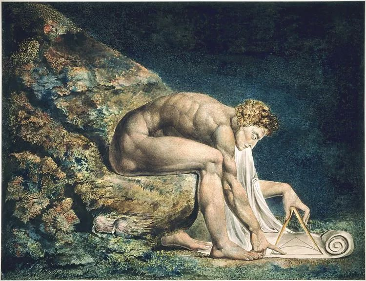

  

William Blake，Isaac Newton

  

有些人你必须了解，这是通识教育的一大内容。  

  

比如中国人就必须了解邓小平，而了解他，有三句话很重要：

  

实践是检验真理的唯一标准。人要有被事实说服的能力，并在事实中发现规律。而不是拿着理论去剪裁事实。

  

不管白猫黑猫，捉住老鼠就是好猫。要避免无谓的争论，细枝末节不重要，结果最重要。

  

发展才是硬道理。不发展，人穷志短，再有道理都软。富裕了，有实力，有成就，你的话就有人听，你的道理就硬。80后之前的中国人，为何普遍哈欧美，欧美就是更高级，中国什么都是错的？那是因为成长过程中太穷了，对欧美的羡慕成为条件反射（常年躲在书房的知识分子尤其如此）。90后，00后，为什么普遍是“小粉红”，对欧美祛魅，觉得中国挺好，更愿意支持中国政府？不是他们被洗脑了，主要是因他们在富裕中成长，比起父辈，他们走的路更远，读的书更多，不比欧美同龄人差，平视的眼光从小养成。

  

从个人到国家，这三句话都可以当作指南。邓小平开启了向市场要富裕，用富裕长国力的路径，大家得利益，年轻人的腰都更直，这么好的路，怎么会改变，之后的中国，已经不可能没有市场，不可能不以经济建设为中心。

  

人类社会的发展，某个天才的出现极为重要，他可以改变路径。

  

今天主要不是说邓小平。而是说一个天才出现的重要性。今天建议了解的人，是牛顿。整个人类社会都受益于他。有学者说，自牛顿以来，人们再无法忽视这样一个事实，那就是迅速进步正在发生。牛顿改变了人类认识世界的方式，没有他，或许没有后来的一切，科技发展，工业革命，财富增长。人类之后的进步，甚至不以人类的喜好为转移，机器、城市、市场经济，它们的出现与增长，都像自我进化的生物，再讨厌它们，它们都要改善你的生活。

  

牛顿在对手眼里，是生性多疑的“奸诈之徒”，非常讨厌别人的怀疑与批评。与莱布尼兹常年论战，争夺微积分的发明权；与天文学家弗拉姆斯蒂德的恩怨；与胡克的互相挖苦。而且他善于利用自己在皇家学会的至尊地位修理对手。牛顿自认为一生最重要的事业是神学，认为宗教最后应走到“善待他人”，只是他自己做不到，在生命的最后几个月，他尝试过，可是愤怒与击溃对手的欲望还是会冒出来。但是看到这些，你不会讨厌他，一是他的对手身上也有这些毛病，人身上也都有毛病。这也没有妨碍他至今仍是最伟大的科学家，就自身超越同代人的程度而言，牛顿超越了达尔文与爱因斯坦。民调显示，现在大部分人仍将牛顿视为最伟大的科学家。

  

除了小时候与母亲的关系比较冷漠，以及没有爱情，至死仍是处男之身。牛顿一生很顺利，少年时就以精巧的双手闻名，能制造各种奇妙的玩艺。进入剑桥三一学院后，学术就开挂了，在数学，光学与力学上，都有杰出表现。尤其是力学上，他发现了万有引力，在人类史上第一次提出一个完整的科学体系。

  

做实验的牛顿可以很疯狂，为了研究光，他暴力挤压自己的眼球，使之变形，还将粗针戳进眼球后的隐窝。

  

在世时，牛顿在英国科学界，已是第一人，受封为爵士，影响力也向欧洲大陆渗透。但他可能很少享受过安全感，性格中的弱点不停折磨他。理解宇宙容易，与自己和解却很难。当然，也可以为他感到庆幸，如果他没有取得那么大的成就，他性格中的弱点就将失控，愤怒、恶意与粗暴，早就吞噬了他。这可能是我们从他身上可以得到的一大经验：不停努力，不停取得成就，这是一个人的自救之路。

  

（上次解读了[《自闭症》](http://mp.weixin.qq.com/s?__biz=MjM5NDU0Mjk2MQ==&mid=2651638167&idx=1&sn=e54e03cf4ebe2049ff43fd9055a61c42&chksm=bd7e4d898a09c49fb69952b5ea3662983bac93f444fae643e7b9e0c61f832b9bb701e94b9588&scene=21#wechat_redirect)，下次将解读《人生的意义》）

  

推荐：[邓小平何以成为邓小平](http://mp.weixin.qq.com/s?__biz=MjM5NDU0Mjk2MQ==&mid=2651638360&idx=2&sn=718afca27076978620d55c68644de5a7&chksm=bd7e4e468a09c7500e5eacda834fc1a4410a25a027a95ff74181a526d2e77d1ebe7e2708df1e&scene=21#wechat_redirect)  

上文：[学会克制，越来越多](http://mp.weixin.qq.com/s?__biz=MjM5NDU0Mjk2MQ==&mid=2651638491&idx=1&sn=7df630f6eb0b07f58eef544bdf9b54cf&chksm=bd7e4ec58a09c7d353937ea8b543070c6f2ea0e6a365c0236434902fd4da4f23ec4eb0e0a5e6&scene=21#wechat_redirect)
