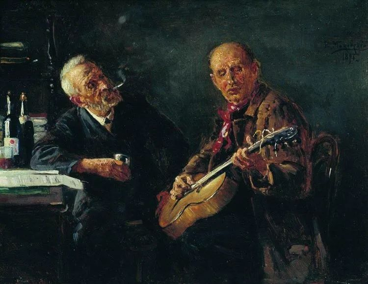

  

Konstantin Makovsky，Friends  

  

最近朋友圈大分裂，我的朋友圈也不例外。每一次观点的重大分歧，都会有此后果，该来的，也得接受。

  

我的朋友圈甚至更惨烈，因为我的职业是写作，无法隐瞒自己的观点。在现实生活中，我已经完全去辩论化了，他人说什么，我就听听，一个话题有分歧，就找另一个无分歧的话题。他人的观念下面，是他的人生冰山，辩论改变不了。

  

一个人喜欢他的错误观念，那么，他一定有激情去否认事实与逻辑。除非一个人自己想改变，否则他就不会改变。

  

友情很重要。说它比爱情重要也可以。一个人可能没有爱情，但他一定有友情。友情不要求独占，却又令人温暖，是“性价比”最高的感情。人容易在爱情上面喜新厌旧，只见新人笑，不见旧人哭。人却不会嫌弃朋友老了、丑了，友情是越旧越好，人到了一定年纪，交友之门逐渐变窄，收获好朋友的可能性降低。

  

所以，对待友情的第一点，是珍惜。观念的分歧并不重要。年轻时我以为很重要，现在事实告诉我它并不重要，许多老友，人生的选择与路径不同，观念千差万别，但最后还是老友。友情追求更底层的一致性，关系更简洁，只要我们在一起愉快，放松，可以信任，那就经常在一起消磨时光。我们3岁时，就是这么交朋友的。在这一致性的树干上，其他分歧是树枝，分裂，却增加整体之美。各美其美，美美与共。

  

友情虽美，乞求不美。对待友情的第二点，是不要乞求。是否终结友情？这个选项我绝不主动，但只要对方表示终结，即使是委婉的、试探性的表示，我一定马上接受，对于有些感情激烈的人，我还会把说最后一句话的权利让给他，作为馈赠。

  

一个人自身不强大，很难有高质量的友情。而你是否强大，可以通过这个问题测试：如果一个朋友都没有，我能撑得住吗？如果答案为能，那没什么事情你会害怕。也只有这样，你才能交到真正的朋友。

  

前不久的某天，我喝酒到下半夜才回家（只是偶尔如此，我作息很健康的，毕竟天天要工作的人），收到一位老友的微信，他也没睡，不过不是在喝酒，而是在吵架，为我吵架。他发现有人因为我的观点在咒骂我，他于是和那人干了起来。其实我猜得出，我的那个观点他未必同意。我本来想对他说，算了，这都是小事，我早就习惯了，任何一篇文章，都有人会咒骂的。最后还是没说，我接受他的好意，我享受他的友情。

  

20多年前，我们都还年轻，常在这种深夜，打完麻将回家，虽说赌注很小（在法律允许的范畴内），赢也还是兴高采烈，输也还是垂头丧气，无论输赢，分手之前，我们常去喝一碗地瓜粥。——那晚，脑子里就一直是这个琐碎的画面，这就是友情，我们一起消磨过那么多时光，我有些存在由你证明，你有些存在只有我记得。

  

推荐：[中年是资产还是负担？](http://mp.weixin.qq.com/s?__biz=MjM5NDU0Mjk2MQ==&mid=2651622495&idx=1&sn=cd51718016c2f9b32d43c53b754065e1&chksm=bd7e08418a09815713374c6eba492caae69a4c098a55e820fe2ba439fb71037ecd6ecf8876e3&scene=21#wechat_redirect)  

上文：[说说“去中国化”](http://mp.weixin.qq.com/s?__biz=MjM5NDU0Mjk2MQ==&mid=2651638342&idx=1&sn=1bcef0747135a43e619b4728f2661308&chksm=bd7e4e588a09c74e1f1cca8e90c5c98732a75701a6d887b4d44a1220b42226a9903b7671f6dd&scene=21#wechat_redirect)
