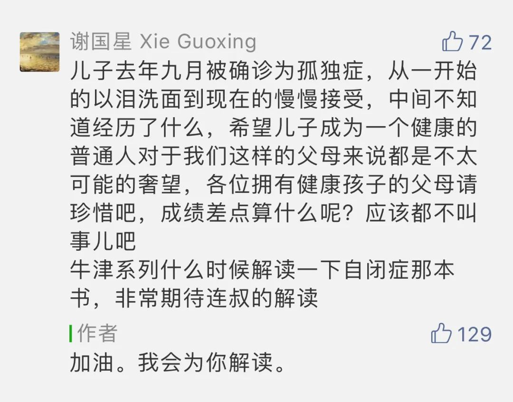

  

Elisabeth Louise Vigee LeBrun

  

今天，4月2日，是世界自闭症关注日。我特意挑在今天，兑现对这位家长的许诺：  

  

  

这是2月18日，在讨论高三孩子学习烦恼时，他的留言。

  

我得感谢他，促使我更早读这本《自闭症》，不然，我就会像一般读者的反应那样，觉得它过于专业，过于冷门，很难调动阅读兴趣。本书作者乌塔·弗里斯，是这个时代最重要的自闭症研究者之一，沉浸其中50余年，而100年前，自闭症还不为人所知，直至1940年代，它才有了自己的名字。 

  

自闭症患者占人口比例的1%，也就是说，中国有1400万自闭症患者，这是一个巨大的绝对数。意味着在我们的生活中，接触过自闭症患者的可能性很大。在我的同事朋友中，我知道的就有4例，他们都展现了惊人的乐观和英雄气概，或许，面临一个无法逃避的责任时，责任感反而被充分激发。

  

记得有一次，我和两位朋友吃饭，有位朋友家里遇到麻烦事，他焦虑，痛苦，不停复述，几欲落泪。这时候，另外一位朋友，他是理性的、善解人意的、脸上总挂着笑意，劝说他：我们做为一家之长，首先应该克制，我们镇定了，事情就会改善，我们不应该一再复述这些痛苦的事情，接受它，发现其中的意义。一般人并没有资格说这话，他绝对有，他的女儿患有自闭症，他要花许多时间精力照顾她，这照顾是终生的，没有期望，没有回报，就只有关怀，只有爱。

  

乌塔·弗里斯说，在自闭症研究中，那些英雄的父母贡献最大。确实如此。而且不只如此，想想看，我们身边有多少人承受了命运给自己的重担，当我们发现，他们比我们更爱笑，更少抱怨，我们对人生的意义，都会有更深刻的认识，仅仅只拥有健康，我们就应该充满感恩之心。而且，人这一生不应该浪费这来之不易的健康。

  

现有的研究结果显示，自闭症是由于基因缺陷导致，现在并无药物可以治疗（声称有药的，都有骗子嫌疑）。症状轻的，经过特殊的培训与家长的耐心，可以拥有正常生活，包括婚姻与孩子。症状严重的，通常伴有智力障碍，随着体力的增加，当他感到沮丧时，将导致破坏东西，伤害他人和自己——可以告慰父母的是，他和任何一个生活在有爱环境里的人一样，是快乐的。爱，目前还是最好的药物。科学还找不到办法时，爱就一直起作用。

  

人是社交动物，在与他人的互动中建立自我。而自闭症患者，缺乏社交冲动，或者说，没有社交能力，他们大脑处理信息的方式是不同的，科学家还没发现机理，几大流行理论都还处于猜测阶段，似乎可以描述一类现象，但证明不了因果关系。正常人很容易处理的信息，比如知道他人的真实意图与言外之意，对自闭症患者来说，都是不可能的事。按照乌塔·弗里斯的意思，自闭症的“自”，更像是社交连接不能导致的“自我”消失，他理解不了别人，别人也理解不了他。当然，科学家正在努力理解它，这个难题攻克，意味着人类对大脑的运行、对基因的理解，有了巨大的突破，所有人都将受益。

  

英雄的父母们，请允许我向你们致敬。英雄的父母，不在于培养出了杰出的孩子，更在于他们爱那些注定无法杰出的，甚至无法达到普通水平的孩子。你们大大拓展的爱之深广，在这个程度上丰富了所有人的自我。

  

（上次解读了[《领导力》](http://mp.weixin.qq.com/s?__biz=MjM5NDU0Mjk2MQ==&mid=2651637926&idx=1&sn=25339aa8c8ea31336ca27f1f6777f8b5&chksm=bd7e4cb88a09c5ae1debb020bdb896a59d2698fff26cd68006f3de9626f927e3180bbf918318&scene=21#wechat_redirect)，下次将解读《牛顿新传》）
