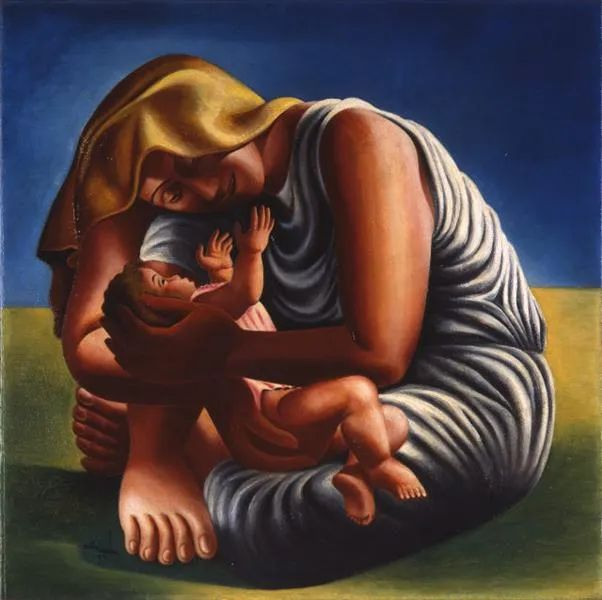

  

Jose de Almada-Negreiros，Maternity  

  

前几天有读者留言说，生孩子是最大的赌博。  

  

以完美主义的角度，这话有一定道理，要求孩子事事如你所愿，将来成为一个伟大人物，这成功率和中彩票头奖差不多，投入还那么大，当然是赌博。

  

但是破除完美主义魔咒，事情就不一样了。比如你养一只狗，你从来没有指望它将来在科学、艺术、商业上有什么杰出成就，你知道它必定不会说话，无法赚钱，一生生活无法自理，不能为你养老送终，但你从来对它温柔。付出这么大的时间金钱成本，你要的回报不过是它依赖你，陪伴你，你也知道它做得到。如果以养狗的心态养孩子，那不是每天都有惊喜？哪会失望。

  

当然人不是狗，要求自然会高一些。但是你爱孩子，则孩子一定爱你。孩子出生的默认设置，就是爱父母。只要父母不改变这设置，一直向他传递“我不爱你”或“我不值得你爱”的信号，那么，他将一直爱你，此生不渝。这比养狗容易，孩子的表现，一定比狗更好。成功率这么高，显然不是赌博。

  

同样的事，调整自己的角度，期望值不过高，心态放松，则世上的爱与乐观就会涌现出来。

  

对谁都是如此。对自己，要努力，但不要努力到一刻无法放松，事事100分，那样最后难免躁狂与压抑，压垮自己之后，事事不及格，过犹不及。

  

对孩子也是如此，当然有要求，连狗都要学规矩，孩子也要学，公序良俗能遵守，诚实守信，踏实肯干，安稳幸福的一生就是大概率。在这基础上，或有天分，或有幸运，或有突破，能上更高的平台，那是命运的赠品，有，不要拒绝，不要浪费，没有，不要强求，不要失望。

  

对我们经历的事情也应如是观。比如这次疫情，可以由此长智慧。在之前，对个人对国家，你都习惯高增长，今年赚了100万，明年非赚120万，只赚90万就痛苦不堪，听说朋友赚了200万，那他从此是仇人，有机会说他坏话一定不会放过，还要添油加醋。现在呢，觉得把工作保住，还有赚钱机会就值得开心。心更静了，目光也变得更长远，这是大收获，在人生接下来的日子，它能持续产生收益。我们的赌性变小了，消失了，更珍惜、更尊重那些慢慢才能做好的笨活、累活，这段时间，一个跑得气喘吁吁的快递小哥，对你的重要性，远远高过一个养尊处优、故作思考状的知识分子，尤其他思考的结果不过是天天吓你，告诉你中国要崩溃了，世界要完蛋了，他不比一个赌徒更靠谱。

  

中国不会崩溃，世界也不会完蛋。只要不指望他人包养，肯干苦活累活，你就永远是安全的。

  

推荐：[成熟度提升等于对抗度下降](http://mp.weixin.qq.com/s?__biz=MjM5NDU0Mjk2MQ==&mid=2651633245&idx=1&sn=922af7bc972354e771a8e3a3d6d4d898&chksm=bd7e32438a09bb553811f36cebca5262fdca191fe601d6a1e880ca8df00cc965a5d4e4abe4e2&scene=21#wechat_redirect)  

上文：[有些人你必须了解，他们决定了我们](http://mp.weixin.qq.com/s?__biz=MjM5NDU0Mjk2MQ==&mid=2651638537&idx=1&sn=d170bfa8a7ddfda254b863d5a06cd73c&chksm=bd7e4f178a09c6012cf990885f0bebfd00f44ed44040c8a22ed40c9cf503d47639a32025b680&scene=21#wechat_redirect)
