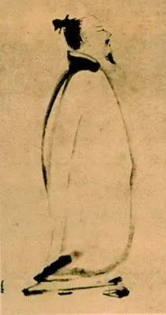

  

梁楷，李白行吟图

  

很多人憎恨背诵，这可以理解，背诵从小和考试紧密相连。一旦不要考试，我们就再也不背诵，如释重负，没有再挑起来的理由。  

  

我在学校也不喜欢背诵。但奇怪的是，离开了学校，不再需要考试，我却不排斥背诵，近些年甚至很喜欢。每天早上，我或背一首古诗词，或背一段古文，或背一段英文，耗时并不多，稍稍掌握记忆术，很快就能背下来。在当天的空闲时间里，喝茶时，散步时，就可以像一只无聊的牛一样，把记住的内容反刍一下。

  

一段话当然没什么难理解的，非得背下来，但是背下来，理解肯定更深，有时也像一根火柴，点燃当天所有不相关的资讯，将它们转化成统一的、单纯的、热烈的火焰。

  

当然了，烈火熄灭后，过几天，过几周，这些背诵的内容退化成草蛇灰线。有时候，我会再背一遍（如果需要的话），多数是随它们离去。你可能觉得这是无用功，既然会忘，何必要背？其实，耗散是事物的必然，往大里说，足够久之后，太阳燃尽，宇宙死亡，一切存在都清零。往小里说，人向死而生，瞬间百年，在时空留下的印记，无法赢过春天的一朵花。梦幻泡影。存在的意义，就在于它存在过。

  

大儒程颢，曾说过一句话：写某字时甚敬，非是要字好，只此是学。

  

写一个字前，先在脑子里过一遍笔画笔顺，但写出来的字可能还是不漂亮，为什么多此一举？这是学习精神。看到这句话时，我应该背了一下，不然今天怎么找得出来？心里暗喜，我诚心背诵，无惧遗忘，与先贤的精神是相通的，背诵主要不是为了不忘，而是为了致敬一段文字，赞叹创造精神。

  

王阳明对程颢这句话，有他的解释：夫既不要字好，所学何事？只“不要字好”一念，亦是不敬。

  

无论怎么学，多数人的字都不会太好，那不学了白学？为何要恭敬？因为，“学了白学，学了没用”，有这种自暴自弃的想法，就是违背学习精神，向好的可能性就死了。

  

我们人生停止的点，不是死亡，而是产生“学了白学”那个时刻。你从时代的高铁下车，三分钟之后，就看不见时代的车灯。你不下车，年纪再大，100多岁，也在高铁里坐着。人活着的车票，不是时间，是你一直在学，永远要“字好”，永远“甚敬”。

  

有人说，随着年龄的增长，记忆力下降，学习能力衰退，我可以负责任地告诉你，这些都是不负责任的说法，都是偷懒的借口，都是“不敬”。随着年龄的增长，脑子里既有知识积累更多，它与新知识的连接方式更多，干柴更多，火焰更大。

  

只要一个人不停止学习，不停用新知识刺激自己，年纪越大，乐趣越大。我建议每一个人从小养成每天背诵，每天挑战自己的习惯，不要怕遗忘，不要怕丢脸，这是真正的学习精神。达成这个目标的好途径之一，就是背诵一个英文单词，一段英文经典。A不是第一个字母，A+ 才是，达尔文告诉我们，进化永不停止，进化到A也不能知足。

  

  

 ****▼**** 点 **阅读原文**, 用 懂你英语®A+ 致敬学习精神！
