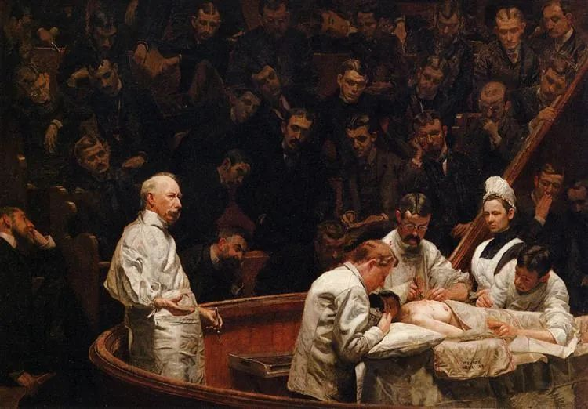

  

Thomas Eakins，The Agnew Clinic  

  

连岳老师好！

  

我是一名高一学生的家长。想咨询老师：怎样提高高中学生的学习热情啊？我女儿从一个县级的初中考到省级前三的名校高中，高一上学期，在众多的学霸中，不能出类拔萃，落差极大，一学期下来，成绩由入学的前200名倒退到最后100名了。现在由于疫情，还没有开学,在家上学校的直播网课。高中繁重的学习压力和知识量的猛增，以及从没住过校的她，不适应寝室的生活，在班级上也没有受到老师的格外关注，和初中相比落差很大，初中那真是老师校长都夸着过的。高一一个学期下来，好像打了败仗一样，整个假期仍无法进入学习。

  

孩子感到学习压力很大，又在逃避学习，寒假作业还没有写完。现在学校每天的网课作业要写到23:00才写完，又没时间写寒假作业了。

  

孩子现在的状态就是提不起学习的劲头。学习没动力没目标，和初中勤奋爱学，力争上游的她判若两人，听着网课偷偷上QQ 和朋友聊天玩，我为此大发雷霆了几次，也吵她了好几次。都不起什么作用啊！她还是我行我素。

  

我怕孩子有焦虑症了，给孩子请了两次心理咨询师咨询，咨询后的那三两天会好一些，之后，还是原样。我准备带她再去医院看看。在家里，只要不学习，看着一切正常，只要一让学习去，就不愿意，听学校网课也不专心，上午前两节不停地瞌睡，无法投入学习。

  

她不停地给同学朋友联系，诉说自己的苦闷，她说一直害怕自己抑郁，害怕自己心理有问题，我也不敢贸然地带她去看心理疾病。她特别地敏感。不想她给自己贴标签。

  

还有，她爸爸姥姥一直埋怨我，初中没有让她养成独立自主的生活学习习惯。现在仍然是初中的习惯，可是高中的知识不像初中简单了，问题都出来了。孩子不想在省会上学，想回到我们的县城上高中，想继续在小地方，想天天可以回到家里，不想住校。我快愁坏了，胸口疼了好多天了。

  

老师好，你帮帮我吧！帮我想想出路，我该怎么办呢?我怎么才能帮到孩子呢？我需要怎么做呢？

  

万分感谢老师！

  

一个高一女生家长

  

* * *

  

一个高一女生家长：

  

家有高中生，就意味着教育进入了最艰难的阶段，也进入了所有人都有收获的阶段。当然，没有把握住，也就进入了所有人都失去的阶段，太多的两代人在这个阶段在内心分手，家长失去威信，孩子失去信心。

  

在成长中，我们太相信有神药时刻，孩子或明白一个道理，或找到病因，一夜之间，他什么都做得好。回顾我们自己的成长过程，有这么神奇的事吗？没有，每天总有每天的烦恼。人的成长更像是骑自行车，在动态中保持平衡。

  

孩子在高中，麻烦会更大一些。他基本可视为成年人了，自我意识强烈生长，叛逆、迷茫。强制性教育，比如大发雷霆，吓吓小朋友可以，对高中生失去了作用。成功的感觉，只属于前几名那些孩子——命运公平的地方在于，他们的挫败感考验将在大学时到来，或推迟到残酷的职场竞争——多数孩子的学习，伴随着持续的挫败感。此时，家长认为只要发发脾气，找到神奇的按钮，他们就可名列前茅，这种轻浮而不耐烦的态度，将深深伤害他们，就像喝着啤酒的球迷，认为球员应该投进每一个球，这种球迷都是不合格的，合格的球迷，只要球员努力了，将接受输球的遗憾。

  

更致命的是，高中生对家长的要求也是过高的，他们还不知生活的艰苦，普通家长在他们眼里，也算是失败者。失败者的指导，并没有权威。失败者的乱指导，更是只会得到反感。

  

这真容易变成一个互相嫌弃的艰难阶段。

  

可以改变。

  

主动权还是在家长手里的，你不嫌弃孩子，孩子也就不容易嫌弃你。这可保证沟通顺畅，否则，孩子连遇到的问题都不想告诉你，你能做什么指导呢？

  

正如一个人活到四五十岁，更容易理解自己的父母，甚至觉得父母伟大。因为已被生活痛殴，知道人生不易，自己和父母差不多，甚至不及父母。所以没有小瞧，没有嫌弃，只有理解，只有敬佩。

  

理解高中生也是如此，感受一下他们的学习强度。比如你的女儿，作业做到晚上11点，又要早早起来上课，上午前两节课不停打瞌睡，这不是心理疾病，也不是意志不强，这纯粹就是困。睡眠不足，100个心理学家也无法阻止一个人打瞌睡。

  

这时候的解决办法是让孩子睡饱一点。至少，在她入睡之前，不要再给她压力，责怪她作业还没做完，这样她的睡眠质量能够高一点。睡得好，第二天不容易瞌睡，学习质量高，作业做得更好，睡眠质量又提升，良性循环逐渐建立。从这小事开始提升，慢慢惠及全部学习。

  

在孩子小时，父母真正关心孩子的饮食与睡眠，孩子睡不好，父母很着急。到了高中，很多父母忘了这初心与本质，认为孩子不睡觉也能把书读好。生理不正常，接下来的就是心理不正常，最后学习也不可能正常。

  

真的爱，有温度，孩子感受得到。高中当然要追求成绩，可是读书也像恋爱，成绩就像漂亮的姑娘，追不到也正常。对家里那个高中生，最好的教育方法就是爱他，他用力过猛时损耗身体，就提醒他休息；他低落，就鼓鼓劲；他失利，就同情他、安慰他；他失控，就一起商量制订纪律。天天有问题，天天解决。大家都不容易，家长不容易，孩子也不容易，相弃，学习就是地狱，相爱，学习就能得到力量。只爱成绩不爱人，那肯定会浪费高中这三年，你们从此难爱对方。

  

祝开心。

  

连岳

  

推荐：[人是复杂的，在这人性上升级](http://mp.weixin.qq.com/s?__biz=MjM5NDU0Mjk2MQ==&mid=2651638097&idx=1&sn=95df42780081cb1fe4d3caa9355bc3b0&chksm=bd7e4d4f8a09c459c27009c6c03dad10c3e3930fb53e9ab528b7b0bab0f55a12cb0c68e53afd&scene=21#wechat_redirect)  

上文：[我那么爱这个人](http://mp.weixin.qq.com/s?__biz=MjM5NDU0Mjk2MQ==&mid=2651638280&idx=5&sn=140a640f8ca8a9180c7282f7c2199c4e&chksm=bd7e4e168a09c70044eeea47bf485befd2a765326d8b2a069a971a612a8c0d405fa686f5d96d&scene=21#wechat_redirect)
