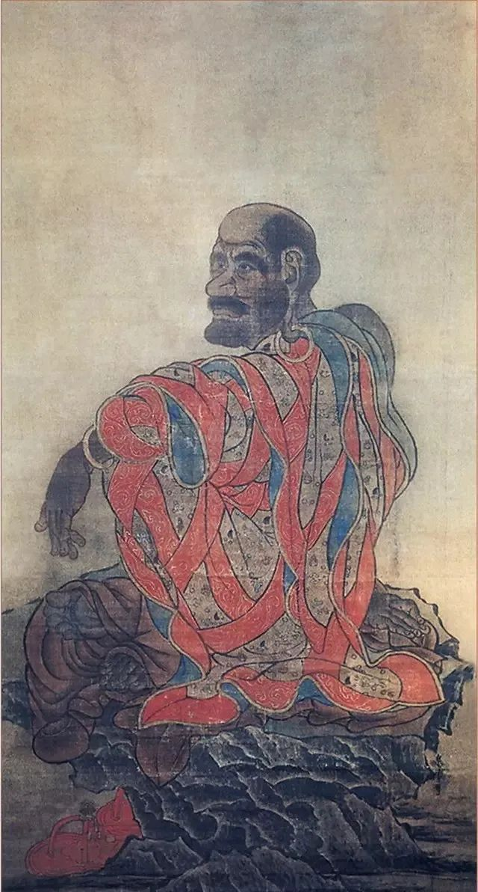

  

贯休《罗汉图》

  

该我的，总是我的。人对自己，对世界，要有点这自信。这是人间基本的运行规律。

  

该我的，是什么？有多少？我们并不知道，知道了就没意思了。所以明天总像一个盲盒，打开才能发现有多少惊喜。今天收获的惊喜，存起来，种到土里，慢慢多起来。  

  

所以今天总是很好的一天。今天尽力了，明天力气又会恢复，惊喜也更多一些。今天尽力了，还能弥补昨天的不尽力，还能把昨天的悲伤、绝望与虚无，重整成资源。只要真诚面对自己，我们经历的一切都不会浪费。

  

黄永玉这句话说得好：

长按二维码可关注

  

好好画今天的画，过好今天的日子，该有的就会有。 

  

过好今天，这个目标是可行的、具体的、细小的，不容易变形。从这点来看，我们的人生控制在自己手中。否则的话，我们很容易陷入“只想得，不想做”的白日梦，以为可以违背人间的规律，以为不该我得的，我也能得到。想不到还好，不该得的，真掉到你头上，那才是灾难。世上的好东西，荣誉、金钱、权力，都是大能量，才德不匹配，就像踮脚举重物，举不久，最后掉下来还会砸伤人。

  

今天是第123期“下周很重要”，计划好下周的每一天，自己越强壮，该得的能量就越大。

  

推荐：[阅读两戒](http://mp.weixin.qq.com/s?__biz=MjM5NDU0Mjk2MQ==&mid=2651638085&idx=1&sn=44d7da5b7ec726ae27f763c17844267d&chksm=bd7e4d5b8a09c44d93d926cd94730f03f2e131de338a3d2d9e116eef981f5788b9fb78ecc204&scene=21#wechat_redirect)  

上文：[会不会发生战争？战争已在进行](http://mp.weixin.qq.com/s?__biz=MjM5NDU0Mjk2MQ==&mid=2651638265&idx=1&sn=9dcc2b43d1338032a874d3a3dd344a46&chksm=bd7e4de78a09c4f1c26ebee2420ccc00160956af7a4a9e919b6c3dd6bef5d76d83299e27d8e1&scene=21#wechat_redirect)
