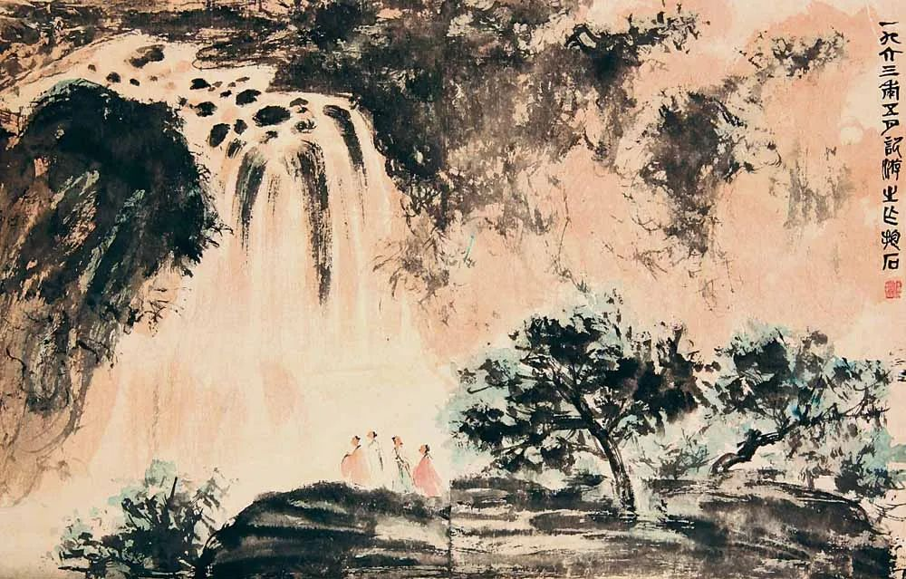

  

傅抱石《观瀑图》  

  

还记得半个月前介绍过的“小费雪厄运原则”吗？

  

我们可以复习一下：如果厄运在30个月内不会发生，你就不必担心。

  

半个月前，有些中国人在担心些什么？在担心这个世界第一产粮国没有粮食吃，要囤粮。现在这恐慌还在吗？没有了，像十天前的一阵风一样，没人记得了。回想起来，只会觉得荒唐。

  

杞人忧天的事很多。杞人有什么特点？他会换一个又一个角度忧天，天没有塌，最后他自己垮了。过度忧国忧民其实是大号的抑郁症，如果我们忧虑过多，每天都主动找事忧虑，那就一点活着的乐趣都没有，这不是远见，这是病态。

  

人缺的不是忧虑，人缺的是信心。你看，中国在短短几个月内控制了疫情，恢复了生产，除了极少数不顾事实的人，我们都会觉得这了不起。这难道不该增加你的信心吗？非常规的疫情袭击都打不倒，常规的生活挑战就更不会输了。

  

这几天，似乎又有新的天要塌了，就是所谓的疫情后去中国化。说美国在疫情结束后将与它的盟国将所有产业撤出中国，那样中国就会完蛋。

  

这种事是不会发生的。

  

尖锐一点的人可能会说，那等美国战胜疫情再说吧，现在都还要抢购中国制造的口罩与呼吸机，说什么去中国化呢？

  

一说去中国化，就认为中国要完蛋。这种心态是不对的，太小瞧自己了。去中国化当然会伤害中国，这毫无疑问。但伤害都是双向的，就像打架一样。美国去中国化，就等于中国去美国化。美国市场上少掉中国的产品，不知道美国普通人能撑多久。美国产品少掉中国这个数一数二的大市场，也不知道美国企业能撑多久。或许他们能撑下去吧。但美国人撑得住，中国人也就撑得住，说到吃苦耐劳，共克时艰，中国人可能没输过吧？这次防疫不就是最新的例证。

  

疫情之前，美国政府全力打击中国的华为（很遗憾地看到，还有不少中国舆论力量的助拳），结果呢？华为凭借美国以外的市场活得好好的。一家有实力的中国企业都能扛住你的打击，更别说所有中国企业了。现在看来，还真要感谢华为的膝盖不软，力量够大，当时没有投降。不然，现在中国企业必输的声浪将大得多。

  

美国去中国化，中国去美国化。大前提是美国有能力号令所有盟国与中国为敌，同时，还要中国也愿意与美国及其盟国为敌。这个大前提本身就不存在，中国与美国都拥抱市场经济，都靠税收养活政府，有这个大共识，其他分歧就不算大。中国离不开美国，美国也离不开中国，这种关系谁也挣脱不了，双方只能认命。

  

只要中国人保持开放，坚守市场经济，人家的好产品好服务在你这儿受欢迎，得利润，只要是正常人，都愿意和你当朋友，中国化都来不及，凭什么听美国政府的去中国化？可能美国人自己最早不理这一套。

  

没什么可担心的。这点可以借鉴美国人的生存智慧：你看，天上的飞鸟，不种，不收，地上的百合，不劳苦，不纺线，它们都不忧虑，所以，不要为明天忧虑，因为明天自有明天的忧虑；一天的难处一天当就够了。

  

那么多掏不出500美元现金的美国失业者都不忧虑，你还是一个有工作的中国人，忧虑什么？不要忧虑，只要中国人不排外，只要中国不答应，世界去不了中国化。

  

推荐：[要不要囤点粮？](http://mp.weixin.qq.com/s?__biz=MjM5NDU0Mjk2MQ==&mid=2651638147&idx=1&sn=13e19d614a360636294bd305400f6bb3&chksm=bd7e4d9d8a09c48bb36833838fd3c808dc1f487193f8b14beac221f19b7619ba6d033e8b18b8&scene=21#wechat_redirect)  

上文：[说说最近两份最重要的投资指南](http://mp.weixin.qq.com/s?__biz=MjM5NDU0Mjk2MQ==&mid=2651638321&idx=1&sn=13b4237abbcec5407457c2c139022d62&chksm=bd7e4e2f8a09c7399310c165be63022954a2623218d165e6143a38351187a517bee3c63da8df&scene=21#wechat_redirect)
