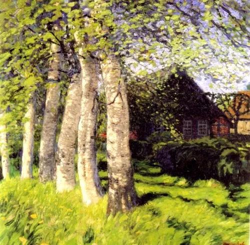

  

Hans am Ende，Spring in Worpswede  

  

什么是最重要的投资指南？是党和政府公布的文件。无论这些文件的内容合不合你的意，合多少，这都不重要，重要的是，你要理解它们，方向明明白写在里面。很多人嫌烦，不看，这是挺可惜的。

  

前几天，有两份投资指南，一是《中共中央国务院关于构建更加完善的要素市场化配置体制机制的意见》；二是国家发改委的《2020年新型城镇化建设和城乡融合发展重点任务》。

  

说说我对它们的理解。

  

新冠肺炎引发的国与国之间的隔离，以及国与国之间的情绪对立及舆论战（尤其是中美之间），事实上将造成逆全球化，对他国的信任减少，更在乎自身全产业的安全。市场的彻底隔绝是不可能的，但留有后手却成必然，万一他国政府干预市场，阻断重要物资的贸易自由，自己可以生存、发展，并施以对等报复。

  

在这个背景下，国内市场变得很重要。中国14亿人口规模的市场，就成为王牌。

  

当然，大市场不释放、不发现，甚至增加限制，那么拿着金饭碗也得讨饭吃。幸运的是，这两份文件，是释放与发现市场，是强化了城市化这个巨大的增长点。有理由相信，它将帮助中国经济度过经济难关。中国的城市化尚在进行，这原本是落后美国的地方，现在反而成为中国特有的经济增长点。

  

这次推出的几条措施，都是专家一直在建议的:

  

放开放宽除个别超大城市外的城市落户限制，试行以经常居住地登记户口制度。

  

制定出台农村集体经营性建设用地入市指导意见。全面推开农村土地征收制度改革，扩大国有土地有偿使用范围。

  

城乡建设用地指标使用应更多由省级政府负责；探索建立全国性的建设用地、补充耕地指标跨区域交易机制。

  

以上几点，都抓住了城市化的关键。它带来的收效有：

  

全民享受城市化的红利。一是非城市化区域，人口流出区域，可以通过耕地指标交易增加收入。二是个人可以通过自由落户城市，为城市服务，享受城市发展。“个别超大城市”，我认为就是指现在落户特别难的北京上海。其他城市，都会越来越自由。

  

城市化由发达地区及其居民的城市化变成全国的城市化，这种利益一致形成的合力可能会使城市化的速度由汽车变成高铁，中国一批城市将像春笋一样生长，日新月异，这将产生无法估量的经济效益。再过10年20年回顾，那将是人类文明史的奇迹。

  

城市化是双向的，它不是带来乡村的凋敝。如果原来造成这种现象，那是因为乡村的要素无法通过市场变现。山村的优美、宁静、天人合一，始终是人性里的一大追求，只是非得在城市与乡村二选一，人们更多选择机会、财富、保障更大的城市。农村土地入市，解决了这个难题。农民可以变现全部或一部分土地，或成为城市居民，或增加收入。有能力的城市居民，可以在乡村拥有自己的理想居所，离城市中心两小时车程左右的乡村，都很合适度度周末。有机会我都想找设计师盖一座梦想房子。城市的资金、理念与人才重组乡村，乡村也有大进化。这是多赢的一手好棋。

  

当然，富豪在乡村盖大庄园，可能观感差，舆论也不友好（对不对另说），这可以通过限制性的政策防止，就像城市的限购一样。顺便说一声，发达城市的限购，我认为不会放开了，因为人在智力、见识与财力上的差距太大，放开，有钱的聪明人就会拥有越来越多的房产，更多占有城市化红利。决策者也知道这点，所以给每人（户）一两套的份额，聪明人买不了更多；笨蛋为了福利与立足，也至少买一套。限购可以理解为某种程度上的弱势关怀。不过，特别笨的笨蛋，永远都不买，拒绝这种关怀，那也只能由他去了。

  

任何不利发生，第一反应都不是焦虑与绝望，而是想想在这不利中能做些什么。今年，甚至明年，不利因素会多一些，但更多着眼于接受现实、发现机会的人，不仅能生存，可能还会有发展。

  

推荐：[孩子跟谁姓？去谁家过年？](http://mp.weixin.qq.com/s?__biz=MjM5NDU0Mjk2MQ==&mid=2651625520&idx=1&sn=958f316f32961d067ffc784d51997fce&chksm=bd7e1c2e8a0995387d92d4f08529df5a6d33521577c85176070970a8b4801886e0dba74439e0&scene=21#wechat_redirect)  

上文：[要战胜挑战，就得学会从相弃到相爱](http://mp.weixin.qq.com/s?__biz=MjM5NDU0Mjk2MQ==&mid=2651638299&idx=1&sn=0e7adc4b78ab20c545b5d94ff498002d&chksm=bd7e4e058a09c71300a8a92aa585be4c6a41a21206da7226d84e38c13bbdf833e8e9dc249a13&scene=21#wechat_redirect)
