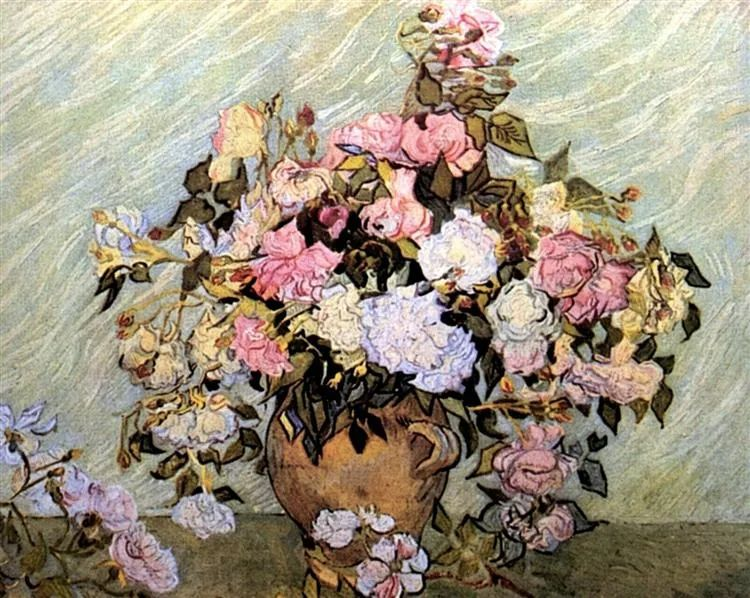

  

Vincent van Gogh，Roses

  

有一种人生观认为，每人一生分配的苦难都差不多，有两种应对方法：一是忍受，最后习惯这苦难；二是你变大，你大两倍，大十倍百倍，苦难的比重下降至微不足道，你无须忍受。  

  

这说法有错有对。

  

错的是，每个人的苦难并非相当。有句话永远是对的，莫忘世上苦人多。有些人特别辛苦，有人苦于贫穷，有人苦于智力不足，这是看得到的苦；有人苦于性格缺陷，有人苦于生长无力，一旦被错误的人与观念捕获，就再无挣脱能力，这是看不见的苦。知道苦人多，人的慈悲会多一点，至少你不会刻意去伤害人。

  

对的是，虽说每个人的苦难并非相当，但确实每个人都要经受苦难。从意外与病痛，到失意、挫折、伤心和绝望，人多少都得尝一尝。你不会追求它们，但它们的出现有时不以你的意志为转移，这很像今年的新冠疫情，就是会突然出现，打人个措手不及。疫情不是好事，可是通过疫情，人的生活方式更健康，希望增加自己的免疫力；工作更负责踏实，希望降低失业风险；家人之间，也有更多的关爱与宽容，因为生命面对重大威胁后，爱与信任显得更加温暖，在疫情中得到的成长，这是价值。这就是创伤后成长，当然，不是每个人都会得到这价值。同样经历疫情，有人会更偏执、更盲目、更恐惧、更胡言乱语，这是创伤后衰退。

  

一个人，一个家，一个公司，甚至一个国家，一种文明，在创伤后，要么成长，要么衰退。

  

衰退的，只能在创伤中忍受。天天诉苦、哭泣、或者控诉、撕咬，都不能减轻一点创伤，只会给周边的人带去创伤，创伤不停生出创伤，创伤成为你和他人痛苦之源，最后，人人疏远你，人人讨厌你，又有什么奇怪？你已经变成病毒了。

  

要在创伤后成长，长大十倍百倍。小时候被欺负，长大后你是重量级拳击冠军，10岁输的几架还能让你痛苦吗？不要老往后看，总在舔自己的痛苦，往前看，明天的快乐将治愈你。

  

今天520，要说一句我爱你。一个人最值得爱的能力就是创伤后的成长力。

  

不幸遇上创伤后只会衰退的，那你得生活在恐惧、抱怨与怒气之中。任何一种不确定性，都让他不能行动，只会把压力转嫁给家人。他无法长大十倍百倍，而是不停缩小，承受力与心眼都越来越小，淋一点雨，都淋成内伤，这伤又可以用来证明世界太邪恶。

  

你爱的人，他不抱怨，不纠结，他接受未来的不确定性，过去受的伤，将来可能的伤，他都不怕，因为他不停在成长，受一次伤就长一次。这种创伤后成长力，也是能够生长的魅力，它才能维持长久的爱情。倒回来想，想要有人爱自己，就得做一个创伤后生长的人。如果有人爱自己，你的配偶爱你，你的孩子无条件爱你，那创伤后成长力，就是责任了。

  

推荐：[我爱你，但你不许屈就我](http://mp.weixin.qq.com/s?__biz=MjM5NDU0Mjk2MQ==&mid=2651635089&idx=1&sn=4d0e7e3b45b9c3d4da51048d4c1699b7&chksm=bd7e398f8a09b099e816d6ec4476d1bb9ee2dd15555987b676d21e259fefd5d98df220af4be8&scene=21#wechat_redirect)  

上文：[中美会断绝往来吗？](http://mp.weixin.qq.com/s?__biz=MjM5NDU0Mjk2MQ==&mid=2651639720&idx=1&sn=587618f9f160a6ad161d73fcd9de7663&chksm=bd7e4bb68a09c2a00d3cdf09318959394a45418ebe7c8cb127606b262ac9917d09dbf49ea7db&scene=21#wechat_redirect)
