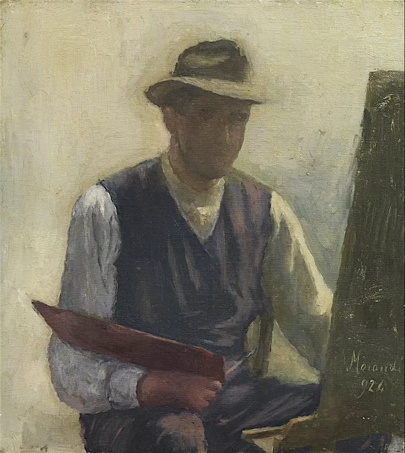

  

莫兰迪，自画像  

  

你比你想象中的力量大，你比你想象中的方法多。  

  

很多时候，一个人觉得困难，只是因为他不想走出困难。你的身体，你的命运，往往是很听话的，只要你说，这个困难一定要解决，它就会解决。

  

比如说ADF，隔日禁食法，一个解决肥胖困扰的终极利器。而且0成本、环保、额外赠送大量的时间。方法简单，36个小时不吃东西，任何带有热量的东西都不吃，喝水喝茶，当然是可以的，在接下来的12小时内，可以尽情吃。有个更容易的版本是16小时禁食，8个小时摄食，效果也不错。

  

这个方法难住许多人的地方在于，认为自己不可能36个小时不吃东西，你在早上8点看到我这篇文章，开始禁食，要到明天晚上8点才能摄食，多么漫长。

  

我刚开始也觉得，这肯定不容易，一次两次可以，多了难熬。但正因为不容易，尝试的热情很高，我倒想看看自己是如何渴望食物的。结果一半预料之中，一半预料之外。预料之中的是，开始几次确实有难度，考验意志。常态化之后，一点不难了，而且很享受ADF。长假和家人在一起，不得不暂停，还会格外渴望第一次恢复禁食。

  

理念的力量很强大，而且只有你做了你才知道它有多强大。食欲够强大吧？只要理论命令它不许吃，它就乖乖地不吃。

  

很多事情看起来很难，听起来很难，开始摸一下，也很难，许多人停留在这个阶段，你不能说他没行动，他是摸了摸，然后开始抱怨、放弃，反正袁隆平很能干，让他一辈子有饭吃，他就固化在“世界为什么要难为我”认知里，连老婆孩子最后都是难为他的组成部分：都是你们，又要读书，又要住房，让我这么苦，不然，我的人生可精彩了。

  

所以，我很欣赏，也推荐你看看这位朋友在评论区留下的故事：

  

“说说我吧，四川5线小县城普通工薪族，2013年的时候想成都买房。但是没钱！手上只有10万，老公，爸爸觉得10万想成都买房不可能。我努力找到了23平方70年产权住宅，未来地铁口通天然气，19万。借钱买了。后来翻倍到38万，再后来买了成都第二套，第三套……10万都可以成都买房，需要的是买房思维！”

  

这种故事其实多见，我公司的一位小朋友，没工作几年，也是这样，凭自己的力量，在厦门这个房价昂贵的地方刚买了小房子。我在和他们聊天时，也一直说，你们都买得起房子的，而且以后买得起好房子，要有信心，周末多去看看房子，看个百来套，越看越有信心，越看越买得起。

  

城市这么大，总有一套房子在等你，但你要去找它，去渴望它。你不够热情，它就不是你的，更别说你只是想一想。那些停留在“世界为什么要难为我”的人，注定一无所有，即使世界已给他一手好牌，他也一定要打烂，从而达到美妙的控诉：你看，我这么惨，世界果然难为我。

  

房子不是最难的，只是它把难具体化了。家人的幸福，自己的成就，获得他人的尊重，甚至去改善世界，这些更难。逃避一个难，就有无数更难。解决一个难，其他难就不难。你要相信自己做得到，才能召唤出力量与方法。

  

推荐：[换换我们的底色](http://mp.weixin.qq.com/s?__biz=MjM5NDU0Mjk2MQ==&mid=2651637926&idx=2&sn=d59e25a9d5521d31b594f5e7c6698092&chksm=bd7e4cb88a09c5aef67e6352a83e04ddd7e716fd42e2b60bd123b2baa4b0000f1998824e5042&scene=21#wechat_redirect)  

上文 ：[说说“多校划片”与学区房](http://mp.weixin.qq.com/s?__biz=MjM5NDU0Mjk2MQ==&mid=2651638882&idx=1&sn=ecaf467037ebe42cc2a3c063a7722372&chksm=bd7e487c8a09c16ae5c50af61f3c2fcd4786014e3ea117802ede8abdacc3d6f30d4eb4a21805&scene=21#wechat_redirect)
