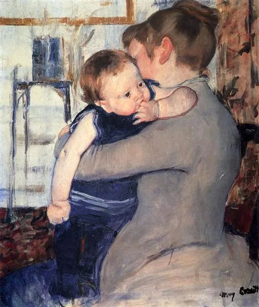

  

Mary Cassatt，Mother And Child

  

昨天深夜，有位妈妈留言：  

  

“连叔，今日和女儿跑步的时候，她首次说起班上同学拿她的身体明里暗里的嘲笑侮辱她，说是忍了三年忍不住了，想拿桌子砸人。我想这个事情我是有责任的，女儿五年级了，长的比较胖，一直以来我都怕她因此受委屈，却不知自己本身就没有接纳她，言行中也给她造成伤害了，导致她没有自信的底气。看着她难过的样子，我不知道怎么安慰，怎么让她去度过这艰难的时刻，不知道连叔能否说一说呢？”

  

今天是母亲节，说一说，当作母亲节的礼物。其实，题目应该叫“父母的温度、策略与方法”，但我想，在母亲节，父亲们应该没有意见我偏重一下母亲们。

  

在这位母亲留言前不久，有位小朋友也留言了：

  

“连叔好！我还是昨天的那名小学生，您上次没有回答我，所以我想在问一次，原谅我的失礼。我喜欢打游戏而且停不下来，学习也一般，想请教您一下，如何少打游戏并好好学习呢？”

  

两条联系起来看，就知道小朋友的成长，也是很辛苦的，甚至比成人更辛苦。小朋友的世界，也分阶层，根据成绩、容貌与家庭，分出阶层。很多小朋友还不知道轻重，显得格外残忍，嘲讽挖苦他人，往往按最大创伤来。而小朋友自己的能力有限，找不到调整办法，“我想，但想不出来”。

  

这个辛苦，母亲们听了很伤心，却是成长的必然。策略上要知道，孩子得经过这个挑战，指望世界对自己的孩子格外温情和照顾，那是不现实的。孩子的地位，也要他自己争取，才能得到。有些家长，按自己喜好，把孩子养成小胖子，却不知道孩子因为体形可能被同学无情嘲笑。这就是家长的策略差，给孩子制造麻烦。

  

知道真实世界的、有策略的家长，面对同样情况，就能够为孩子去障碍。比如上面那位母亲，就不必太担心女儿的体重困扰，因为孩子已经和她一起跑步，并告知了自己的烦恼，此时自责或怨恨真实世界，都没有用，最好的应对是制订方法让女儿得到健康的体形，一起锻炼并且健康饮食，最后女儿用漂亮的体形回应嘲讽，这也是她得到自信与力量的过程，而且因为前后有对比，她还能得到同学们双倍的尊重。过程当然不容易，但正因为不容易，父母协助孩子完成了，她才能从他律走向自律。成长，就是经受过几次这种挑战，否则，就成长不了，一生只会在嘲讽前抹泪退缩，在挑战前空想而不实干。

  

母亲得知孩子的不容易，不要害怕，这是教育机会。不要自责，而应自豪，这说明孩子信任你，你像她刚刚出生时一样，依然是温暖的、值得信任的。你和孩子的沟通顺畅，她的求助信号一发出，你就可以即时回应，你的意志、方法、智慧与成就，成为孩子的第二个脑袋，教育，就是这种共同进化。

  

上面那位打游戏无法自控的孩子，解决办法也是恢复（提升）与家长的沟通，主动告诉母亲，我打游戏无法自律，停不下来，我玩游戏前告诉你，希望你在半小时后替我停止，接管我的手机（或游戏机）。你的母亲可能缺乏教育的策略与方法，甚至不知道你玩游戏失控，第一次听到时，也许失控责骂你，希望你能挺住。你母亲因为你这次主动寻求帮助与他律，也有能力的提升，这是由孩子发起的共同进化，很罕见，一般孩子没这个勇气，所以更了不起。

  

孩子及时寻求母亲的帮助，母亲及时回应孩子的请求。只要我们这样相亲相爱，一切苦恼，一切挑战，经过汗水和泪水催化，最后都会变成我们的力量与资源。

  

推荐：[你无法回避领导的责任](http://mp.weixin.qq.com/s?__biz=MjM5NDU0Mjk2MQ==&mid=2651637926&idx=1&sn=25339aa8c8ea31336ca27f1f6777f8b5&chksm=bd7e4cb88a09c5ae1debb020bdb896a59d2698fff26cd68006f3de9626f927e3180bbf918318&scene=21#wechat_redirect)  

上文：[幸福的养料，不忘99%](http://mp.weixin.qq.com/s?__biz=MjM5NDU0Mjk2MQ==&mid=2651638759&idx=1&sn=27607bf0dceca7446b0d854fa92a83b1&chksm=bd7e4ff98a09c6ef258263d30542cbd0caf914c7a2063cbe98dfdfbdf70e053dde03c27e39b8&scene=21#wechat_redirect)
