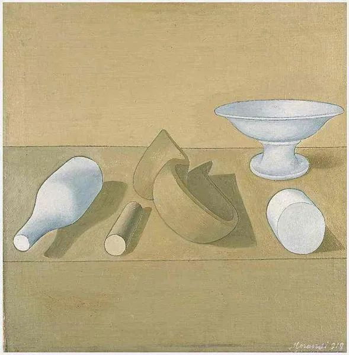

  

Giorgio Morandi，Still Life

  

常有人问是否支持婚姻里的财务AA制。  

  

从个人自由的角度，是必须支持的。婚姻是让人更好的，因为有了婚姻，一个人掌握自己财务的自由都没有了，那是说不过去的。

  

婚姻是最小的、最紧密的分工合作组织，两个人的力量大于一个人，这力量的重要组成部分是财力。比如，租一套房子，可以住一个人，也可以住两个人，结合起来，就省下了一份租金。一个人，可能养不起孩子，供不起房子与车子，但两个人，就做得到。各自做擅长的工作，不仅做得到，而且生活水准有大的提升。这就是分工合作的好处。

  

婚姻的分工合作，比起其他的分工合作，其有利的地方在于，它的信任基础最强，是建立在相爱的基础上，托付一生，生死与共。从这个角度看，太计较就是信任不够，婚姻的基础不稳定。财务AA，事事算账平摊，这是效率比较低，信任感比较差的做法。

  

好的分工合作，是更擅长管理与投资的那个人，掌管财务。有的人霸着家庭的财务大权，今天炒股，明天炒币，后天创业，亏得精光，家徒四壁，四壁还是租的。他若早点交出财务权给配偶，婚姻可能就幸福了，因为婚姻测试出了他的短板，也限制住了他短板的发作。当然，这样的人很难交出财务权，可能连AA都不愿意，最喜欢的状态是，你负责照顾家庭，我负责亏本，一转眼就苦了你半辈子一辈子。这就要求一个人婚前的功课做足，你要与之组成家庭的人，他要具有基本的财务能力与自知之明。

  

基本的财务能力，门槛不高，至少取得一份平均收入的薪水。自知之明，就是踏实，不做一夜暴富的梦，错了能及时修正。两个这样看起来普普通通的人，联合起来，不需要多么高明的技巧，依本能地提高物质生活水平，按部就班解决衣食住行，在这和平繁荣的时期，家庭的财富水平都会很快增长。而没有信任，两个普通人联合不起来，总担心对方亏待自己，事事要AA，天天在维权，那婚姻自然借不了时代上升之势，更不会有双剑合璧的威力。

  

爱情与婚姻，追求的是实质正义，而不是程序正义。两个人觉得幸福，这个结果是最重要的。这事我吃点亏，那事你多尽点力；今天我让你，明天你脾气不好。具体的事情上，分不出绝对的公平，硬要事事AA，以为这样才有权利，那婚姻经不起这样的折腾，难免散伙。

  

爱是最高级别的信任，信任才是婚姻的核心竞争力，你信任我，我则有义务创造幸福生活。相爱的两个人都这么想，则力量惊人。幸福生活的基础，当然是物质。没有物质之根，精神之花易逝。所以，努力工作，供房供车，终身学习，不停进化，都不应视为负担，而是在兑现自己的承诺，不然，就成骗子了，越会说愿景，话术越高明，则骗术越高明，最后自己都骗了。

  

推荐：[爱你的圣殿](http://mp.weixin.qq.com/s?__biz=MjM5NDU0Mjk2MQ==&mid=2651635365&idx=1&sn=77d2354ee1f4496224afdbb0137dfb54&chksm=bd7e3abb8a09b3adb9aa27ec004d5b4195ac4e0fea253007fc1f74dfa6812c36159ea852925a&scene=21#wechat_redirect)  

上文：[你的命运，往往是很听话的](http://mp.weixin.qq.com/s?__biz=MjM5NDU0Mjk2MQ==&mid=2651638968&idx=1&sn=c40dd3d65e965a21c248b92b892dcc61&chksm=bd7e48a68a09c1b0c73a2dde0b4462e364c269054f6416b4fa077358d0308d9b2cd2ccca0b10&scene=21#wechat_redirect)
