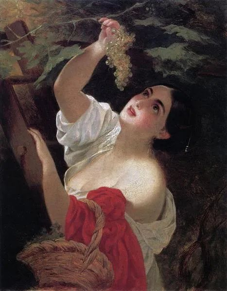

  

Karl Bryullov，Italian Midday

  

长期投资效率最高，持有好的资产与股票，它日复一日升值，相当于一群优秀的人不停为你工作。即使判断不出“好”，只要存过钱，拿过利息，就能理解这点，钱能不停地生出钱来，利息就是钱的子孙。  

  

有投资的观念与行动，是好事。现在货币的一大特点就是持续贬值，不会投资就可能越过越穷。但投资是一把双刃剑，只想着投入与升值，很多人吝啬的习性就越发顽固。而吝啬，是投资最本质的敌人，它让人忘了投资的初心。

  

吝啬与节俭，一纸之隔。可以说，人的天性中，必然有节俭，我们的身体就是节俭能量的机器。没有节俭，能量全用来满足当下，就不可能积累下资本，投资也就无从说起了。但是当下永远简陋，该有的满足不满足，那就变成了吝啬，积累了再多的钱，也失去了意义，你总是会死的，死人无法拥有财产。

  

长期投资要答好这个问题：投资要让谁受益？它最后总有人受益。节俭的人对这个问题有答案，而吝啬的人并没有。所以吝啬者的一生，很悲惨，即使投资成功，也只是赚了数字，这数字没有转化成物质与爱，回馈给自己和自己爱的人。

  

节俭的人知道，投资的最初目的，就是为了改善生活，你是为了得到更好的物质才去投资的，所以，在积累资本时的节俭与享受投资成果的慷慨，可以共存，也只有同时具有这两个看似矛盾的素质，才能投资生活两不误。你不会奢靡得浪费所有资本，也不会吝啬到终生像个乞丐。

  

何时需要慷慨？何时需要兑现一部分长期投资所得？就是你爱的人需要好生活的时候，他们绝不能生活得比别人差，必须生活得比别人好，这是最有力的证据，证明你是一个好的投资者。你户头有一个亿，可是老婆没有一件像样的衣服，家里没有像样的房子，孩子还在馋小伙伴们的享受，这一个亿不就是巨型笑话？你投资的结果无论如何，家人都难受。你投资失败，损害家人的利益。你投资成功，家人也只得到无法满足的渴望。

  

好生活是投资的大动力，投资有收益时，你要兑现一部分去享受世界上的好物。你喝一瓶茅台酒，就心疼喝掉几股茅台股票，那你就很难卖掉几万股茅台为家人买套房子。好的投资者，做这些事，轻松惬意。和家人畅饮茅台，是常态；提升家人生活品质，是责任。投资最大的乐趣，是有能力对自己所爱的人慷慨。过不了吝啬关的投资者，享受不了这个乐趣，你希望爱自己的人无欲无求，牺牲一生为你筹集资本，他们是什么？不就是你的奴隶吗？你是什么？不就是金钱的奴隶吗？你们都有悲惨的一生。

  

好的东西，都要先给所爱之人。从对家人慷慨开始，他们该有的，都要有，都要好，这样才能长出更大的能力，才能领会到更深刻的投资哲学，投资也才能更成功。

  

推荐：[孩子能走多远，就该走多远](http://mp.weixin.qq.com/s?__biz=MjM5NDU0Mjk2MQ==&mid=2651633439&idx=1&sn=9e6463d186af272e27f08adc843196a5&chksm=bd7e33018a09ba177e330b2ec5a9a5fe8f9e3e1d5252a8efdd115defb7f86aeff2cce07fad08&scene=21#wechat_redirect)  

上文：[婚姻最核心的竞争力](http://mp.weixin.qq.com/s?__biz=MjM5NDU0Mjk2MQ==&mid=2651639059&idx=1&sn=c05ca34dd463328f2fcdddbf88a54982&chksm=bd7e490d8a09c01b5af4cfe501040518927e90875828fc941d1217ca42e21055672c12a09dbd&scene=21#wechat_redirect)
