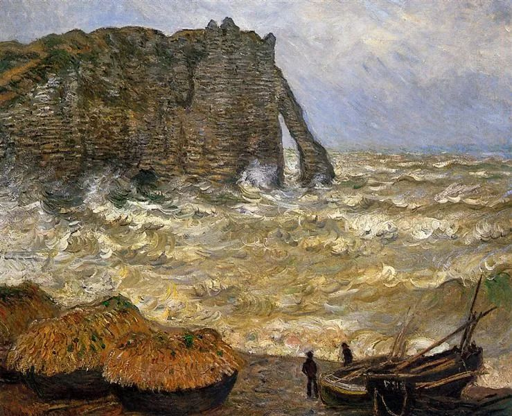

  

Claude Monet，Rough Sea at Etretat

  

我成为社会人了，有什么想对我说的？昨天有朋友这样问。今天展开说一下。  

  

开始工作，有自己的收入，这是人生重要的时刻。这意味着你真正有贡献，对自己和世界负起了责任。

  

在宣传片里，后浪统治一切。作为鼓励，这没有问题。某种程度上，也是事实，年轻人的优势就是年轻，他们剩下的时间更多，谁活到最后，世界就是谁的，这是显见的事实。但是，时间可能挥霍掉，也有可能0价值，如果你无作为，无工作，再多时间都等于0，世界怎么可能是你的。

  

后浪只要一进入现实社会，成为社会浪，就会发现，到处都是强大的前浪，从收入到地位，要获得尊重，得到提升，并没有那么容易。

  

但也不会很难，有些注意事项是小朋友级别的，却奇迹般地从幼儿园开始，一生有用。

  

一、 把自己形象搞清楚，早起洗个澡（感谢社会进步，现在基本有条件做到这事），换上干净的衣服。身体是自己的圣殿，肮脏油腻，别人不信你里面有神。保持清洁是最大的软实力，就像你到一个小乡村，房子都简朴，没什么设计，但如果家家户户清爽干净，就格外有魅力。年轻人不可能一身名牌，也没那个必要，只要清爽干净，就能让人眼前一亮。

  

二、 不要迟到。早出门5分钟，一天都领先。能做到不迟到，规矩全守得住。纪律不是约束，它是帮手。正因为有纪律这外在的限制，可以不走神，更专注，最后达到随心所欲不逾矩的大神状态。

  

三、 少说多做。年轻人有一肚子改造世界的愿景，但想与做是完全不同的概念，至少有10万人同时和马云一起想做电子商务，只有马云做成了。世界只会尊重做事的人，嘴炮令人心烦。在做的过程中，人会慢慢务实，也能学会尊重那些把事情做好的人，你知道，无论多小的事，做好都难。

  

四、 眼里有活。这是做的主动性。你要与人合作，你做的事有前后顺承的逻辑。细心一点，照顾他人感受，活就可以上一个层次。比如问前辈一个问题，你把事情交代清楚，整合成一段话，就比你连发10多条片断微信好得多。

  

五、 耐烦，不要怕做简单的事。天天做同样的事，好烦。这样想的人很多，他们错了。天天能做同样的事，这是好运。你能越做越轻松，越做越专业，举一反三，在更高的层次上再次重复。重复重复再重复，生物是这样进化的，世界是这样进步的。再大的事业，核心都是简单的。你每天要花样翻新才能活下去，一个月就得饿死。

  

六、 不要抱怨。抱怨工资低，抱怨房价高，抱怨父母，抱怨社会，这种抱怨症像瘟疫一样可怕，一旦染上，可能终生受害。你当然能找到抱怨的点，但要记住，没人会给你的抱怨付报酬，越厉害的喷子往往越不入流。不要期待别人给你高薪高职才开始负责与精进，这是搞反了因果，是因为你负责与精进，才有了高薪高职。

  

大道至简，没什么复杂的，一天天修行就是了。人生很长，中国也在往上行，开始你的这段美好旅程。 

  

推荐：[没有找到意义的生命，是不值得过的](http://mp.weixin.qq.com/s?__biz=MjM5NDU0Mjk2MQ==&mid=2651638700&idx=2&sn=b46d16f5c56b375022198c2a54bca16c&chksm=bd7e4fb28a09c6a480678e01ea154caf4a4a4cb5c7191da6f1048355f5fb27810888c00a7c7d&scene=21#wechat_redirect)  

上文：[对爱人慷慨，是能力之源，是投资的成就](http://mp.weixin.qq.com/s?__biz=MjM5NDU0Mjk2MQ==&mid=2651639127&idx=1&sn=ebf1fe1c76704aaabb04b3120b9975ae&chksm=bd7e49498a09c05f9799e39dbe3d43626450d538fa63e2f35c0ef8ce99f48c7c8ad3a3fe5dde&scene=21#wechat_redirect)
