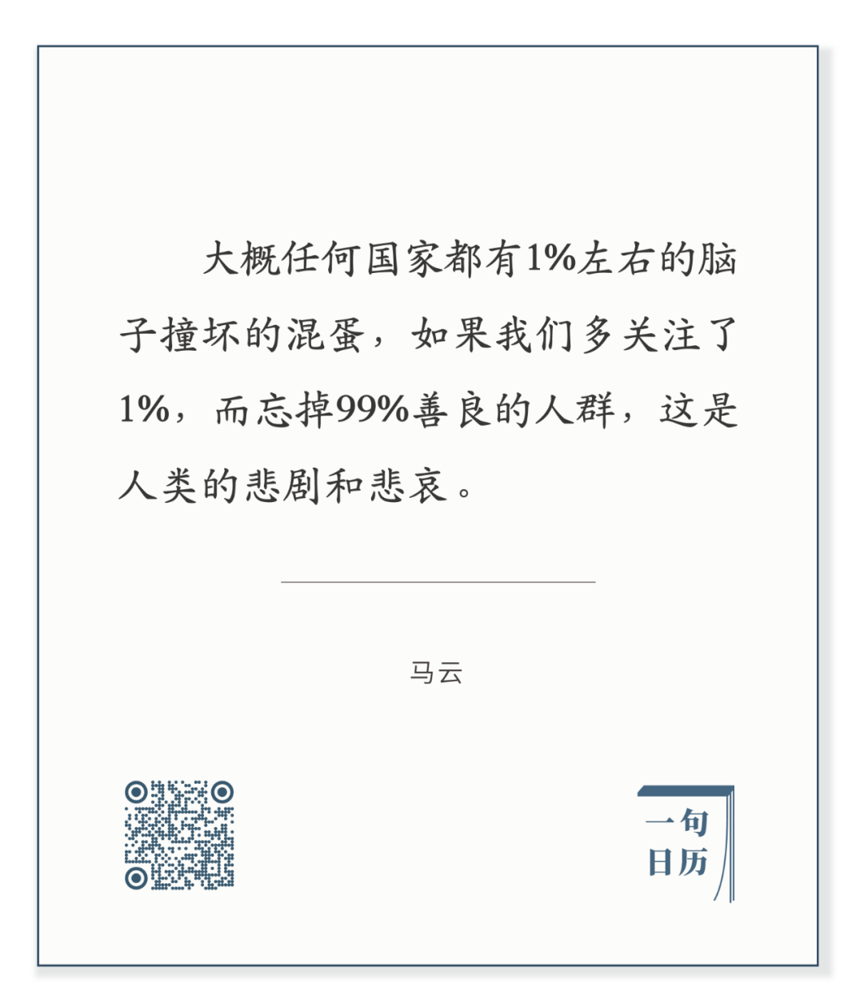
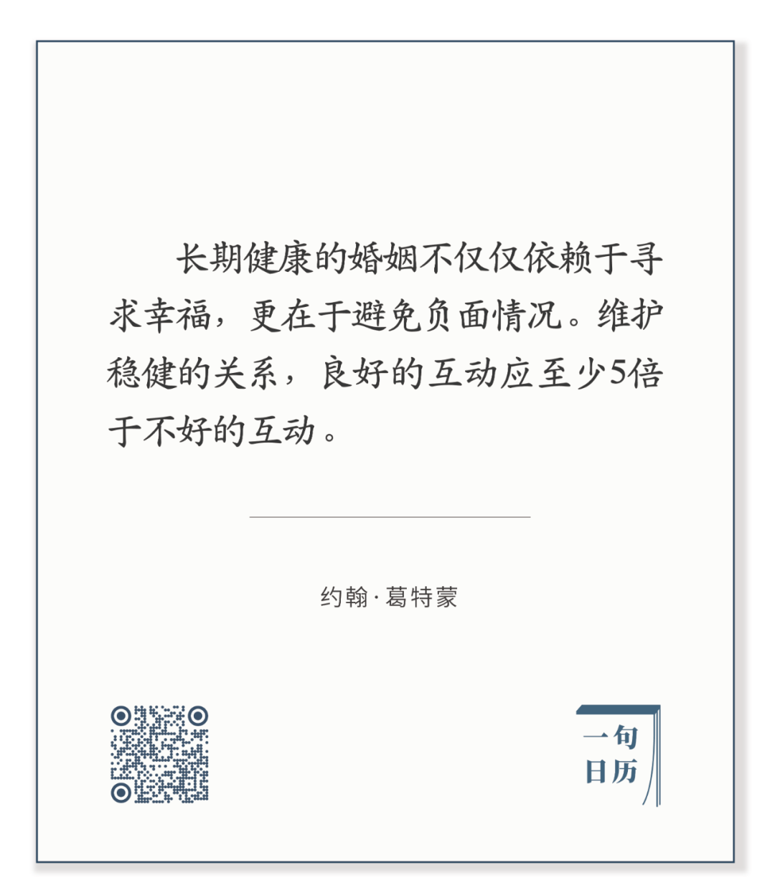

  

Laura Knight，The Beach

  

大多数事情我们看不见，大多数人我们看不见，大多数声音我们听不见。  

  

为什么会有这么大的盲区？我一直赞叹贝叶斯定理是个很厉害的思维与分析工具，它可以解释。大多数人事物是正常的，我们习惯了。美好也容易习惯，兰花开三天，你就忽略了它的香。而极端事物以人的刺激，才印象深刻。贝叶斯定理就提醒我们不要忘记这个大多数，否则，就是忽略了先验概率，算出了错误的结果。

  

马云说得更形象一点：

长按二维码可关注

  

这1%的“脑子撞坏”，就属于生活中的极端事件，它的比重很小，可以视为不存在。但它的存在感又可以很强，媒体喜欢报道极端事件（这是媒体业的基因缺陷）；匿名的社交平台，正经人说话当然继续保持谨慎，甚至不说话，但那1%却更加肆无忌惮，以至于好像占了世界的50%，甚至更多。我们似乎知道得很多，但却知道得更少了，因为我们忘了那99%。

  

只盯着那1%，并不是一个人更敏锐、更有责任感，只是一个人的思维没受过训练，只愿意跟着情绪走。如果这个人恰巧抒情水平高，那更是误人误己，把自己搞得很悲壮，把世界想得很黑暗，其实不过只是在1%里鬼打墙。  

  

而在我们个人，我们生活中的言行，也分成99%与1%，我们有那1%的脑子坏掉时刻，做一些混账事，说一些混账话，伤害自己爱的人，毁掉自己的生活。如果我们希望生活幸福，我们就得控制这1%的黑暗面。当然，我们爱的那个人，当他1%的坏时刻发作时，不要针锋相对，火上浇油，这会烧毁99%。多想想他的99%，在骂他之前，先想他的5件好。这么做很难，可是爱他呀，值得训练出这种思维与行事习惯。

  

今天是第126期“下周很重要”，制订一个幸福的计划，你或有不满、指责与悲伤，在这1%冒出来之前，你先做5件让你平静、获益与长进的事，给幸福足够的养料。  

  

推荐：[如果你不想做，你会找一个借口，如果你想做，你会找一个方法](http://mp.weixin.qq.com/s?__biz=MjM5NDU0Mjk2MQ==&mid=2651638573&idx=1&sn=77cd29b8e28623493925cdec07e04a49&chksm=bd7e4f338a09c62503ad97a0c72d793e557bbd2d2b52f0ea017d825388387ea0a2671e4fd79e&scene=21#wechat_redirect)  

上文：[真刀真枪拼，才是真后浪](http://mp.weixin.qq.com/s?__biz=MjM5NDU0Mjk2MQ==&mid=2651638738&idx=1&sn=60f05a6418a24c1e29faea58e1f8521c&chksm=bd7e4fcc8a09c6daa2bbd42ef2a8c271a995fa98fde466e2da24ae9d3c865b4130c921c29795&scene=21#wechat_redirect)
