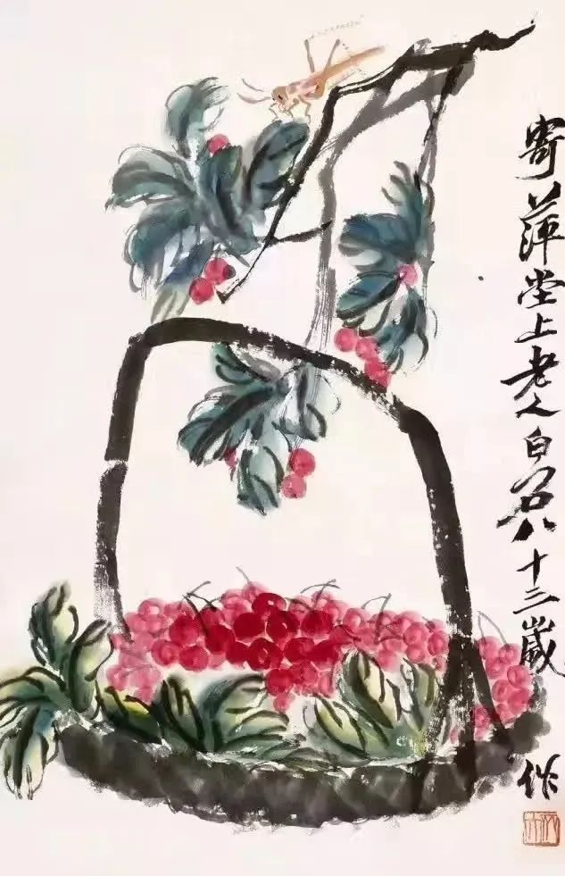
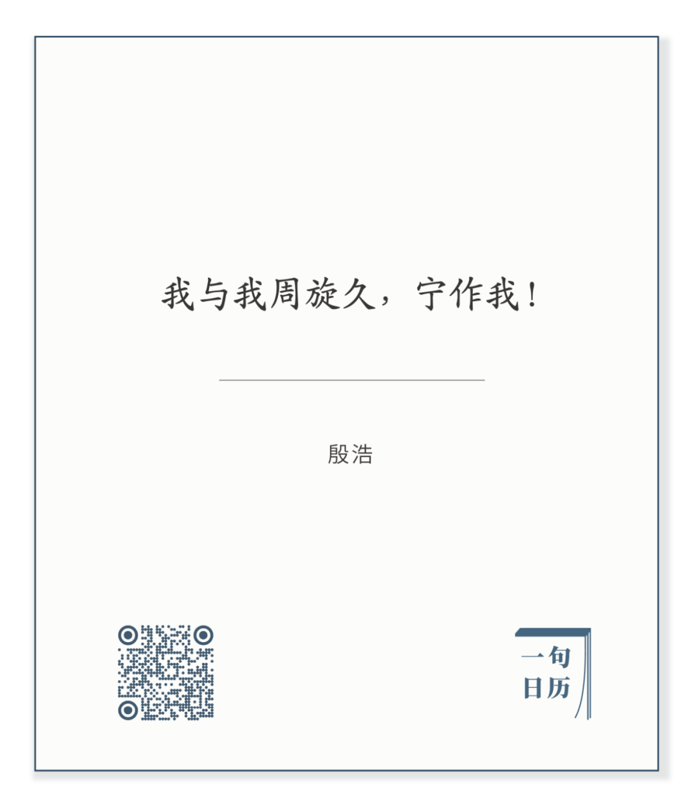

齐白石，红樱桃

  

有人问自我抱怨是否抱怨。  

  

当然是，只不过是最深的抱怨，很难觉察。因为它与自我批评一墙之隔，容易混淆。

  

自我批评，是难得的品质。人容易自恋成癖，觉得自己什么都好，即使不好，也要通过虚荣假装自己好，自我批评太难，出了问题，一般选择责怪他人。人要自我更新，则一定得有自我批评，这样才能去掉错误。

  

一个自恋者，人人看得出他可笑。抱怨他人，也会被他人强力拒绝。这种错误辨识度高。

  

而自我抱怨，辨识度低，它是高明的防御，我先否定自己了，你也就不好意思再说我了。最后变成了求关注，索关爱的技术。我在地上打滚，爸妈总得把我拉起来；我都快淹死了，人都会伸出援救之手。所以，孩子有时和父母顶几句嘴，为自己的观点与行为申辩，不必怒气冲冲，非得马上强力压制，那是他在维护自己的边界。他真的习惯了自我抱怨，父母的批评，他再放大十倍，那就走到抑郁与自恨了，都有生命危险。自杀，就是自我否定的极端体现。

  

东晋的殷浩有句话说得好：

长按二维码可关注

  

人的成长，就是自我周旋，周旋一生。你的体内有两个你纠结争斗，一个自恋，一个自怨。做对了，自恋的笑声大，做错了，自怨的哭声大。你在这两者中取得平衡，你的人格就健康，有点成就时，沉思一下历史，仰望一下星空，想象一下未来，那自己不过烛火；犯了错误时，知道这是人成长必须付出的成本，先贤的成长路径并无二异，自己是烛火，也可以照亮自己，照亮身边的人，能用火种点燃他人的蜡烛，那就是现贤了。

  

达到平衡后，你就知道，人的秘密，都在自己身上，了解自己，就是了解人类，把“我”做好，是一切的起点。中国的道家与儒家，各执一端，可在从我做起这点上，他们是一致的，儒家讲修身齐家治国平天下，道家讲真正的道与德，要先修之于身，然后一步步扩大，家，乡，邦，最后到了天下，才是普适的真理。

  

我与我周旋久，宁作我。是这种认知的体现，无论我们此生的角色是什么，宁作我。不想做我，那就是自怨自恨了，最后就会怨一切人。你看犹太人与犹太教的历史，他们有个自恨者的角色，就是认为犹太人一切都是错的。最真诚反犹的，反而是身为犹太人的自恨者。

  

其实每个种族，每种文明，都有自恨者。在东晋那种生存极其艰难的时空里，中华文明就这么美妙与深刻。王羲之当然大家都知道，他的朋友殷浩知道的人不多，也是当时的大人物，一句诗就能把人的自我认知、自我接纳与自我更新表现出来。这样的文明，也有自恨者，从去年的香港到今年的疫情，“中国一切都是错的”“中国人就是低贱的”，这种自恨的话，甚至被当成良知与启蒙。

  

变成自恨者，小则不愉快，大则有生命危险，恨自己恨到极点，只能去死了。我们不说天下、文明这种宏大主题，就是为了自己一生的快乐幸福，为了能对家人负责，我们也要接纳自己，要反省自己犯的错，但也要允许自己犯错，无论有多少考验与挫折，都有“宁作我”的自我肯定。只要有这个起点，就有不停生长的爱。

  

推荐：[为什么最恨中国人的是中国人？](http://mp.weixin.qq.com/s?__biz=MjM5NDU0Mjk2MQ==&mid=2651636707&idx=1&sn=249dc26c08b70a53352148e91b440b56&chksm=bd7e47fd8a09ceebed1fc3b823bd4ca208d168d78a046f21a8b410f2874dcfc0ac3b53f0bf5a&scene=21#wechat_redirect)  

上文：[520，一个人最值得爱的能力](http://mp.weixin.qq.com/s?__biz=MjM5NDU0Mjk2MQ==&mid=2651639803&idx=1&sn=fb9b6c73ff81f4eaaf5b7706bdb5fc4b&chksm=bd7e4be58a09c2f3ad5d9dbd98cc7165eb9ea899f0b27637178f802530c8addd9dd3cc85940c&scene=21#wechat_redirect)
