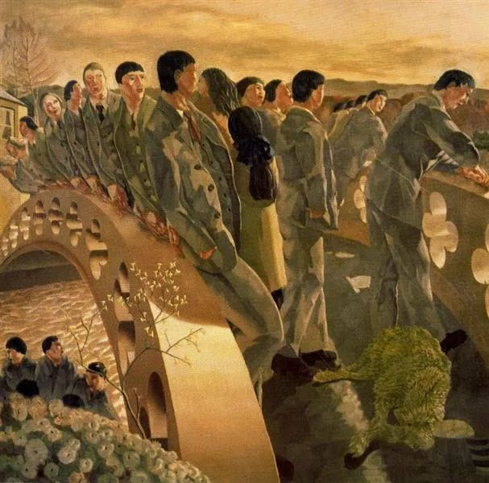

  

Stanley Spencer，The bridge

  

连叔，您好！  

  

关注您的公众号很久了，很喜欢您的文章，只是没想到有一天也会给您写信。

  

近来，我读了一些书。

  

我产生了极大自我怀疑——成绩和学校真的那么重要吗？

  

一个作家是她，一个是他。放心，都算是极有名气的大作家了。读了他们，我感觉是找到了灵魂知己似的。共鸣——我们太像了！一些观念，一些想法，一些性格……我在现实中太孤独了！读了和我一样的人，真是感动的都要哭出来了！

  

然而，他们的作品里都有讲到一个话题：读书和学校。开始我并没有多在乎，因为这似乎对我来说并不是一个多重要的问题。但是后来我越想越是不对劲。他们有说，“学校里我唯一学到的东西就是学校里教的东西都不重要”；还有，“凡是被逼着学的东西，我却都不愿意去学。”尽管我并非完全赞同他们的观点，但是放下书来，我思考了。

  

我喜欢看课外书，但是我并不喜欢一遍遍跟着标准答案分析那语文课文中的人物；我不喜欢紧张巴巴的数学物理考试，但是我能静下心来琢磨一道压轴题上几个小时不知疲倦；我讨厌枯燥的英文语法，但我每每读到漂亮的英语诗句总是会不禁思索如何把它翻译地同样美丽；我不喜欢（也不擅长）写辞藻华丽的优美记叙文，不过若是我的观点我能洋洋洒洒书写（废话）上千字；我不喜欢背诵道法和历史，我却是对时政和历史感兴趣的。

  

您也许能看到，我好像有点共情他们的观点了。

  

小时候，我以为“成功”就是出名，有钱（额有点肤浅）；再大点，我觉得“成功”就是考上最好的学校；近些日子，我又觉得“成功”就是从事自己喜欢的行业，一辈子，同时还要为社会发展作贡献；现在，我真的不知道了。

  

推己过后，我又想到，不少人“成功了”，但毕竟成绩从前并不是年级第一啊。

  

不知您从前成绩如何，但在我看来，您是一个非常成功的人了。

  

成绩当真重要吗？我的成绩之前一直花费三分力左右，算是中上游吧。若是花四成力大概可以考上市第五好高中的。前段时间开始决定用功了，却看到了他们的文字，不禁自我怀疑了。

  

我应该花六分力去追求我热爱的呢？或者，我有必要全神贯注花十成十的力气专注一次又一次背诵道法和历史提纲呢？

  

若是您能耐心读完一初中生的废话连篇，实在谢谢您！期回复。

  

无信

  

* * *

  

无信：

  

成功是什么？这很难回答。你说我成功，说实话，我越来越不敢肯定，我会保留这个疑问，一直到死那一天。我感谢这个疑问，它促使我进步。有些事情当下没有答案，那就留着它，一边生活一边慢慢找答案。

  

我初中成绩一般，写不出你这样的文字。我高中的成绩更一般。可是，我有成绩出色的高中同学，现在可以确定青史留名，他在科研上做出了重大突破。高中出色的同学，现在泯然众人，这是有的。这证明一直领先不容易，并无法证明逆袭很容易。可以从初中就领先，当然是最爽的。

  

如果让我再读一遍初中高中，我希望自己更努力，成绩更好。该背诵的背诵，该理解的概念当下思考清楚，尽早体会一门学科的体系之美。现在不需要考试，但我每天反而会背点什么，涉及的概念一定弄明白，我感兴趣的学科，则必然老老实实啃完其重要书籍。也就是说，我现在过得更像一个优秀的初中生。我的很多同龄人觉得我过得太苦了，但我自己觉得很幸福，能够永远以初中生的状态活着，每天都要早起完成作业，这种苦，是命运对我的厚爱，说明我有价值。再说了，这能有多苦呢？比起世上真正的苦人，我不苦，你也不苦，我们要做的事，只要觉得它应该做，只要认真做，每天的任务并不重。

  

对学校或现行教育体制的批评，从来都受欢迎，因为普通学生毕竟是多数，如果告诉他们读不好是学校错了，是老师错了，当然是巨大的心理安慰。这不是初中生才会犯的错误，这是人性的弱点，在成人的世界也一样，当一个人想偷懒，一个人要为自己的失意或失败找借口时，他更愿意去责怪环境，而不是检讨自己。

  

只有那些强者，他们才会检讨自己，顺境逆境，只是自己行动的条件而已，顺的时候，不要懒，不要骄，逆的时候，不要弃，不要怕。再强的人，也有考不好的时候，犯错、失意与失败，更是必然，他变弱的信号，就是他开始责怪环境的时候。但愿你永远不要有这种时候。

  

当学生的好处是，每天的任务是具体的、量化的，是否成功，成绩说了算。在以后的人生竞技场，你很难看到这么单纯的竞争。尽你的全力，去争第一，去享受自己的力量。虽然成功很难定义，但它一定需要你尽全力才能得到。或许这尽力，就是成功的一部分，尽力读好中学，尽力读好大学，尽力对家人负责，尽力陪伴孩子，尽力做好工作，在尽力的过程中，力量越来越大，也能帮助越来越多的人。从现在开始尽力吧。

  

祝开心。

  

连岳

  

推荐：[别逃，随大流吃苦](http://mp.weixin.qq.com/s?__biz=MjM5NDU0Mjk2MQ==&mid=2651633429&idx=1&sn=2458cd8c2c967e23ed71bee773e1bad1&chksm=bd7e330b8a09ba1dbf14722390fe40a11f89925ab32bc0dbc98b273f5e95193f67fc7ae380be&scene=21#wechat_redirect)  

上文 ：[掌握一生最可靠的名利之源](http://mp.weixin.qq.com/s?__biz=MjM5NDU0Mjk2MQ==&mid=2651639388&idx=1&sn=5e8a7889d11a6e15b7106215fcd594fa&chksm=bd7e4a428a09c354d80ad6318660e51e0980e2b9efada2a44601d19ad94a1c3f6c18490533da&scene=21#wechat_redirect)
