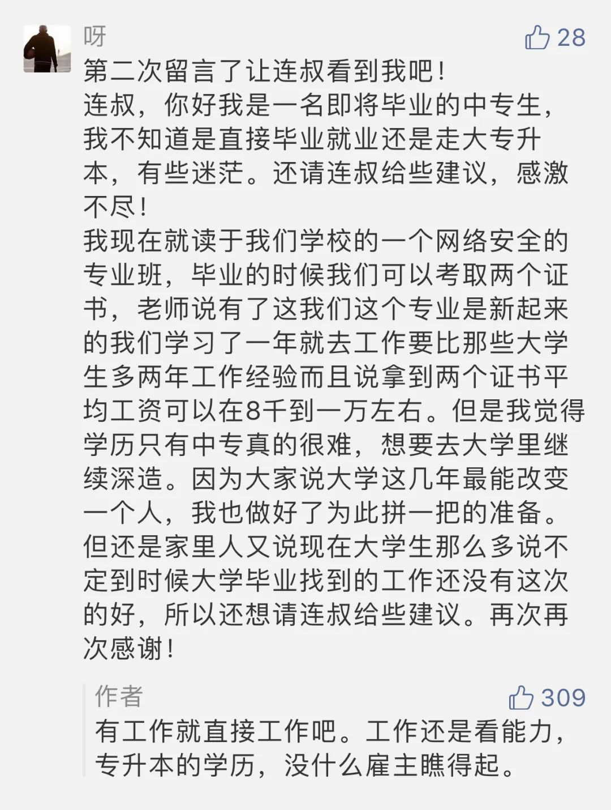

  

Paul Gauguin，The wave

  

我一直认为，年轻人（即后浪）有机会工作，则应尽快工作，不要留恋校园，因为真实的世界很残酷。  

  

在宣传里，在谈话中，大家都倾向于鼓励年轻人，我觉得这也应该。谁都应该鼓励，何况年轻人呢？一个时代，老年人老觉得一代不如一代，年轻人也失去信心，那没落的可能性自然加大。

  

但真实地评价一个人，不是因为你年轻，而是你有没有本事。谁是单位与公司的最高决策者？我估计都是前浪。你没本事的话，他们可是一点也不客气。本事这词很模糊，具体来说，你保得住工作，且在工作中精进，获得信任、职位提升、薪酬增加，那就是本事。如果你一直没有自己的现金流，生活处于亏损状态，那么，你再年轻，都是没本事，而且会得到双倍的鄙视，很容易被归类浪费青春的笨蛋。

  

人受教育，慢慢成年，做好了准备，为的是什么？就是工作。因为能力，受教育水平有高低，有人只能完成义务教育，有人专科，有人本科乃至博士。有没学术研究能力，高中毕业就能看出大概，考上一流大学的，和只考了专科的，前者有研究能力。到了大学毕业，还保有学术研究兴趣的，又没有急迫的财务压力，则可以继续深造。以混文凭为目的，自欺欺人，最后结局就尴尬了，拿着博士文凭，活做得不如一个高中毕业生，你被解雇的可能性就极大，甚至可以说是必然。

  

认为高学历就等于好工作的想法，是错误的。有高学历，并有与之匹配的本事，那才有好工作。没有高学历，但有本事，最终也会活得好。没人雇你？怕什么，你自雇。只要想有工作，就一定会有工作。世上不缺工作，缺的是轻松钱多的所谓好工作——眼里只盯着这种工作，文凭再高也得失业。

  

有人如此提问：

  

  

现在文凭相对容易拿。尤其是今年经济风险多，就业压力大，更是指望年轻人在校园里多呆几年。今年教育部已经安排硕士研究生扩大招生规模18.9万、普通专升本扩招32.2万。几年后，到这些扩招生毕业时，就业形势大幅好转，那压力不会增加，不然的话，这些人的就业就更成问题了：你觉得自己文凭高了，看不上的工作更多了，选择变少；雇主想招更好的人才，他们最看重第一学历，别说专科生了，一般大学的本科生，简历都不上心，选择你的雇主也变少。少上加少，你在校园多混几年，反而没工作了。

  

当然，很多人会举某个出色的专科生，升本科，继而研究生博士生，最后出人头地的例子。我不怀疑有这样的专科生。但是一个专科生想这样拼文凭，就犯了一个典型的思维错误，[丹尼尔·卡尼曼在《思考，快与慢》](http://mp.weixin.qq.com/s?__biz=MjM5NDU0Mjk2MQ==&mid=2651638717&idx=1&sn=d8768ef95153c504ad94bfb268b84ee3&chksm=bd7e4fa38a09c6b5d22876141236ae3f363437cd35b41cdfd9dadc2ff6a1d1da00ade9dc0100&scene=21#wechat_redirect)中，称之为“过于关注罕见事例”，没有概率思维的人，往往会被小样本带到错误的路上。正确的思维方式是算出概率，成功概率太低的事，不值得投入。

  

连叔我招人，也喜欢招好大学的毕业生，他们更大概率是好员工。可我也绝不会瞧不起专科生，我自己就是大专生。只要有本事的人，我都尊重。市场是最好的大学，你永不毕业，真刀真枪，只要你拿得出好的服务与商品，别人就愿意付费，管你是什么文凭，这么公平的竞争，为什么要逃避？

  

不敢流汗流血真拼，算什么后浪？只是后退。  

  

推荐：[求之不得的绑架](http://mp.weixin.qq.com/s?__biz=MjM5NDU0Mjk2MQ==&mid=2651633404&idx=1&sn=463a9138d70cbd0d36d1b18b511d9e18&chksm=bd7e32e28a09bbf455b89c5dead575d43212813fc1b52ad65dbf8ad850c7bc970a2d71d17574&scene=21#wechat_redirect)

上文：[你太快了！](http://mp.weixin.qq.com/s?__biz=MjM5NDU0Mjk2MQ==&mid=2651638717&idx=1&sn=d8768ef95153c504ad94bfb268b84ee3&chksm=bd7e4fa38a09c6b5d22876141236ae3f363437cd35b41cdfd9dadc2ff6a1d1da00ade9dc0100&scene=21#wechat_redirect)
