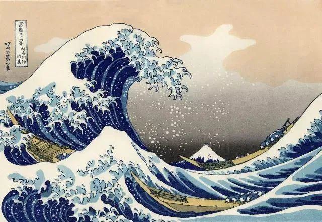

  

葛饰北斋，神奈川冲浪里

  

如果把青年比作后浪，那中老年无疑就是前浪。  

  

青年的标准有很多，但是过了45岁，可能就不再适合称为青年了。

  

长江后浪推前浪，前浪死在沙滩上。前浪们很容易想起这句残酷的俏皮话，难免心里会有一些悲凉。这也是用比喻来认知的不利之处。甚至引发不必要的对立，似乎后浪一定要拍死前浪才算有朝气。你看，钟南山院士与李兰娟院士，都不是青年，但他们是青年的偶像，是引领后浪的前浪，在这里，后浪与前浪是和谐共生的。

  

当然，我认为后浪与前浪的竞争关系一定要有，也是天然存在的。如果青年人不想战胜并取代前浪，那就没有朝气，没有梦想，不是合格的后浪。如果中老年人不想继续领先于后浪，那就没有韧性，没有积累，自然是必输的前浪。

  

人生一眨眼就会用尽青年时光，从后浪变成前浪。到了中老年，有些人的心态确实会发生微妙的变化，当他们感觉机会和头发变少，欲望却共腰围增大，慢慢开始边缘，心理非常不愉快，极力挣扎是本能，否定后浪于是成为口头禅，除了自己的孩子是青年才俊，其他后浪都是无脑无知的荷尔蒙野蛮人。这种前浪，气质日益尖酸刻薄，脸上的肉都慢慢长横了，除了拉帮结派互相吹捧，就不干正经事了，后浪把它们淘汰在沙滩上，这正是后浪的进化功能，不然，世界将变成多么的无趣与死寂的、波澜不起的一池死水。

  

成为一朵保持活力的前浪，也不是那么难，并非一定要成为钟南山与李兰娟。在我们身边，在自己家里，都能找到这样的前浪，他的审美，不是青年的审美潮流，但是美；他的脸，没有青年光滑，但是笑容一样多；他的话语，有他那个时代的特色，但表达的仍是智慧。

  

他没有谄媚青年，刻意模仿青年，他只是专注于创造价值，世界永远需要创造价值的人，这价值可以体现在一啄一饮，一丝微笑，一个深深的拥抱，时光是他的朋友，前浪有更大的复利雪球，更多财富，更多智慧，完全不是他人与世界的负担，却更能帮助他人与世界。要成为这样的前浪，这样的巨浪。

  

人的一生，由后浪时间与前浪时间组成，青春短，前浪长。要经历两次考验。在后浪时间里，越努力，越自律，越专注，越珍惜时间，就越不怕进入前浪时间。那很快就会到来，似乎大学刚毕业，工作没几年，前浪时间就接管人生。我今年50岁，回想30岁生日，就在昨天。再眨一眼，80岁就到了。人生像浪花一样易逝，不要浪，一浪就是一生。

  

但愿我们都有后浪不浪，前浪不死的美好人生。

  

推荐：[像他一样变老，像他一样不老](http://mp.weixin.qq.com/s?__biz=MjM5NDU0Mjk2MQ==&mid=2651638426&idx=1&sn=56accf3bf266bd36d5d3595f1347015e&chksm=bd7e4e848a09c7927703d5ce27f8f3c6ad3b78858baa2404606b18e8abf16474c254f466b647&scene=21#wechat_redirect)  

上文：[一，多，守一得多](http://mp.weixin.qq.com/s?__biz=MjM5NDU0Mjk2MQ==&mid=2651638670&idx=1&sn=62b78a9a15e34d8da012710d05abc1ef&chksm=bd7e4f908a09c686d84263158244c5f1fa809a7e8df928814dbe7c881275849663f19f52a721&scene=21#wechat_redirect)
