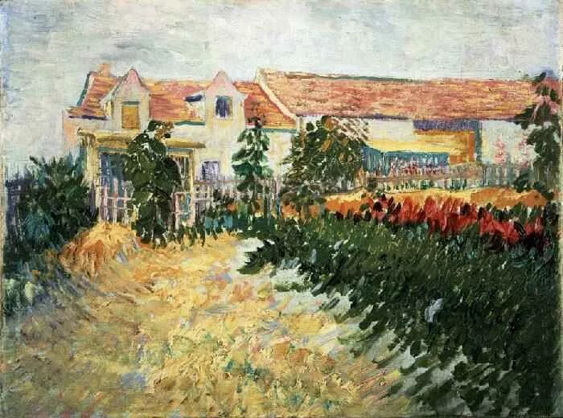

  

Vincent van Gogh，House with sunflowers

  

近期，“学区房”历来最贵的北京市西城区出台学区新政，今年7月31日之后新购房产将实施多校划片。至此，北京市城六区均明确提出多校划片方式入学。  

  

政府的主要内容有两条：

  

（1）自2020年7月31日后，西城区购房并取得房屋产权证书的家庭适龄子女申请入小学时，不再对应登记入学划片学校，全部以多校划片方式在学区或相邻学区内入学。

  

（2）自2020年起，西城区将对适龄儿童入学登记地址及就读学校实施记录，自该房产地址用于登记入学之年起，原则上六年内只提供一个登记入学学位(符合国家生育政策的除外)。

  

“多校划片”其实并不新鲜，到了最硬核的北京西城区也实行，其实是宣布“多校划片”政策无法阻挡，将长期化而已。它对房价的影响也容易算出，学位房由绑定一所小学（或再加上中学）变成绑定多所小学及中学，原来高价的降低，原来低价的升高，达到一个新的平衡点，在这个平衡水位上，再继续升高。

  

将来家长们趋之若鹜的最好学区房，是那绑定的多校均是名校。有没有可能出现？有。“多校划片”政策出现后，这个可能性增加了。在人才、资金密集的地区，这个可能性更大。当地政府也有动力通过高质量的教育吸引更多人才与资金。

  

只要中国人普遍对家庭负责的观念不变，只要他们仍然重视孩子的教育，学区房就将一直存在。通过民众与政府在教育上的大投入，一代代人进化速度更快，这是中国的核心竞争力之一，没有任何政策想放弃这个优势，自废武功。只有到了中国人生下孩子就遗弃，对孩子未来完全无所谓，读不读书都行，那时候，学区房才会没落。而中国人永远不会堕落到这个地步。

  

从“多校划片”也可以看出，“房住不炒”政策将是长期的，不会取消了。在经济持续繁荣的地区，房产投资是最好的致富术。如果一个人欣喜于自己的房产升值，甚至在指导他人买房，同时却唱衰中国，那逻辑就无法自洽，知识水平得提高。

  

中国的有钱人、聪明人、同时对中国持续繁荣有信心的人，绝对数太大了。他们中的多数，迟早会知道房产投资的好处。与此同时，中国的笨蛋更多，他们将一直拒绝搭上房产致富的顺风车。在智力鸿沟的两边，前者的房子越买越多，越买越精，越来越富；后者越来越笨，天天等房价腰斩，等不到时就怼天怼地怼买房者怼政府。

  

中国政府还是照顾笨蛋的，这点真不容易，于是有了“房住不炒”。聪明人见好就收吧，买个一套两套得了，不要在房产上太炫富，刺激笨蛋。同时，把房价人为压一压，为笨蛋上车创造条件。而这有限的市场，房地产业也没有死掉，还在增长呢。就这样搞一搞相对平均吧。绝对平均主义是不可能的，就像北京西城区的多校划片，就在西城搞搞平均，全北京摇号更平均，西城区的孩子摇到密云读小学，走到学校都放暑假了，反之亦然。绝对平均社会就崩溃了，再说了，真的绝对平均，那得全中国的小朋友摇全中国的学校。

  

配置资源，解决问题，主要还是靠市场。改善家人生活，考虑孩子前途，该买的房子早点买，别老等政府帮你。顶级的笨蛋，政府都帮不了他。

  

推荐：[没有找到意义的生命，是不值得过的](http://mp.weixin.qq.com/s?__biz=MjM5NDU0Mjk2MQ==&mid=2651638700&idx=2&sn=b46d16f5c56b375022198c2a54bca16c&chksm=bd7e4fb28a09c6a480678e01ea154caf4a4a4cb5c7191da6f1048355f5fb27810888c00a7c7d&scene=21#wechat_redirect)  

上文：[写在母亲节：母亲的策略、温度与方法](http://mp.weixin.qq.com/s?__biz=MjM5NDU0Mjk2MQ==&mid=2651638817&idx=1&sn=b6ccf83520a959b42cf0493d51641f13&chksm=bd7e483f8a09c1299064d941b8f35ff3df0f849420880e81000f6725dd7bbe31393fbdd794c4&scene=21#wechat_redirect)
