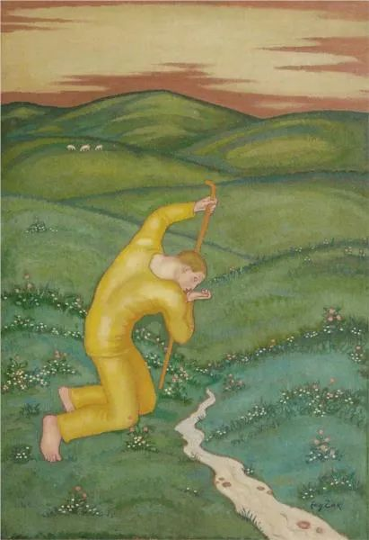

  

Eugeniusz Zak，Shepherd

  

亲爱的连叔，你好呀！  

  

以前遇到什么自己想不通的事情总会想到你，很多次我都想给你写信，但转念想连叔工作也很忙，哪里有空能看到我写的信。但今天我想跟连叔说一下我自己一直都想不通的一件事。

  

连叔你知道吗？我自己是个比较好强的人，当我遇到想不通的事，想找别人倾诉，向别人寻找解决的办法之前，我会自己消化，让时间淡化一切，我不知道这是不是逃避，但是时间长了总感觉会好一点。但是，接下来我跟你讲的事却一直萦绕在我心头，时不时在我心情低落时总会刺疼我的心，为此我感到非常迷茫。

  

上面跟连叔说了这么多，其实我迷茫的无非就是两个字—”钱“。在我们这里，我家其实不算贫穷，但是我觉得我家的生活不是我理想中要的生活，父亲十几年都在外面工作，母亲在家看着我和我弟弟，这十几年来，由于父母一个东一个西，不经常在一起，小时候经常听他们吵架，甚至几次还闹过离婚。十几年了，每年都有几次感情危机，我心里真的不好受。所以小时候长大要赚好多好多的钱，不能像父母一样因为赚钱几个月都不能见面，要和自己爱的人在一起好好生活的想法就在我心里扎下了根。现在我长大了，残酷的现实却一次次摧残我美好的想法。我发现钱真的不好赚，而且我也发现我做自己没有特别突出的本事，技艺，我对自己的专业不太喜欢，成绩平平，觉得这个专业以后真的没前途，赚不到大钱，我怕我以后给不到我爱的人想要的生活。

  

特别这几年，虽然我刚过20，但由于年龄的增长，钱对我来说越来越需要，但同时我对自己越来越没有信心，我感觉我快被现实打败，我觉得我以后创造不了我心里面所想的理想生活。所以我想问一下连叔，当残酷的现实和理想的生活发生冲突，我应该怎样才能调整好心态，回到原来努力向上而不堕落颓废的轨道上？ 

  

一个迷茫不知归途的少年

  

* * *

  

少年，你好呀！

  

恭喜你是一个好强的人。好强的人具有天生的优势，自带不停前进的动力。

  

真正的好强，那一定不会允许自己专业输人，业务输人，赚钱输人，照顾家庭输人，在一切可决出胜负的领域，你都会拼尽全力。这样仍然输，你就不会怪自己，熟知你的人，尤其是你的家人，更不会怪你——也许暂时会怪你，但终究会尊重你。随着阅历的增长，我们对同样一件事的看法会改变，我与你父母的年龄应该差不多，比你见了更多人生沧桑，从你对父母的短短几句描述，我与你的观点不同，我佩服他们。

  

你也许觉得奇怪，他们只是普通人，能力一般，钱也不多，生活还不停有危机，有什么值得佩服的？天赋过人，意志顽强，最后功成名就，这样人的当然值得佩服。但多数人，总有这样那样的的欠缺，有时运气差一点，有时能力不太够，有时意志软弱，有时看得不远，就像你的父母，最后只能交出一份平均分的人生答卷。一直在做事，夫妻始终无法团圆，见面总有烦恼，这人生很辛苦，他们比你我更了解这点。

  

他们一定想团圆，一定想赚足够多的钱以消除足够多的烦恼。但自己的能力就是无法实现这个理想。在这种情况下，有些人会选择堕落颓废，不再对老婆孩子负责任。堕落颓废是充满诱惑的，一松手从此什么事也可以不做，反正现在活着很容易，随便混混即可。明知只能达到平均分，明知努力后的现实不太理想，仍然没有放弃，虽然家人对自己可能不满意，但还是要尽力养家。这是不易觉察的理想主义。因为普通人太普通，所以他们身上的光辉看不到，其实他们身上的光辉更是真光辉，我们早点学会看到这真光辉，人生就拥有丰富得多的精神来源，他们触手可及，不仅仅是远在天边的伟人、富豪和偶像。

  

你想多赚钱，这是对的。钱是一个人努力生活与创造的附赠品。人在任何领域都可以努力生活与创造，所以世上不存在着不能赚大钱的专业。什么专业的钱都不好赚，什么专业都有钱途。安德鲁·卡内基说过，“通常绿叶只可一片一片地冒出，若有人能将一片绿叶分成两片，那是多大的能耐！对社会的贡献有多大！这就是我们整个民族的重任所在。”只要你有本事将一片绿叶分成两片，生产力增长两倍，任何一个行业都大有前途。

  

再过几十年，一直努力的你，或许没有赚到想象中的大钱。这是极有可能的，多数人的人生没有附赠品。此时，堕落颓废也不是选项，它从来不应该是选项。有没有赚到大钱，这有运气的成分。但没有赚到大钱，却尽了自己的责任，是一个好儿子，好丈夫，好父亲，该我的职责都尽力，身上一直有他人看不到的真光辉，这才是真正的好强。  

  

祝开心。

  

连岳

  

推荐：[我最喜欢谁的意见？](http://mp.weixin.qq.com/s?__biz=MjM5NDU0Mjk2MQ==&mid=2651638068&idx=1&sn=ea0d37e928a0300ef85d0ca1cc70ca18&chksm=bd7e4d2a8a09c43c09ebce22e5694eb2acb7b065ca7ef6b076f7ad79af5380d0e5617de39690&scene=21#wechat_redirect)

上文：[要感恩父母吗？](http://mp.weixin.qq.com/s?__biz=MjM5NDU0Mjk2MQ==&mid=2651642904&idx=1&sn=9967149b8d2e3eed343b260a13f68afd&chksm=bd7e58068a09d1104d598392cea214af096843ed51dfb4474c6fcc726c827dc6bbc752a39c00&scene=21#wechat_redirect)
