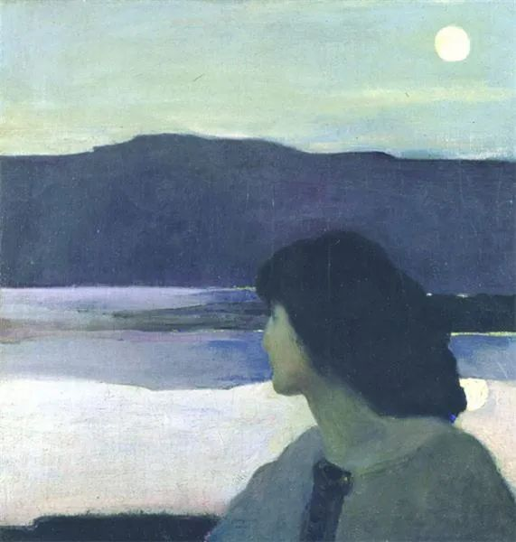

  

Arthur Beecher Carles，Silence  

  

疫情以来，两个职业的美誉度上升很快，一是医疗，没有医护人员，不可能控制住疫情。

  

二是教育，停课期间，家长们亲身感受到老师对教育的重要性。

  

遗憾的是，这都是暂时的。民意如流水，今天载舟，明天覆舟。医疗与教育是两个最容易被妖魔化的职业。疫情危机解除以后，生活重归常态，人们就会慢慢忘掉他们的重要性。

  

什么职业，都是正常人居多，医疗与教育也一样。我不赞成神化这两个职业，神化了，正常人就不能当正常人，他们就得有超能力，做正常人做不了的事情，这显然是不可能的事，至少无法持续。我更不赞成把他们妖化魔化，以为他们就是存心害人的，这对他们不公平，中国的医疗与教育，一点不弱，性价比是一流的，靠妖魔鬼怪，不可能有这样的成就。带有这种偏见的人，对自己也是伤害，你去看病，你的孩子的上学，你一副受迫害的心态，没有信任的基础，没事也能搞出事来，结果怎么可能好？

  

医生老师容易被妖魔化，是其职业特色决定的。病人与学生，更多人最后感受到的是失败，与预期有巨大的落差。

  

病人去医院，想得到健康，可是有些病，花再多钱，也治不好，或者无法根治。人生的终点，往往是在医院。总有某些疾病，比现有的医疗水平领先一步。没有这种常识的人，认定医疗能够战胜一切疾病，没把我治好，那肯定是医生的失误和黑心。

  

家长把孩子送进学校，对他的人生预期，往往是北大清华，飞黄腾达。按照这个标准，多数孩子是失败的，能受高等教育的学生总是少数。但是家长们又不想放弃这个高标准，接受义务教育的正常标准：孩子们经过义务教育，脱盲了，对公序良俗有基本的认知，具有一定自学能力，可以成为一个自食其力的人，就是成功。

  

一个学业出色的孩子，如愿上了好大学，是几大要素的合力促成。最重要的是遗传，天才是天生的；其次是家庭，有爱有知识的家庭，孩子的成才率一定高；最后是老师的作用。而一个孩子学业“不成功”，检讨起来，没有哪个家长会说：我们把孩子生得不够聪明，我们的家庭教育不太给力。找到的原因，基本都是老师不负责任。这种心态，遇上被媒体引爆的个案，马上烈火燎原，上升到了对老师群体的否定，对中国教育的否定。这种思维方式，没人是赢家。学校与老师，教学目的改为避免一切可能的矛盾，把标准越降越低，不管孩子，没有作业，人人高分，孩子肯定开心，也能满足家长的幻觉。到了大家都追求这种假象时，教育就完蛋了，整个国家也失去希望。

  

没人是神。我们自己不是神，如果是，我们就无所不能，不需要医生老师。医生老师责任很大，但他们也是常人，得允许他们犯常人会犯的失误，他们不应承担无限责任。神化与妖魔化他们，都是在不负责任地毁掉他们，到最后，我们不会有好的医生，也没有好的老师。

  

推荐：[未来有风险，而这是好事](http://mp.weixin.qq.com/s?__biz=MjM5NDU0Mjk2MQ==&mid=2651632658&idx=1&sn=19d18e0caf85ef048233330a755f8dfd&chksm=bd7e300c8a09b91a1b5e1450d4e9b60c46e717eebf5a696521ff8ace20a453c93fffc3be3b7d&scene=21#wechat_redirect)

上文：[什么是好作文？](http://mp.weixin.qq.com/s?__biz=MjM5NDU0Mjk2MQ==&mid=2651642195&idx=1&sn=558d8b5d2c694766d3ca229ccba94e95&chksm=bd7e5d4d8a09d45bc8aa0ef5c04a486c9b196ae917c8f17332e934531f61e19df3b93d9b22bf&scene=21#wechat_redirect)
