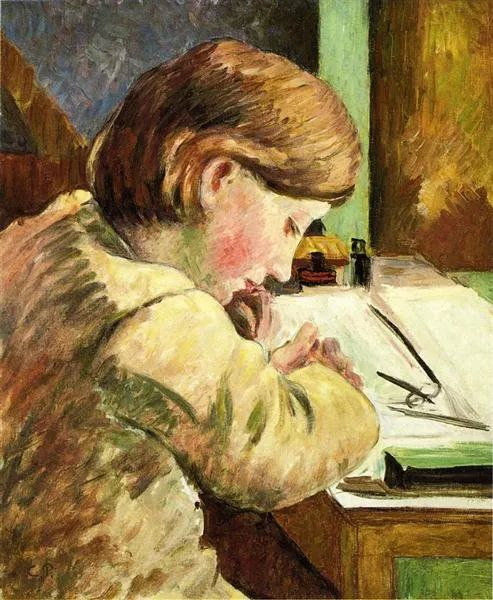

  

Camille Pissarro，Paul Writing

  

作文约等于语文教育。作文好，语文成绩未必好。但语文好，作文不可能不好。  

  

受完义务教育，甚至大学教育，写不出像样文章的人，比比皆是。所以说，语文教育是很难的，但是，因为人人都识字，颇看了几篇爽文，个个都以为自己能够指点语文老师，这是语文教育最大的不利所在，大家不太尊重语文老师的专业性。数学老师，到了小学高年级，家长就知难而退了。

  

一个负责任的家长，在否定孩子的语文老师之前，先想想自己的作文水平，上一次写文章是在几年前？再想想自己的阅读水平，上次读完一本书，是什么时候？如果都想不太清楚，那建议尊重语文老师的专业，孩子的语文水平更多得指望老师的教育。当然，这不是意味着文章好，爱阅读的家长，就可以轻视语文老师，他们更知道语文学习的不容易，只会更尊重专业人士。

  

语文水平的增长，很难，是漫长的过程。每一位老师，每一本书，不过在接力而已。得尊重这个学习规律。老师点拨一下，读了几本书，语文就好了，这种急功近利的想法不科学。或有针对应试教育的一些小窍门，但作文水平的获得与提升，非一日之功，没有捷径。而且，对好文章的理解，必须有阅历，在你勤奋阅读与写作的前提下，不到40岁，好文章放在你面前，你也欣赏不来。

  

小学生对好文章的理解，一般就是词藻华丽、情节曲折、思想深刻。一般人对好文章的理解，也停留在这个阶段。有时候，不值一提的小事，或者小概率的意外，写作者“思想深刻”起来，非得出惊悚的结论，不批一通中国人的劣根性，不把天写塌下来，誓不罢休。这就是小学生作文后遗症。

  

好的文章，有几个特点：

  

首先是准确。无论是写情书，还是写论文，不走形地表达出自己的情感或观点。这点是基础，也是最难的。很多人满脑子想法，写不出来，或者写出来完全不是自己想的。大脑像被关了禁闭，起不到作用。所以，准确表达不是为了应付作文考试，而是释放出自己的思维能力。

  

其次是简洁。一句话能说清楚，不要用两句话。口语能说清楚的，不要掉书袋。简洁美，是文理相通的点，解答数学题，论证步骤少的，总是更美的。啰嗦，颠三倒四，点缀再多形容词，都是思维不清晰，沟通效率不高的体现。

  

前面两点做得到，已是好文章。

  

最后一点的要求最高，但能否达到，却不是最重要的。那就是所谓的思想深刻。一个时代，思想深刻的，一两人而已。多数人，诚实表达就好了。鲁迅只有一个。小学生作文试卷收上来，个个是鲁迅。一个国家搞点文字的人，都自以为鲁迅转世，一天至少在朋友圈送出十顶国民性大帽子。这不是思想家多，这是神经病多。这种矫揉造作，虚情假意，反而是语文不好，作文差的人最爱玩的套路，或许能拿高分，也能骗点喝彩，但最后害得自己无法诚实，一提笔就要装深沉，深沉是装不来的，于是再也不会写文章。

  

我建议家长与孩子经常写写信，至少一个月写一封。有诸多好处：一是总结双方的失误与进步，有话可说；二是文字过滤了情绪，只保留理性与爱，教育效果好；三是家长也温习一下作文有多难，对孩子，对老师，都会更宽容，更有耐心。

  

推荐：[锚定在那个柔软的点上](http://mp.weixin.qq.com/s?__biz=MjM5NDU0Mjk2MQ==&mid=2651636087&idx=1&sn=ee5eab1fbe59c3f57f0e06516e292f2f&chksm=bd7e45698a09cc7fc85b315f4ad9f9195d1084b0733cba821ffd2d95e79a2548cc8813d37afa&scene=21#wechat_redirect)  

上文：[诱惑的价值](http://mp.weixin.qq.com/s?__biz=MjM5NDU0Mjk2MQ==&mid=2651642115&idx=1&sn=a669f11fb01353ce7e5ddc96b8b8d232&chksm=bd7e5d1d8a09d40be4c6634abdbf872e107ed0fe006d46bbab9f44c8ced654b353dbdbc746e2&scene=21#wechat_redirect)
