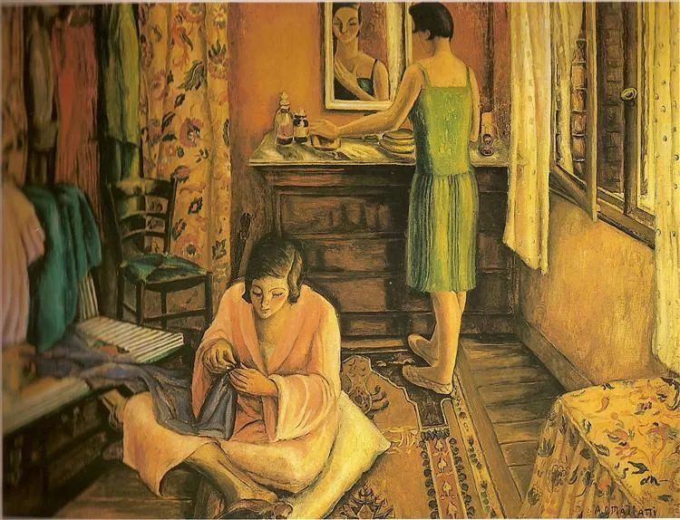

  

Anita Malfatti，La rentrée

  

几天前，有位读者朋友说，工作4年，进入瓶颈期，想改行换个工作。  

  

换工作，改行，都是很正常的事。我自己在32岁以前，在12年的间里，当老师，在检察院写材料，到第一家报社写评论，到第二家报纸当记者，换了三座城市，干了三种职业，最后才找到最适合自己的工作，就是别人眼里的没工作，自由职业，开始靠写稿养活自己，而且还要活得体面一点。一直到现在，媒介与世界，与近20年前，天翻地覆了，但我的主要工作还是没有变，就是写稿。

  

写稿这工作，我做了半辈子，还会做下去。从第一天开始，我就知道，它是个苦力活。尤其是自由职业，一日不作，一日不食，没有谁养着你。到现在也还是如此。将来也不会改变。但我挑中它，正因为它是苦力，是体力与脑力的双重苦力，是苦力中的苦力。别人不愿做，我来做，人性取巧偷懒，我来做笨活，这样一定会有我一口饭吃，吃得很踏实。

  

现在，谈风口的人越来越多，一天一个发财的大机会，再加上社交媒体无限放大诱惑与焦虑，对人的定力要求更高，不然，你就会成为风口的一根干草，天天飘着，以为很牛逼，其实只是学舌了一堆生造的概念，什么价值也没有。正因为我一直干苦力，对这些东西有免疫力，我还用它当反向淘汰法，凡是夸夸其谈，一点苦不想吃的，正经事没做过的，说得越动听，越得离远点。

  

我们寻找适合的工作，要反风口，风吹不走的，才是适合我们的。探索世界，换工作，改行，形态不停变化，但一个人的工作精神不能变。要把工作作好，总是苦的。抱着不怕吃苦的态度换工作，才能越换越好。如果只是以为别人的工作更轻松、钱更多，总是以逃避吃苦为由换工作，那越换路越窄。就是换到一个所谓的“轻闲”工作，满足感过去后，你又会苦恼，为什么我没有存在感？为什么没人在乎我？因为你的生活没有努力过。

  

这一两年，对工作机会要尤其珍惜，经济风险加大，工作机会就会变少。以瓶颈期为由嫌弃自己的工作，是常见的幼稚病，因为任何工作都有瓶颈期。有什么工作，是没有瓶颈期，一直往上飞的？那是梦中的工作。

  

所谓的瓶颈期，就是一直努力，好像也没有突破，职位仍然如此，薪水仍然如此。可是，一直努力不是应该的吗？这当然不应该理解为任人宰割，不给（少给）你报酬你也牺牲，你的报酬是否合理，有社平工资，有同行参考，你容易判断。其实，报酬如果明显高于你的努力水准，并不是好事，要么这公司很快会垮掉，你失去工作，要么你潜在的竞争者太多，你也很快会失去工作。感觉自己在瓶颈期一直努力，其实是个不错的感觉，证明努力程度对得起自己的收入，有突破当然好，没突破，被替换的可能性也低。

  

推荐：[富甲天下](http://mp.weixin.qq.com/s?__biz=MjM5NDU0Mjk2MQ==&mid=2651639127&idx=2&sn=8a7aed5911f2cad9c5784c53e7e3a23f&chksm=bd7e49498a09c05fb606b199263103513307270512521c37f4f23b8fde96495567f426687021&scene=21#wechat_redirect)  

上文：[如何改变“傻乎乎”的大人？](http://mp.weixin.qq.com/s?__biz=MjM5NDU0Mjk2MQ==&mid=2651641206&idx=1&sn=a4f262af1581421add5981f65241f9fc&chksm=bd7e51688a09d87e8880920610a40edb652da91ac55d1ef96390b67a8882a4fa1d188725191c&scene=21#wechat_redirect)
