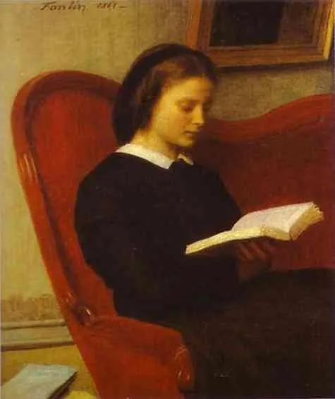

  

Henri Fantin-Latour，The Reader

  

老有家长说，我的孩子喜欢阅读，但他的作文成绩好像一般。言下之意是，这不白读了吗？  

  

这些家长太心急了。不小心，能把好事急成坏事。孩子爱阅读，或者说，能让孩子爱上阅读，这要么是老天爷的礼物，要么是了不起的引导。阅读的作用，仅仅为了作文，那就把阅读的重要性变小了。持有这种看法，那不需要考作文以后，就无动力继续阅读。很多人甚至成为有大学文凭的阅读困难者，没有能力读完一本书。 

  

阅读是比作文更基础、更重要的技能。人类社会，已经进入知识社会，人类的信息总量，每隔七八年，就翻一番，估计速度还会加快。知识是无穷的，知识交换以后，双方没有损失，只有得到，一加一大于二。知识的增加，没有天花板，没有限制，产生比有形的物质宇宙更宽广的无形宇宙。

  

芒格说，我认识的聪明人，没有不爱阅读的。其实，在知识社会，不阅读，是无法聪明的，很快会被淘汰掉。一个人天资再高，和人类社会的整体创造力比，都可忽略不计。不阅读，是人的自我禁闭，大脑锁死在既有的知识当中，这些知识过时了，被证伪了，它却仍然是你的操作系统，你最后当然与世界格格不入，怎么可能聪明。

  

在手机上浏览资讯，这不算阅读。这时大脑毫无压力，处于休眠状态，你得到的是一些零星的、碎片的、真假难辨的信息，但你又有获得知识的错觉，忙不迭更新朋友圈，展现自己的知识、正义与爱心。如果你有朋友圈有会阅读的人（一定有几个的），他可能已经摇头叹息，或者早就不看你的更新，或者把你删掉了。

  

阅读最朴素的定义就是“能把一本书从头到尾看完，无论这书是100页还是1000页，是小说还是理论”。能做到这点，以下几种能力就逐渐加强：

  

定力。阅读消耗意志力，无阅读力的人，读几分钟，或走神，或放弃，每本书，读了几页十几页就进行不下去，扔在一边，假装自己读过了。有阅读力，则能不停恢复、注入意志力，控制自己，完成少则几小时，多则几百小时的阅读工程。

  

时间管理能力。阅读需要一整块时间，也要能够整合碎片时间，瞬间进入主要任务，才能保证持续地完成阅读任务。

  

解决问题的能力。人生永远都有问题，这是人的幸运，问题引领我们，解决一个问题前进一步。不需要解决问题，那是死亡的同义词。有问题了，把相关书籍找来，看看先贤大哲的解法，看看顶尖专家的研究，他们的大脑变成你的大脑，他们有办法，你则不必重新发明轮子，他们都没办法，你也别沮丧，证明你在思考最前沿的问题，多有价值！

  

甄别好书坏书的能力。世上有很多坏书，你如果让小朋友看了色情、暴力、美化死亡的书，一定增加他的风险。你也能看到有些号称搞文艺的，一辈子在那几本哀哀怨怨、小肚鸡肠的书里打滚，似乎爱读书，但最后人味都没了。好书让人意志更强、方法更多、心胸更宽、生活更好。坏书则相反。

  

阅读者有上述诸能力，却未必一定能得到写作能力。一个好的阅读者，没有经过一定量的写作训练，未必能写出好文章。但这并不重要，阅读主要功能是得到更好的行动力，有更高效的生产力。你的孩子爱阅读，这本身就是值得开心的事，他得到一个好人生的概率大大增加了，作文，那是小事。  

  

推荐：[我为何每天感到幸福？](http://mp.weixin.qq.com/s?__biz=MjM5NDU0Mjk2MQ==&mid=2651636482&idx=1&sn=eb44a9044cd824c36eb133aee3294d1a&chksm=bd7e471c8a09ce0aac915aeb4ea5ba7f7a72b6cad9115264d59370bfe8df48688942afb21f0c&scene=21#wechat_redirect)  

上文：[两个容易被妖魔化的职业](http://mp.weixin.qq.com/s?__biz=MjM5NDU0Mjk2MQ==&mid=2651642361&idx=1&sn=6154da5cc95c25edd3a97f8f9a10fa06&chksm=bd7e5de78a09d4f1a699a051403ff9419fd53c7fa003502c8b8c87d3a4171ce0d6caac041231&scene=21#wechat_redirect)
