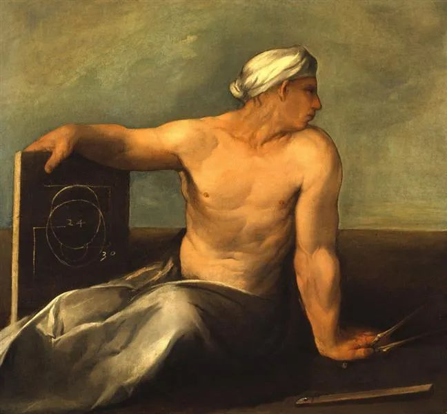

  

Dosso Dossi，A Personification Of Geometry

  

连叔：  

  

您好！

  

自我介绍一下，我是一名中考生，现正处于焦虑之时。

  

从小到大，我成绩一直名列前茅，但从中学开始，我发现优秀的我在一群优秀的人中并不起眼。初一我还维持在年级前50，心中有些落差却还较满意。初二我忙于学生会，我总认为既然不能在学习上赢得一处安生，那便在其他地方取一块净土，虽然最后如愿以偿地成为了chairman，但成绩影响之大，到现在我都再也没进过前50，且这次大考我考了我15年来最差的排名。我对自己很失望。我的考试心态使我无法发挥最好的水平，我常感慨：如果每一科都考到平常的水平，我的总分和排名会很好看。我常羡慕那些不用刷太多的题，不想学就骑着车满城玩，但静下来又有极大成果的人。我的焦虑严重影响了我的学习，我在学习时无法完全专心，在休息玩耍时又有一心挂着学习。简直是在过“学也学不好，玩也玩不好”的低效率生活。现在离中考只有一个月了，我怕考试且不知怎么调整心态。希望连叔支点招，谢谢！

  

期待回信！

  

Sky

  

* * *

  

Sky：

  

大考之前有些焦虑是正常的，你以后高考之前也会有同样的心态。你那些看起来轻松的同学，他们也会焦虑。人在面临重大挑战之前，多少都有焦虑。

  

中考，人生只有一次，不可能有经验。但是你的老师有过多次中考经验，考前一个月该教什么，学什么，节奏如何把控，他们的应对经过了实践不停的检验与调整，是最合理的，效率最高的。你跟着老师的指引走，犯错的可能性最小。好为人师的人多，就像你得了病，几乎每个人都敢给你意见，甚至告诉你秘方，但是最安全的办法还是听医生的，虽然医生的意见听起来比外行“平庸”多了，不敢把话说死，以至于你听了以为病可能好不了。

  

捷径、秘诀、不劳而获，这些往往只有外行才相信，学习越差，越以为存在这些妖术。内行，一个行业的顶尖高手，都只信奉一些笨功夫：理解基本概念，灵活运用；大量练习，培养直觉；不逃避难点，遇见难点反而会兴奋，因为解决了难点就是解决了核心问题，占了竞争的优势。

  

看见难点就逃，假装其不存在。这是学习最容易犯的错误。你以后知道，这也是人生最容易犯的错误。难点意味着最硬核的竞争，暂时可以逃，但无法永远逃，就像平时的学习，或可取巧，也有办法骗骗师长与自己，但中考高考总会来的，真正的实力才能让自己过关。

  

你是个聪明的人，聪明的人如果知道不逃避难点，往往具有智力与意志的双重优势。聪明人最难避免的坑，就是他很巧妙地逃避了难点，别人一时还看不出来。就像你，不是那么想学习，可是学生会主席的光环照样让你受到关注与喜爱。这就是聪明反被聪明误。

  

还好，你付出的成本不高，你的学习还是属于比较好的，从今开始不逃避，无论多难，也把自己的主要工作做好，你的聪明就会让你加速。学生的主要工作是学习，学习好了，其他的好，锦上添花，才有价值。学习不用力，靠别的获得关注，终究是旁门左道，美梦一场，醒了更难受。

  

知道了这个道理，以后，你工作了就会把工作做好，成家了就会把家人照顾好。不偷懒、不浮夸、不虚荣，你能直击要害，一眼看得到事情的难点，然后耐心地解决它，要5年就花5年，要10年就花3650天。

  

从今天开始就这么做。一道道题刷，一个个难点吃掉，吃掉一个就长一点力量。听老师的，如果被老师批评，自尊心不要太强，逆反尤其不能有。所谓批评，难免有些硬话，比较难咽下，认真揣摩老师的批评，它往往指向我们最习惯的软弱与逃避，一逃再逃，逃之夭夭，把他给气坏了，所以特别严重地指出来，能够心平气和地接受，进步的效率将会快得多。

  

祝开心。

  

连岳

  

推荐：[爱你，与你何关？](http://mp.weixin.qq.com/s?__biz=MjM5NDU0Mjk2MQ==&mid=2651641090&idx=1&sn=4d65c0d89a045464610a37569f5a8538&chksm=bd7e511c8a09d80a1218528a1af6acc3750a9d7382f7bd7c770311b0e0003fb7927f52a6d1dc&scene=21#wechat_redirect)  

上文：[自律4境界](http://mp.weixin.qq.com/s?__biz=MjM5NDU0Mjk2MQ==&mid=2651641885&idx=1&sn=eff60c1a3274453eeed64c26a4bce66e&chksm=bd7e5c038a09d5156799ce799463a00c2ea3a9df3f3e5d96a7ba44887d6cf5c4a337aa0e072b&scene=21#wechat_redirect)
