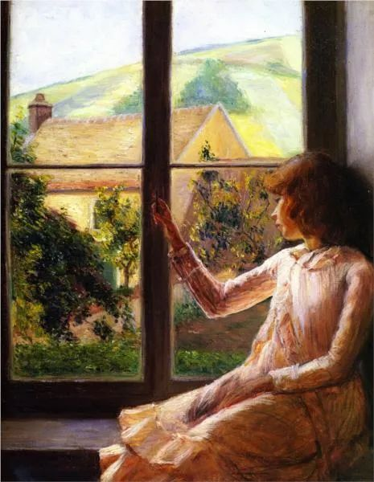

  

Lilla Cabot Perry，Child in Window  

  

连叔：

  

连叔你好！我叫连悦，是一名六年级的小学生，我看了您的一些文章后，我要有一些问题想请教您。

  

有些时候，我会很不理解一些大人的世界和他们的观点。我是一个比较固执的人，有的时候我会一直坚持我的观点，因为我可以确认他是正确的，但是大人们宁可去挑一些麻烦的或者不对的，我指出后，他们也不会承认，我就特别好奇，也不知道这是为什么，甚至觉得他们一点傻乎乎的。而且有时候家长也会非常不理解我，我希望干什么，他们偏不，有的时候他们也不理解我们的想法。我受了委屈，自己哭的时候，他们会说我们矫情，难道我们就不能自己待会，自己调整一下心态吗？我相信很多小学生是可以的，我们也只是需要一个独立的空间，独立的，不需要任何人打扰的，可是家长始终不能理解我们，是我传达的方式有问题还是家长的问题呢？我可以做到的一些事情，家长却直接否认，比如我想听歌写作业，是为了隔绝杂音，更好的进入状态，他们却觉得听歌对学习没好处，我辩解一句，他们反驳我十句，甚至不讲理的直接把电脑关上，我十分生气，但又碍于对他们的一种心理阴影（小时候父母打我比较狠，我产生了一种对他们的恐惧和阴影），不敢说，就会一直保持沉默，然后自己待着。

  

连叔，我十分不理解他们的行为，我希望您能帮我解开疑惑。

  

连悦童鞋

  

* * *

  

连悦童鞋：

  

你的父母属于霸道型的，指令不容违抗，否则，就有更多的批评，甚至直接动手。孩子往往会怕这种父母，怕的过程当中也慢慢失去了对他们的爱。

  

这类父母占比不低，我是很同情他们的。我并不恨他们，或者讨厌他们。为什么呢？他们往往有朴素的责任感，觉得要把孩子管好，把一堆规则硬塞给孩子。不负责任、不关心孩子的家长，孩子受了委屈，哭了，他们也未必知道。你的父母知道你哭了，在这过程中，还探头探脑，不停说几句——他们反应到这个阶段，都还是正常的，也是应该的，因为孩子毕竟还小，怕你承受不住委屈，做出什么伤害自己的事。

  

但你提出需要自己静静时，他们拒绝，觉得你因为小事矫情，他们这就错了。他们可能不理解孩子，值得孩子哭的事，对这个孩子来说，就不是小事，哭完心情恢复平静，也是心理建设的过程。知道缘由后，想哭就让孩子哭一会，抱一抱他们，哭完小小声聊几句天，做一个你喜欢吃的菜，有个温暖的收尾，委屈不仅会过去，还增进了感情。不知道这么做的父母，你一哭他们就害怕，怕你出什么事。这种害怕是爱的一种体现，但他们无法恰当地表达爱，只会慌张急躁地禁止你哭，甚至通过轻视、羞辱的方式：别哭了，别那么矫情！他们天真地以为，只要你不哭，事情就解决了。

  

霸道型的父母，责任感有，培养孩子的功夫也做得不会少，甚至比更成功的父母焦虑得多、担心得多，得到的却是孩子的疏远、冷漠和憎恨。吃力不讨好，失去自己孩子的爱，这当然很可怜。要过很长时间，到了你成年，知道生活不易，你或有可能恍然大悟：原来他们不是不爱我，只是不知道怎么爱。他们表现得那么凶，其实只是太弱小。

  

你观察得没错，人确实是傻乎乎的，错了认个错就没事的小事，偏偏要固执地让它变成大事。但这就是人性的弱点，它很强大。你和我，也会受这人性弱点的困扰，为了自己的面子、自尊，傻乎乎地固执于错误，宁愿伤人伤己也不回头。知道这种人性弱点，有利于自己的成长，在自己身上发作时，你可以警觉到自己正在犯错，慢慢学会控制这情绪，听清楚这情绪传达的诉求。这样也可以增加自己的同理心，你仍在依赖你父母供养时，你已生出怜悯，他们被显而易见的弱点控制得那么牢。

  

冲突发生时，有怜悯的那个人，是站得更高的。更高的人将寻找方法避免、化解冲突。如果加剧冲突，引发争吵，只会让对方更加固执于弱点，那我们就害了他。比如关于学习方法的争论，你想边听歌边写作业，家长要求你写作业时不许听歌。从科学研究的角度看，家长这个要求没有错，注意力资源是稀缺的，人很难同时做好两件事。但也无法排除你是例外。争吵不仅无法解决这个矛盾，还不利于你。这时候，你可以想得更远一点，支撑一个人话语权的，是实力。如果他们的教导，符合主流价值，比如老师也是那么说的，那就暂时听他们的，实力强了，再来谈判。

  

学生的实力，就是成绩，如果你是永远的第一名，你说，我就得听歌写作业，成绩才能好。你父母哪里敢禁止，早当成你的趣事在朋友圈炫耀。用实力说话是最轻松的。成年后也是如此，你成就大，你负责任，你的观点，你的方法，人家就听。

  

从现在开始，就可训练自己，不用抱怨、生气与泪水来提要求，用实力提要求。你只是六年级的小朋友，这个要求很高，毕竟成年人都很难做到，但开始只做到1%，就很牛了，你能慢慢掌控你自己。几年后，你能做到50%时，你都能改变你的父母。

  

祝开心。

  

连岳

  

推荐：[那些孩子喜爱的父母品质](http://mp.weixin.qq.com/s?__biz=MjM5NDU0Mjk2MQ==&mid=2651628044&idx=1&sn=7a14bcf1b10d12f76dcb914aa9d76f64&chksm=bd7e26128a09af0445569d49e12df4ddce1dcca83691faa3d00000dd9390fd0f726910a8eb26&scene=21#wechat_redirect)  

上文：[爱你，与你何关？](http://mp.weixin.qq.com/s?__biz=MjM5NDU0Mjk2MQ==&mid=2651641090&idx=1&sn=4d65c0d89a045464610a37569f5a8538&chksm=bd7e511c8a09d80a1218528a1af6acc3750a9d7382f7bd7c770311b0e0003fb7927f52a6d1dc&scene=21#wechat_redirect)
