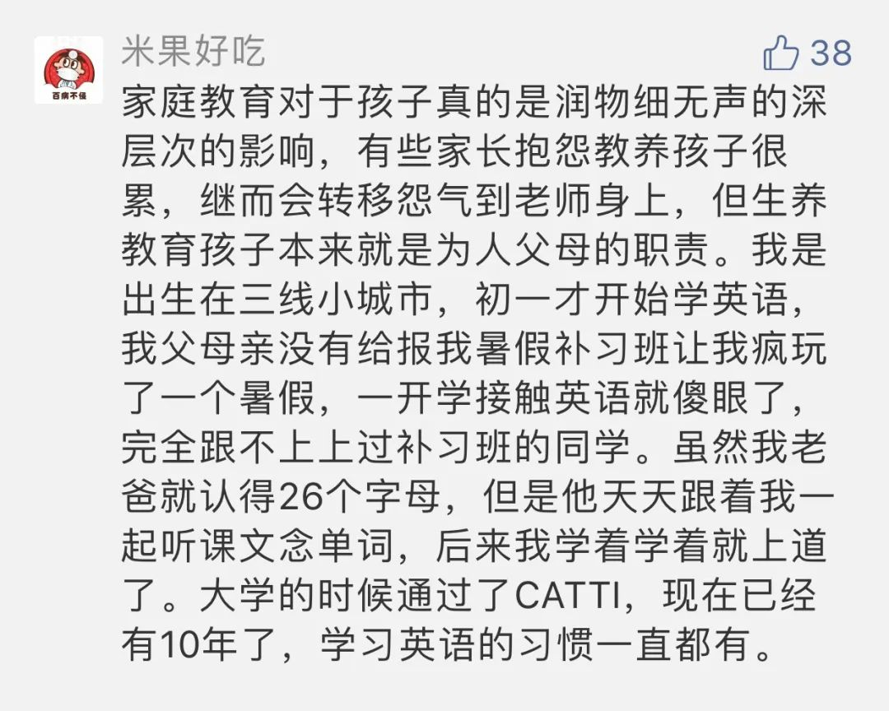

  

Ludwig Knaus，Grandfather and Grandson Talking

  

教育是个系统工程，其主战场是家庭，所以书香门第的人才产出率很高。认识到这一点的家长，领先了一步。同时也更早体会到了压力，你时时想着怎么教育孩子，当然比不管不顾的家长更辛苦。  

  

尤其是，当家长的学识跟不上孩子的功课时，更有恐慌的感觉：我知道这件事很重要，但是我做不到。孩子学业一直进步，则家长的学识总有一天无法辅导他。这是必然的。

  

没必要恐慌，影响孩子的，不是你知道多少知识，而是你的求知欲。传递知识是有限的，求知欲是无限的。一个人知道再多知识，也可以说是无知。知识总在不停地迭代，只要你没了求知欲，很快就会坠入无知深谷。

  

求知欲如何传承呢？

  

一个孩子放学回家，爸爸妈妈，爷爷奶奶（外公外婆），都在看书，家里可能连电视都放弃了。看的书，他可能不理解。但他爱上阅读，善于求知，却是大概率。久居兰室，身上有幽香。真传承，不刻意，耳濡目染而已。

  

耳濡目染是最有效的教育，因为它体现你的本质。人是最聪明的物种，沟通效率非常高，一个眼神，一个细微的动作，瞬间传递的信息，可能高达几G，这是人与人相处久了的第六感，这点，可以让真诚的人不恐慌，你的好本质，孩子总能感受得到。顺便说一声，这当然让虚伪的人恐慌。多好。

  

知道这个技能后，只要你真的有求知欲，那就不要恐慌，它一定能够传承，即使你暴露自己的无知，也没有关系。其实，学习就是不害怕暴露自己的无知。刻意掩饰自己的无知，假装无所不知，这点虚荣与自大，孩子也感觉得到，他以为这是好事，也能默默学会。  

  

下面就是例子：  

  

  

你说，这孩子过了CATTI，TA会嘲笑老爸的英文水平吗？  

  

上面这位长辈，让我想起我的岳父，他只读了几年小学，就成了孤儿，但他的求知欲到了偏执的地步，后来在企业写材料，自考了大专。退休后，又钻研市场，自己创业，发了财。他学习使用电脑时，经常某个功能不懂，就打电话问我。我回答不出来，就会劝他：爸，没必要每个功能都知道，你问的这个Word功能，我写文章从来没用过。

  

我估计他很不满意我的回答。  

  

到了后来他学习智能手机，他还是这个习惯，每个功能都要搞清楚。这个时候我就学聪明了，甩手让连太去解答。连太的观点和我一样，说，很多功能根本用不上，没必要知道，知道了也会忘掉。对女儿，不客气了，老人家就觉得敷衍，会生气。

  

我在旁边，看两个人气得哇哇叫的场景，觉得这就是好传承。因为连太不止一次跟我说过，她受惠于父亲对知识的热爱，所以从小自律。一路开挂，成为学霸——后面这句是我加的，连太谦虚，从来不承认她是学霸。  

  

作为父母，起点低，没有关系，你成为一个求知者，这最重要。求知者的求知，无止境。和孩子一起求知，这是求知的基本体现，一是温故知新，二是以新带学，让孩子带领自己进入新知识。比如学习第二语言，基本是孩子在带领父母，此时父母有热情，有勇气，有恒心，将给孩子带来巨大的自豪与动力。每天和孩子一起打卡，比赛分数，共同感受学习困难，也共同战胜学习的困难，何须多说，孩子分分钟感受到你的爱，你的力量。

  

  

  

****▼**** 点 **阅读原文**, 用学英语传承求知欲。
