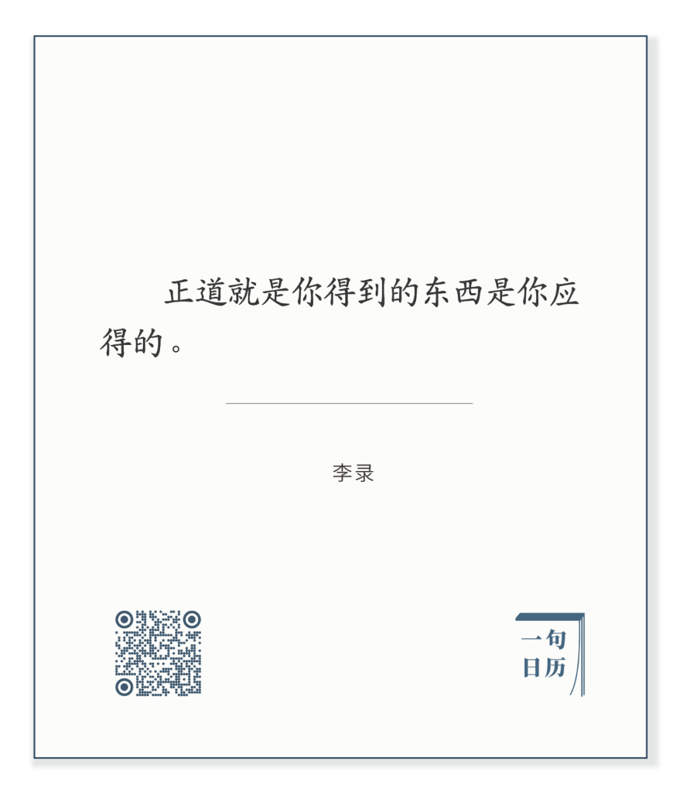

  

Jean-Leon Gerome，Bonaparte Before the Sphinx

  

长按二维码可关注  

  

一个人的得到，有应得不应得之分。

  

不应得的。或利或名，给你幻觉，把你高高举起，重重摔碎你。痛苦加倍。

  

当然，得到的人，几乎都认为自己应得，直到有人被摔碎，才被迫接受那是自己不应得的。

  

所以，要知道应得的标准：

  

它是可以公开说出来的。作弊，撒谎，盗窃，欺骗，陷害，或可让人暂时得利，但无人敢承认。

  

它是让他人也得到的。你可以利用自己暂时的优势，唯我独尊，迫使他人牺牲。但他人会成长，你优势可失去，更强者永远存在。你或被抛弃、或遭报复。

  

它是需要维护的。知识会过时，财富会贬值，健康可失去，爱情能消逝。得到不能终止，因为失去一直在进行。

  

所以，它是需要流汗的。得到都需要付出一定的汗水。该流的汗水越多，你要越开心，这才是真正的护城河。

  

今天是第131期“下周很重要”，制订你下周流汗的计划，得到你应得的，走你的正道。

  

推荐：[活出生命的意义](http://mp.weixin.qq.com/s?__biz=MjM5NDU0Mjk2MQ==&mid=2651638700&idx=2&sn=b46d16f5c56b375022198c2a54bca16c&chksm=bd7e4fb28a09c6a480678e01ea154caf4a4a4cb5c7191da6f1048355f5fb27810888c00a7c7d&scene=21#wechat_redirect)  

上文：[应试，我有句话可以缓解焦急](http://mp.weixin.qq.com/s?__biz=MjM5NDU0Mjk2MQ==&mid=2651642671&idx=1&sn=fd776bb74532a7e42780aa7a3fdae96f&chksm=bd7e5f318a09d6273df5d7b41c78fbd4fb9b2b6f61d6c06ace15d5efa157dd268f165b9c26ec&scene=21#wechat_redirect)
