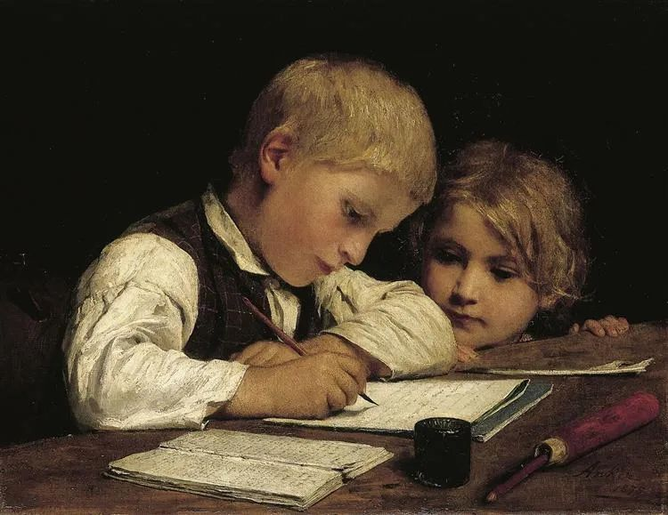
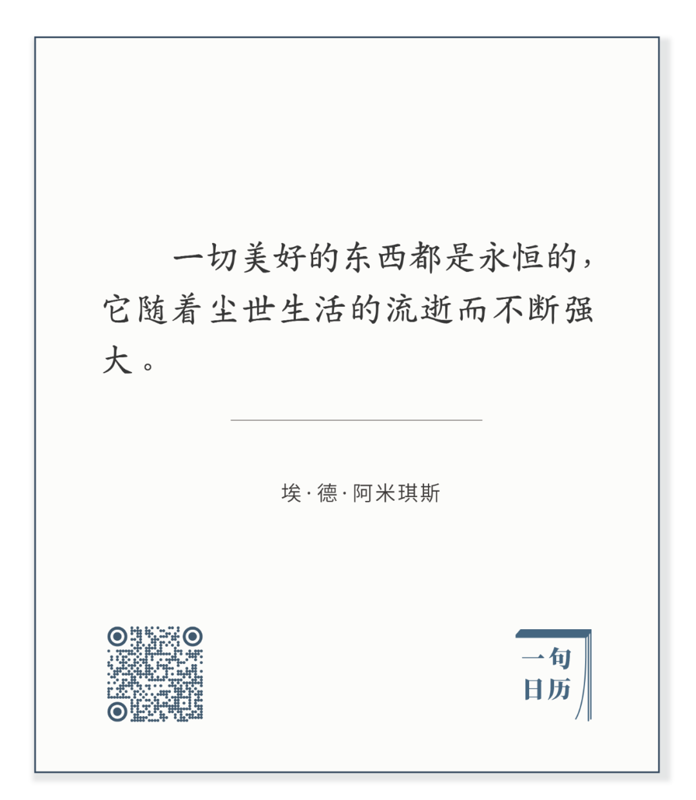

  

Albert Anker，Schreibender Knabe mit Schwesterchen

  

更好地规划未来，重点不在于想象什么会变，在种种风口中迷惑，为变而变；应该采取相反的策略，想想时间不会改变什么，那才是你需要坚持的。不变的东西，往往显得不那么时尚，不那么容易，笨笨地得到一点点。但是只要看清楚了，有定力，一点点是未来的万千点。  

长按二维码可关注

  

拥有美好的东西，你随着时间的流逝变得更强大。1908年去世的阿米琪斯，用自己的创作证明了这点，创作是美好的，过去、现在、未来，人类都需要创作。他的《爱的教育》，虚构了意大利一位四年级小学生恩利科一学年的故事，1886年发表后，立即轰动。

  

发表即轰动的书，可能只是幸运，未必有足够的美好战胜时间。100年后，1996年，联合国教科文组织把《爱的教育》正式列入《具有代表性的欧洲系列丛书》之中。它现在也是中国《教育部基础教育课程教材发展中心中小学生阅读指导目录》中的书籍。这本书已经突破了时间与空间的界限，其美好充盈一切。

  

有理由相信，中国的父母大多数没有读过这本书，包括那些想当然批评中国教育的父母。我常想，父母们跟着孩子，把《中小学生阅读指导目录》里那几百本书读完，素质与见识，都非常人可及。世上的烦恼，多如杨绛所说的：书读得太少，却又想得太多。

  

《爱的教育》表述的核心很简单，在受教育过程中，一个人最核心的是学会爱。恩利科出生于一个富有教养的家庭，但关于什么是爱，他在与同学、老师和家人的互动中，也得不停地学习与体会。爱需要观察、敏锐、勇气、怜悯、担当、耐心、克制、才能……它包含一切美好。恩利科在指引下，慢慢学会在生活细节中表达爱，比如在一位刚刚失去母亲的小伙伴面前，他敏感地体会到母亲巧妙拒绝他热情拥抱的用意：这样会刺激这位小伙伴，让他更加悲伤。

  

理解爱，并坚持爱。这样的教育就是成功的，永恒的。这样的人生，当然也是成功的。正如书中老师对恩利科所说：不成功有时并不是缺少才能，而是缺乏耐力造成的。

今天是第129期“下周很重要”，用爱指导你的计划，写下你想坚持的美好小事，让计划实现你的爱。爱能在这些美好的小事中生长，你身边的人与土地，能感受到你的爱，那才是真正的、永恒的爱。

  

推荐：[那些孩子喜爱的父母品质](http://mp.weixin.qq.com/s?__biz=MjM5NDU0Mjk2MQ==&mid=2651628044&idx=1&sn=7a14bcf1b10d12f76dcb914aa9d76f64&chksm=bd7e26128a09af0445569d49e12df4ddce1dcca83691faa3d00000dd9390fd0f726910a8eb26&scene=21#wechat_redirect)  

上文：[说说地摊经济，最顽强的商业模式](http://mp.weixin.qq.com/s?__biz=MjM5NDU0Mjk2MQ==&mid=2651640825&idx=1&sn=e7f6c0ed556bf1def26a8d868412dde0&chksm=bd7e57e78a09def1da60c4911eeae19633a19f688785c5376a611b8aca75564b9eb623aff00f&scene=21#wechat_redirect)
