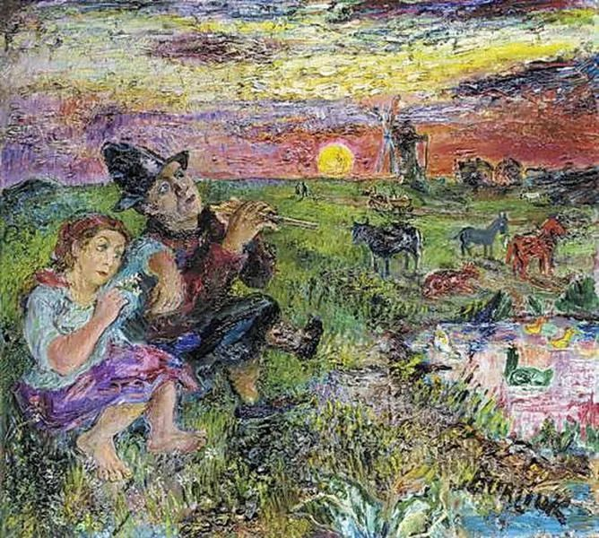

  

David Burliuk，A song of youth

  

连叔您好！  

  

我是一名九岁小学三年级的学生。自从开学以后我就自称我坐了一个黄金位置，因为我坐在了我喜欢的女同学的旁边。可是好景不长，6月3日中午，我们的班主任就要求我们两个人换位置。下午，我要重新写一篇作文，我就想借她的作文来做参考，可她想都不想，就直接说“不行。”晚上，回到家以后，我就一直骂她忘恩负义，因为在这之前，我每天都带一本书借给她看。

  

第二天，我想都没想就直接用红笔在手掌上写了“我要和你绝交！”这几个字，走过去给她看。她满脸笑容地说：“好的，友谊的小船就这样被风浪打翻了。”我马上就后悔了。这几天我想理她她也不理我。请问连叔，要怎样才能让她再理我呢？

  

轩轩小坏蛋

  

* * *

  

轩轩：

  

你自称小坏蛋，看来真的挺后悔。

  

我能理解这后悔，从你简单的描述来看，这位女同学不简单，不自觉地喜欢她，想和她当朋友，是很正常的，估计不止你一位男生喜欢她。

  

从我这个成年人的角度看，她的过人之处有两点，是很多成年人都做不到的：

  

一是她坚持自己的原则，敢于拒绝别人。借不借作文给你参考，就像借不借钱给你一样，肯定是她的权利，不借并没有错，有很多正当的理由，比如写的内容不想让你看，或者她认为不符合老师的要求。如果她本来不想借，但碍于你一直示好，违背内心勉强自己借你，那太像一个普通人了，反而降低了她的可爱度。

  

二是她遇上大事很镇定。面对你的绝交宣示，一般人的反应多是生气、震惊、悲伤，情绪起伏很大。但她笑容满面地接受，很有风度。

  

她宠辱不惊，你给她甜头，她不违背自己的原则；你给她威胁，她也不惊慌失措。你怎么变，她都是她，并不会迎合你。我挺佩服你看人的眼光，这样的女同学，确实值得亲近。

  

知道并欣赏一个人的优点，想得到她的友情，唯一办法就是配得上她，双方实力要相当。我们一辈子，通过这种方式，能从许多好朋友身上学到他们的优点，因为不想失去朋友的爱，我们会变得更好。

  

所以，你也要成长为宠辱不惊，有大将风度的男生。她不借你作文这种事，以后不仅不能生气，还应一笑置之，毕竟，你借书给她看，不是为了控制她，急吼吼地求回报。况且，她看你的书，未必就是得你好处，相反，可能是她给你好处，因为，她可能并不想看那些书，她可能并不缺书看。成年人也常有这种认识误区，把我认为的好当成大家认为的好，比如认为我请你吃一顿饭，你就欠我人情，可是别人又不差这顿饭，花时间陪你吃饭，说不定才是给你人情。你现在学会换位思考，长大后就不会犯这种愚蠢的错误。

  

一个强大的人，爱人，对人友好，不是出于算计，每笔都要挣点小钱。那是受他们的本质驱使，强大就是输出爱，输出友好。就像太阳只会发光，它温暖你，不指望回报。爱的最高境界，就是爱你，与你何关？不过是因为我觉得对而已。

  

失落，伤心，甚至被背叛，难免会发生，因为这种事，我就变成一个令人讨厌的人，那是弱者的做法。强者，宠辱不惊，环境如何，他人如何，我总是在发光的。

  

从先当一个强大的小学生开始，首先，专业要强，小学生的专业是学习，学习努力，成绩出色，天然容易获得友情。

  

其次，该认错就认个错，只有强大的人才不怕认错，找合适的机会向她道个歉：对不起，我太冲动了。当然，她若不原谅你，或者你们的友情没有恢复，你不要又生气：哼，我都道歉了，你为什么还不对我好？那样就又犯同样的错误了，指望他人和世界按自己的要求做。

  

专心做对的事就是了。暂时的不满意，要像你的女同学一样，以笑容回应。这样的人，谁都想当他的朋友。

  

祝开心。

  

连岳

  

推荐：[讲理规则](http://mp.weixin.qq.com/s?__biz=MjM5NDU0Mjk2MQ==&mid=2651628016&idx=1&sn=f9cc3d346e19c2497cdb9a5d79bd9e42&chksm=bd7e25ee8a09acf849429a3bb13361ef1e377a0fa67fa5bb918213ea9fdcf247538cf578756c&scene=21#wechat_redirect)  

上文：[爱的教育](http://mp.weixin.qq.com/s?__biz=MjM5NDU0Mjk2MQ==&mid=2651640981&idx=1&sn=87e14cdaa8c858ca1e568ec71779fbd3&chksm=bd7e508b8a09d99de10ba66f42fd6f705b0dd8028b0098c23ce8b59fcfa2d4517ba932bec42a&scene=21#wechat_redirect)
