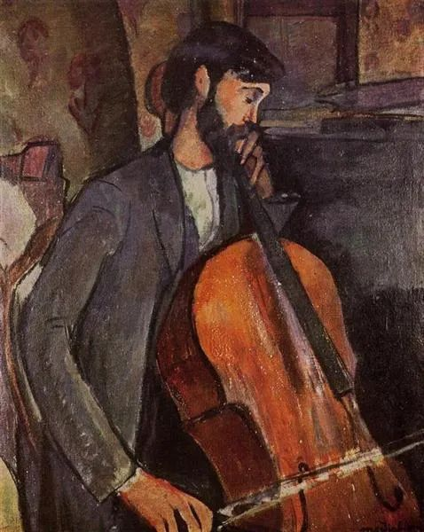
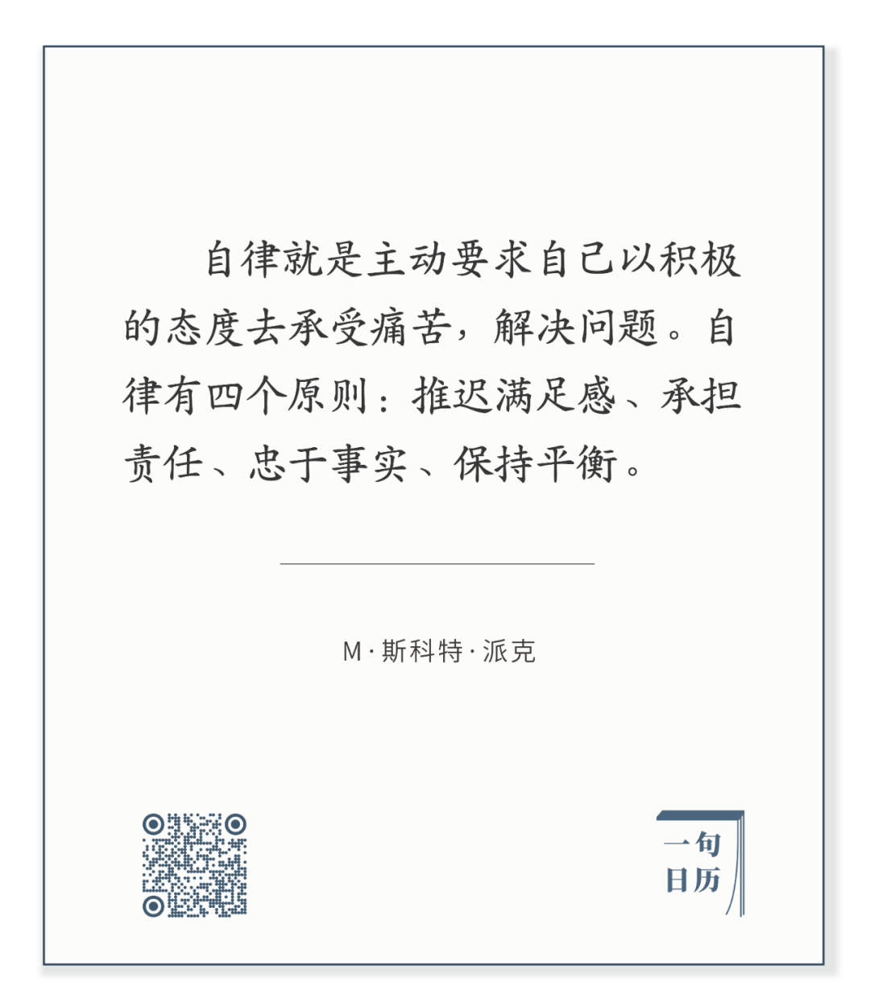

Amedeo Modigliani，Study for The Cellist

  

  

长按二维码可关注  

  

第一境界：推迟满足。这更多体现为肉体的痛苦，学习、锻炼、节食、都转化为某种身体的压力，它迫切地希望得到放松与满足，将大脑从工作状态变化享乐状态。

  

第二境界：承担责任，意味着在更长时空里的推迟满足。责任可长达一生，仅仅让自己爱的人过上体面的生活，都意味着数十年努力工作、积蓄、投资与还贷。有人不满，难道我这辈子就是为了还贷吗？如果要负最基本的责任，可以把问题如此简化。人之所以愿意承担这种长期的苦役，就在于他想负责。

  

第三境界：承受改变的痛苦。我们面对无穷的未来，无穷的知识，它们必定带来无穷的挑战，迫使我们有限的观念做出调整与改变。否定自己是极其痛苦的，固执于错误也可以过完一生。根据事实改变自己的观念，这是最难的自律。但这也是人可以持续进步的最大动力。

  

第四境界：享受自律。这是最容易被遗忘的最终境界。痛苦不能成为目的，它毕竟只是手段。自律过头，为自律而自律，永不实现满足，那成为吝啬鬼。钱不是永远用于投资的，有一部分必须满足家人的享受，更好的房子，更好的车子。时间不是永远用来学习的，有一部分必须“浪费”给所爱之人，一起吃饭，聊聊天，散散步。我不只是我的，我美好的那部分，必须与你共享。

  

今天是第130期“下周很重要”，写下你的计划，走到自律的每一境界。  

  

推荐：[我为什么这么高兴？](http://mp.weixin.qq.com/s?__biz=MjM5NDU0Mjk2MQ==&mid=2651640981&idx=1&sn=87e14cdaa8c858ca1e568ec71779fbd3&chksm=bd7e508b8a09d99de10ba66f42fd6f705b0dd8028b0098c23ce8b59fcfa2d4517ba932bec42a&scene=21#wechat_redirect)  

上文：[这世界会变好，但要补上漏洞](http://mp.weixin.qq.com/s?__biz=MjM5NDU0Mjk2MQ==&mid=2651641741&idx=1&sn=c6f6286c32502497dba8530772164c92&chksm=bd7e53938a09da854919b603fd350767a4093f461f5223d9f06538ef6720a4eba8c73ce0da86&scene=21#wechat_redirect)
