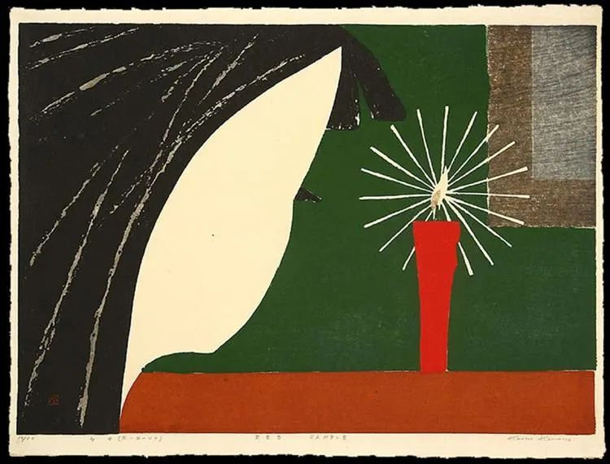

  

Kaoru Kawano，Red Candle

  

前几天，有大学生考试作弊被抓现行，不久后跳楼自杀。一直有读者让说说这事。  

  

坏事发生以后，人本能地想找一个责任者。人依赖因果律，有结果了，就一定需要一个原因。其实，不少结果是没有原因的，不少问题是抗解的。知道这点，可以让自己冷静一点，遇事更镇定。避免社交媒体时代容易产生的坏习惯，一有事情发生，仅凭一些难辨真伪的碎片信息，人人争着表态，非常轻浮地论断他人，最后站队争吵，开始说脏话，曝隐私，放谣言，一地鸡毛。

  

监考老师抓作弊，责任所在，不抓才不正常。作弊的学生理应被批评，被处分，这也毫无争议，不然，没有规矩的学校如何保证正常教学？被处罚，觉得羞愧，没面子，也是正常反应，知耻而后勇。我太知道这种心情了，我高中因为在宿舍偷抽烟，被抓现行，一张处分书大大地贴在墙上，几十年过去了，这事还让高中朋友们善意地调戏。

  

每年被处分的学生很多，因此而自杀，这是无法防止的意外。有些学生，可能因为一句批评，一句有歧义的话而自杀，甚至毫无由头就自杀了，有什么办法呢？没有办法。学校只能继续按照规律办学。

  

孩子没了，家长埋怨学校几句，只要不是胡搅蛮缠，怎么能够指责呢？那只不过是悲伤的一种体现方式罢了。

  

这类事情发生，对旁观者有什么提醒的话，那就是自杀不是解决问题的方法，自杀只是让自己爱的人过得更难。一个人活得坚强一点，开心一点，幸福一点，不仅仅是为了自己，更是责任感，这可让那些爱自己的人放心。

  

不要去伤害自己爱的人。人生不过只是不停加深理解这句话。理解了，当孩子的，就会努力学习，不糊弄父母老师；当父母的，就会关爱陪伴孩子，不嫌弃他笨他不如别人；当丈夫的，不再觉得买房买车好辛苦；当妻子的，也更能体谅自家男人的不容易。

  

不伤害自己爱的人，有这习惯，你也更容易不伤害陌生人。己所不欲，勿施于人。自己被人冤枉，被人乱judge，不舒服，就不爱judege别人。季羡林先生说过，年轻时，以为“半部《论语》治天下”是胡说，年纪大了，才知道半部《论语》足够了，甚至不要半部，只要实行“己所不欲，勿施于人”，就行了。

  

正如特里·伊格尔顿在《人生的意义》中得出的结论，经过现代后现代一通混乱与迷惑，人生的意义这个大问题，最后复归为日常生存的平常事务，它不是什么令人震惊的启示，而是正直的人都能做的事，不外乎给饿的人食物，给渴的人清水，尽力抚慰伤痛。这些简单的事不容易做到，我们看得更多的，是笑人穷，妒人有，别人得到的全靠运气，我得到的都是实力，双标满天飞，个个是上帝，以为世界太糟糕，其实不过是自己太糟糕。

  

爱别人，可能难度太高。但一个人至少可以淡定一点，少点judge，不要毁自己，不要毁别人，这样的人，就已经很可爱了。

  

推荐：[人生的意义是什么？](http://mp.weixin.qq.com/s?__biz=MjM5NDU0Mjk2MQ==&mid=2651640768&idx=1&sn=4d12e0104fa869f5b4f0ef70ad790e6a&chksm=bd7e57de8a09dec8fd0922d64460089325bcc45ac72b86340a8ebec203a368efad4cd1f9c0e9&scene=21#wechat_redirect)

上文：[当老师，不当上帝](http://mp.weixin.qq.com/s?__biz=MjM5NDU0Mjk2MQ==&mid=2651641427&idx=1&sn=9c298a132b532df5ae38e6392d383e58&chksm=bd7e524d8a09db5b6b6e4f32a79c5ab086dea8977b842a7d8bd0873d316f8f2f9dabdb920a4d&scene=21#wechat_redirect)
