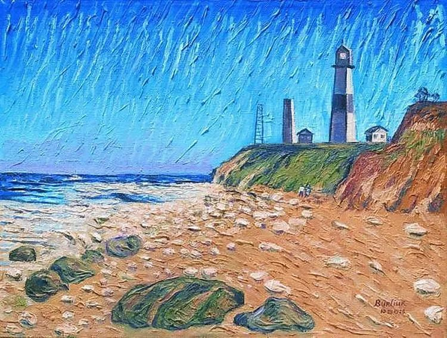

  

David Burliuk，Lighthouse on the Coast

  

这几天，最重要的事情之一，是颁布了《海南自由贸易港建设总体方案》。  

  

《方案》很长，有些条文也得反复推敲才能理解透。多数人未必有耐心读。但其核心精神，却人人能懂，尤其是从事过一点商业活动的人。零关税，低税率，简税制。换言之，你在海南做生意，办企业，可能交世上最低的税（也只有达到这个目标，自由贸易港的竞争力才强），同时，它还背靠世上唯一的、统一的14亿人大市场。这其中的机会，看不明白，才不容易。

  

利益，才是真正的、永远的世界语言。只要能获利，人们会放下意识形态、宗教信仰、文化与生活的一切差异，达成合作。短期，可能意识形态挂帅，一旦存粮吃完，人总要务实地赚钱。《海南自由贸易港建设总体方案》释放出的改革开放与海量机会，必然吸引实干者。己欲立而立人，己欲达而达人。推己及人，追求共赢。这可以用来解释商业精神，这也是交朋友的最好方法。

  

与此相对，特朗普在闭关锁国，要把大美国变成大清国。这位商人出身的总统，本来让人充满期待，任期之初，也成功地减税。可是后来的作为，越来越反商业精神，只要自己获利，可以撕毁一切合约，损害合作者利益。在疫情与暴乱的双重挑战中，更是反智妄为，手足无措，只剩下甩锅和大棒了。这么赤裸裸地损人利己，这么愚蠢地损人损己，再强大的美国，也经不起折腾多久。他想孤立与封锁中国，怎么做得到呢？跟着他，只负责吃亏与背锅，怎么会有小弟？中国有机会，美国的企业也会千方百计到中国，更别说其他国家的企业了。

  

能孤立与封锁中国的，只有中国自己。正如除了特朗普，没人能把美国搞得如此尴尬。

  

特朗普越整中国，中国越开放，越按市场规律办事。某种程度上，得感谢有这样一个强硬的、不讲理的“外敌”，从香港到疫情，处处与你为难，你才不会“死于安乐”， 在忧患意识下不停地寻找市场机会，从地摊经济回归到建立自贸港。以改革化解风险，以开放回击封锁。

  

当然，普通人一听到这《方案》，第一时间想到的也许是去海南买套房子。不过，这政策是不可能演变成炒房的，那样就把它做小了，浪费了一番美意。房住不炒，房地产变成有限市场，房子人人可以买，共享发展红利，但份额只有一两套，不买可以放弃，多买没门。这种政策不会改变了，越是热点地区，越不可能改。想做事的人，倒是应该仔细研究一下《方案》，海南自由贸易港的建设期长达30年，它若实验成功的话，有充足的时间参与。

  

推荐：[说说香港，都该醒醒了](http://mp.weixin.qq.com/s?__biz=MjM5NDU0Mjk2MQ==&mid=2651636048&idx=1&sn=fe8779a5b2f38c138259ce47c814387e&chksm=bd7e454e8a09cc58575cc49f036f847b11f044195e497abeebf2d1d3058c1dbeed72a30d6923&scene=21#wechat_redirect)  

上文：[很长很长的第三次“世界大战”开始了](http://mp.weixin.qq.com/s?__biz=MjM5NDU0Mjk2MQ==&mid=2651640645&idx=1&sn=c3662c2f0815db3119be4d7c72928593&chksm=bd7e575b8a09de4d0dc384428abcba22fe62fc90c7cde7e788a1f7b87c6987c29dd204d93da8&scene=21#wechat_redirect)
