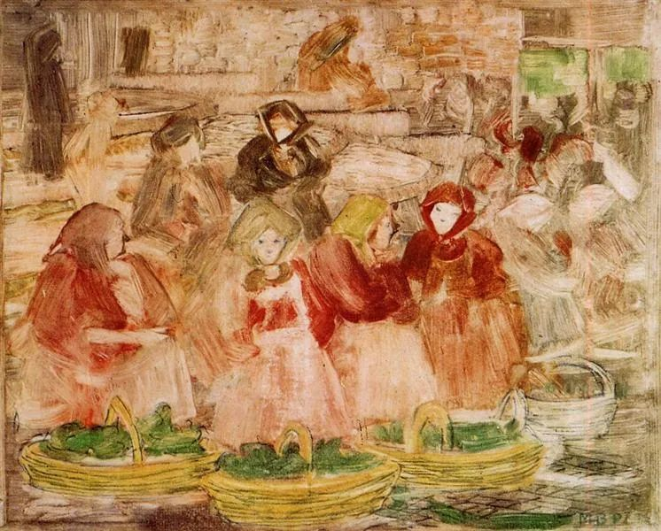

Maurice Prendergast，Market Scene  

  

总理点赞地摊经济以后，一夜之间，地摊经济在全国复苏，城管相应的工作内容都来了180度的转弯。

  

管理者原来不喜欢地摊经济，是有理由的，它确实有些不好的后果：污染、扰民、质量与卫生很难监控，最主要的是，收不到税。只有成本，没有收入。禁止当然是最本能的选择。

  

门店经营者，对地摊经济的竞争，也不可能高兴。他们的成本高得多，店租、税费、各种证件的取得。地摊好过了，他们就难过一些。

  

地摊经济复归以后，不好的后果及不同类经营者之间的矛盾，多少又将重现。但这些问题只能在行动中解决。接下来，门店经营者的成本怎么下降，以确保他们的生存？城市怎么不变成脏乱差？又考验管理者的水平。这些挑战，管理者都承当走了，工作他们做，骂声他们承当，好处我们得，我是乐见重启地摊经济的。

  

地摊经济，就是最传统的经济模式，人人可以无门槛地做生意。有农村生活经验的人，知道“赶集”，在固定的日子，一般按照农历，比如逢一逢五，集市就自发形成，农副产品，日用百货，都在这里摆摊交易。你家母鸡多生了几个蛋，菜园多收了点菜，自己吃不完，就可摆在路边换点零用钱。

  

上个月，为产品的事，我跑到一个小镇，恰逢赶集。我想当然以为被无孔不入的电商杀掉了的市场，还像我小时候那样热闹，还是那些种类，还是密集的人流，现场拔牙的极简版牙医也还在。我看有人在抢购大鸭子，便宜得不可思议。很多传统的商业模式，生命力很顽强，降低成本的能力也超级厉害。

  

事后想想，我本不应该感到意外。我现在居住的城市核心区，楼下路边常年也有一个老头，每天用单车载着两筐时令水果和一篮鸡蛋在卖，都做出口碑了。傍晚时分，也常有一辆五菱车装满水果蔬菜来摆摊，走的时候，地板干干净净，对环境非常友好。

  

人人可以上手的地摊经济，马上可以解决的，就是现金流问题，现金流像氧气一样重要。极端一点的情况，比如你今天伙食费都没了，你在家里找几件东西，去路边摆个摊，就能换成钱，暂时的难关就过了。原来不合法，你不敢，也觉得丢脸。现在你还可以拍几张照片在朋友圈秀一秀。

  

法律的许可和政府的鼓励，是塑造现实的巨大力量。人人可以摆地摊做生意，等于人人多了一个谋生技能。精英阶层、高收入阶层，地摊经济，可能只是时髦谈资。人均月收入1000元的阶层，在经济的风险与压力如此大的当下，这种做生意的便利，却是续命的良方。

  

也许地摊经济只是暂时的，疫情结束，世界太平之后，又重新加强管理。也许摸索改革出了一条新路，人人可以接受的新地摊经济出现，它将长存、壮大。或许达到一个新的平衡，城市要美，但不是偷懒的禁止之美，而是加上了活力便利之美的美。无论如何，想办法向市场要答案，拼命度过难关，这种努力总是对的，接地气的。我们应该这样努力。

  

推荐：[没有爱，就没有教育](http://mp.weixin.qq.com/s?__biz=MjM5NDU0Mjk2MQ==&mid=2651640696&idx=2&sn=89d737d616de654ed1ca029b5874b7e9&chksm=bd7e57668a09de70c51890ba0707c175281b5389135f77f144acc6943b7a328e5d0e7916ddc3&scene=21#wechat_redirect)  

上文：[人生的意义是什么？](http://mp.weixin.qq.com/s?__biz=MjM5NDU0Mjk2MQ==&mid=2651640768&idx=1&sn=4d12e0104fa869f5b4f0ef70ad790e6a&chksm=bd7e57de8a09dec8fd0922d64460089325bcc45ac72b86340a8ebec203a368efad4cd1f9c0e9&scene=21#wechat_redirect)
