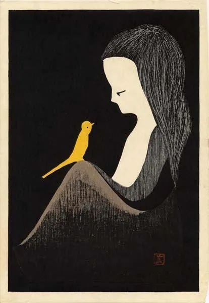
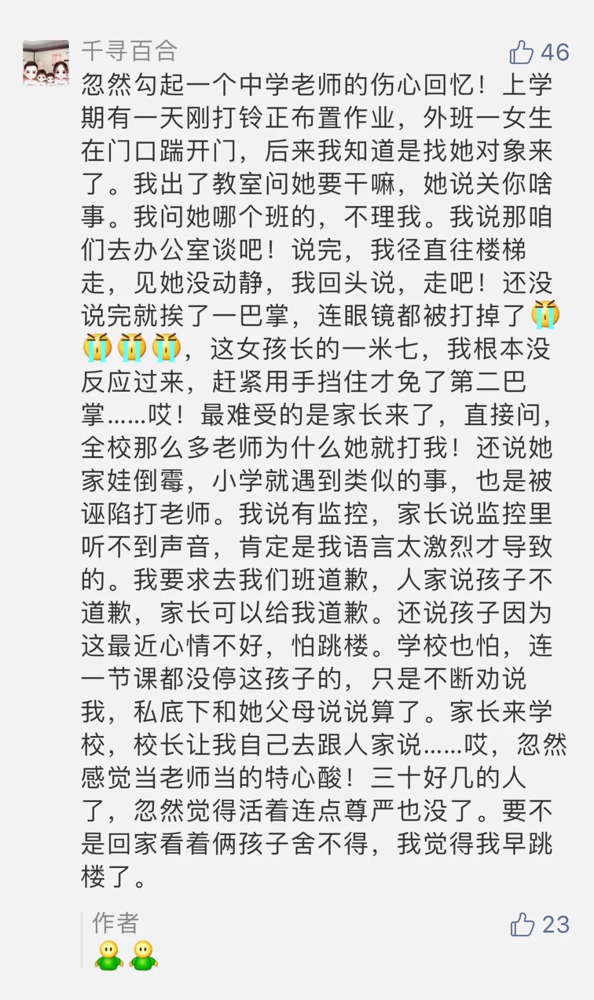

  

Kaoru Kawano，Yellow Canary

  

这世界会变好吗？  

  

当然会。

  

为什么这么肯定呢？因为强盗小偷生了孩子，他们也不想让他们当强盗小偷，也想让他们有体面的职业和体面的生活。黑帮在其小圈子里，要讲义气，拜关公，内部没有诚信，也很快会解体。我们很讨厌伪善的人，但伪善的人之所以伪装成善，不就是因为善是人人爱的吗？指导人的最底层的逻辑，都是相通的，即所谓公序良俗，从这点来看，人类社会总体是坏不了的，某一代人再糟糕，他们的后代也趋向于变好。

  

心理学的科学实验也证明，婴儿在12个月左右，就会喜欢一些准则，包括喜爱公平与帮助他人，厌恶阻碍他人与伤害他人。可以认为，这些道德准则是天生的，没有它们，种族就无法延续，社会就无法正常运行。大多数人不犯罪并不是因为害怕警察与监狱，而是因为行善令自己快乐。

  

说上面这些话，主要是为了安慰一个受委屈的老师：

  

  

人类整体的善，无法排除个别人的穷凶极恶，总有变异。而且我同意季羡林先生的说法，有些坏人是不会变好的。对于这种坏人，吃一次亏，最多两次，我们就要下决心隔绝，不要缠斗，更不要当圣母去拯救他，让他自生自灭，让隔绝他的人变多，他再无资源可用，自我衰竭。

  

但老师的不利处境是，他碰上不可救药的坏孩子的可能性，大大高过常人。碰上了，也无法隔绝。教不了，打不过（即使打得过也不敢打），再加上学校管理者的软弱与推诿，被这样天生的坏人折磨几年，确实是悲剧。这种事情不应该持续存在，纵容这种坏孩子，对老师，对其他好孩子并不公平。

  

因为义务教育制度，学校开除孩子很难。法律对未成年人犯罪，又有从轻或免于惩罚的设置。这种系统不严密的地方，被坏人无心有心利用，就获得作恶与犯罪的特权。

  

这种不严密，并非不能严密起来，把漏洞补上就是了。比如给予在若干情况下学校开除学生的权利，被正常学校开除了，也不是无法完成义务教育，还有特殊学校，让他们在管理更为严格的工读学校继续学业就是了。未成年人犯罪，轻罪或可给机会，但是，谋杀、轮奸之类的重罪，则应接受与成年人罪犯一样的处罚。  

  

很多制度设置的出发点是爱与责任，但是留有漏洞，这制度就会被利用，成为坏人伤害好人的工具。坏人在利用漏洞，在学习作恶方面，是有天赋的，这种漏洞被越用越多，越用越大，而且还受保护，好人无可奈何，那是对整个世界的嘲弄与不负责任。  

  

推荐：[所谓体面](http://mp.weixin.qq.com/s?__biz=MjM5NDU0Mjk2MQ==&mid=2651632648&idx=1&sn=e9ddcadf0b4dce4b27c643b284023a88&chksm=bd7e30168a09b90073c3836e70541ffaa2653b4e5749e4b5f8c753fae9d49a783eef929e6482&scene=21#wechat_redirect)  

上文：[自杀与责任](http://mp.weixin.qq.com/s?__biz=MjM5NDU0Mjk2MQ==&mid=2651641605&idx=1&sn=8e9ec50d695108901ab14a7c24395ce1&chksm=bd7e531b8a09da0d7eedf86c08bd6ce79d8927807de484d3569c6a7b45ab83c831fee349d241&scene=21#wechat_redirect)
