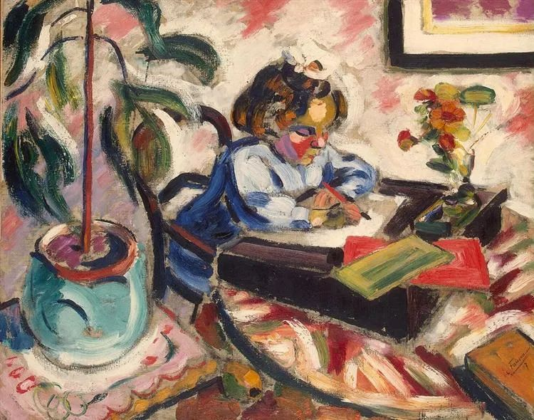

  

Henri Le Fauconnier，Little Schoolgirl

  

连叔，

  

我回县里高考，家里爸妈和奶奶喜欢吃饭时讲别人如何长短，挑别人的刺，我受不了了，回房间关门塞耳机，就连歌曲间隙都听到我爸责备我弟的声音，平常讲话也没有几句人和人之间正常交流的，我常常听到抱怨、责备和消极，我只有靠塞耳机来隔音，一点小事就能让我爸发火，但他们对我又挺将就的，学校里我和同学们一起开开心心，现在回家了脑袋里全是他们说话时的“抑扬顿挫”，快疯了，写不进去题了，昨晚自己吃了泡面，今早去外面吃了早饭，不想再听到那些东西了，但高考这段时间还有好几天要熬，这才不到一天我就受不了了，离我上大学还有两个月，打算高考后到市里找个暑假工，既能赚钱又能远离这个环境。

  

我现在也变得和他们一样，开始挑他们的刺了，我也开始消极了，且我现在能感觉到心里他们的观点和想法我的在心里形成冲撞。连叔我有两个问题想问您，我该如何正确的认识他们对我弟很苛刻老是责备他，对我又将就我这件事，我要怎么摆正自己的位置？我又该怎么抵抗他们的消极声音，不沾染上坏气息？谢谢连叔。

  

小羊苏西

  

* * *

  

小羊苏西：

  

高考马上就要开始了，我建议你一心只有高考，万事不关心。只要高考没有取消，天塌下来也不要管。要把思想与精力聚焦到极短极窄的一段时空，一科考完，无论好坏，就忘掉它，好像没有发生这件事，专注于即将考试的那一科，如此“机械”地度过高考那几天。此时，讨论你的爸妈奶奶与弟弟，完全没有必要，你得把他们当成陌生人，“六亲不认”。

  

高考是你面临的第一次大压力，人在此时，往往敏感、易怒、容易分心，换一组不同的家人给你，你也有可能找到理由焦虑。有人甚至会因为窗外的小鸟唱歌而崩溃。你的家人当然不像小鸟那么无辜，但你要意识到，你现在的情绪，是压力的体现。高考一结束，你的容忍度就会大幅提升，觉得，人嘛，哪有完美的。知道情绪的真实意思，那就不易崩溃，能够控制自己，否则，此时发泄与争吵，家人惊慌失措，你的情绪波动也加剧，只会对你的高考不利。

  

高考难过，包括其中面临的情绪挑战。这难过很有价值，好好经历它。因为人生与自然一样，与宇宙一样，都是由一些自相似模型构成，你经历一次的事，以后将不停重复经历。理解了一次，战胜了一次，就不怕以后的无数次。下次类似高考的压力出现，你对干扰、情绪与应对，就有大致的理解。

  

人在类似高考这种高强度的压力面前，容易逃避。控诉、发火、崩溃、甚至甩锅、碰瓷、找茬，都是逃避的体现，人要给自己找一点理由，给别人找一点过错，那还不容易吗？此时应该回归最本质的动作：只要我按部就班把事情做完，这一切不舒服就会消失。

  

所以，那些人生中应该承受的压力，都得去承受，越逃压力越大。恭喜你承受了高考压力。从此开始改变世界之旅。没错，每个人都在改变世界，你也一样。路径大概是这样的：承受高考的压力，承受大学的压力，承受工作的压力，承受爱情的压力，承受养家的压力，承受事业的压力，承受对社会有所贡献的压力，承受死亡的压力。而每解决一个压力，你获得的尊重就会多一些，给他人的能量就大一些。

  

我估计，你高考完，就能慢慢成为弟弟的小依靠，愿意倾听与理解，慢慢展示成人力量的哥哥（姐姐），为弟弟提供更好的人生模板，就是在帮助他、拯救他。人生的成长就是这样，因为别人做不好，那我来做得好一点，我来提升效率，我来找条新路，我来承受压力。只有这样，孩子才会胜过父母，未来才是美好的。

  

祝你及所有考生高考顺利。

  

连岳

  

推荐：[高收入的方法](http://mp.weixin.qq.com/s?__biz=MjM5NDU0Mjk2MQ==&mid=2651634056&idx=1&sn=46d1214ec14b220702a2116ef3c2a424&chksm=bd7e3d968a09b48077e3f580e68ccfca2244204b71d30f4ed259475e863c2be9a895d6561e97&scene=21#wechat_redirect)  

上文：[善良，淡定，这是真聪明的起点](http://mp.weixin.qq.com/s?__biz=MjM5NDU0Mjk2MQ==&mid=2651643416&idx=1&sn=50be2b8ef590a03d13c00a3d84040000&chksm=bd7e5a068a09d310504439567f155bf0fb1e4b055083ea5685c5d998197fc190f93f9f458afa&scene=21#wechat_redirect)
