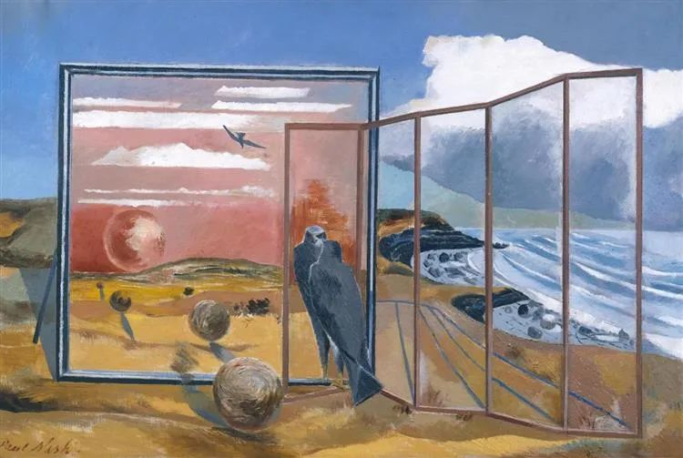
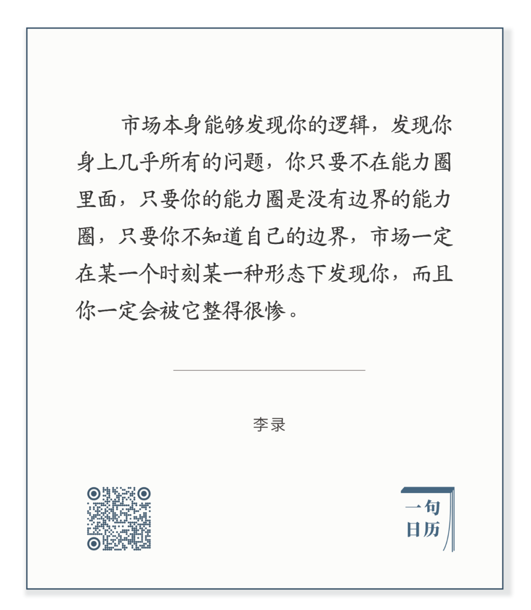

  

Paul Nash，Landscape from a Dream

  

长按二维码可关注  

  

能力圈是巴菲特对投资理论的重要贡献，也是他的看家本领。我觉得，没有投资者比巴菲特更聪明，每个人都有必要知道自己的能力圈。

  

能力圈，分两步走。

  

一是承认自己无知，世界无限，知识无穷，而人的时间有限，以有限应对无限，注定人对大多数问题是无知的。不知道这点，就以为自己无所不知，无所不能，看了一条新闻，听了一条传言，人家怂恿一下，蛊惑一下，你也以为自己能了。在朋友圈当当这种万能人物，没有金钱上的损失（当然，形象可能受损），但在投资上这么玩，风险就太大了。

  

二是人通过聚焦自己的时间精力，可以逐渐形成自己的能力圈，你对某一件事，某一个行业的判断力高过其他人，你脱离了恐惧，你才可以在别人恐惧时贪婪。否则，做自己不懂的事，以期获得超额收益，这就是赌博。输是必然的。

  

能力圈概念，其价值早就超越投资，是对人性的洞悉。有能力圈概念，并实践它，一个人就不会跟风、摇摆、当墙头草，可以远离一切浮躁与骗术。我不知道的不碰，你怎么骗我？我知道的，你又怎么骗得了我？这样安全地滚人生雪球，人品、技能与财富，都会有可观的回报。

  

能力圈的建立与拓展，是长达一生的事业，把自己手头的事做得更好，做到最好，你对这行的理解就高过常人，这既是你的立身之本，又是你的投资指南。有疑惑，不要怕，疑惑是宝藏，用阅读去解疑，寻找新知识，用新知识指引实践，能力圈就慢慢拓展。每过一天，聪明一点，这样的人生，不亦快哉。

  

  

今天是第133期“下周很重要”，制订你下周的计划，每完成一件自己想做的事，自己的能力圈就牢固一些。  

  

推荐：[你太快了！](http://mp.weixin.qq.com/s?__biz=MjM5NDU0Mjk2MQ==&mid=2651638717&idx=1&sn=d8768ef95153c504ad94bfb268b84ee3&chksm=bd7e4fa38a09c6b5d22876141236ae3f363437cd35b41cdfd9dadc2ff6a1d1da00ade9dc0100&scene=21#wechat_redirect)  

上文：[说说股市](http://mp.weixin.qq.com/s?__biz=MjM5NDU0Mjk2MQ==&mid=2651643770&idx=1&sn=bccc48e7831a939fca4b76cd26d3b3af&chksm=bd7e5b648a09d272e8fbbf5954b3da169e3b088166cb618e1986bcbfed8b594df77490de09e8&scene=21#wechat_redirect)
