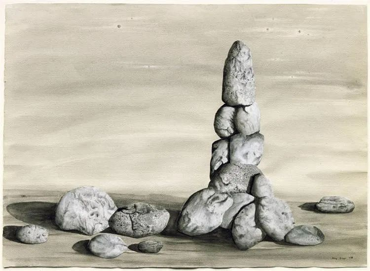

[连岳 | 当你真爱一个人，生命的意义就会慢慢呈现](http://mp.weixin.qq.com/s?__biz=MjM5NDU0Mjk2MQ==&mid=2651642780&idx=2&sn=ea14ca3f8ceeb84add553bbbfa301f4f&chksm=bd7e5f828a09d694ff0864711df23cf5932657d8719badc60acfa179180dd5f2958f8f6db737&scene=21#wechat_redirect)  

Kay Sage，Constant Variation

  

按进化论思维，是好的，也是应该具有的思维方式。

  

讲到对感情与婚姻不忠，有人会说，这是基因决定的。这是走了一半的进化论思维，他使用了对自己有利的一面。

  

确实，基因将驱使一个人尽可能多地繁殖，所以一个人更多地寻找性伴侣，这种冲动确实是基因决定的。但在现实生活中，一个人为寻花问柳而抛家弃子，我们不会赞扬他为基因英雄，而是默默地在内心降低他的信誉，将其列入不可信任者名单，避免和他有过多来往。这种评价体系，是不反基因的？

  

其实，人的很多行为，是反基因的。

  

基因驱使你不停储存能量，吃成一个胖子，但你却会节食，ADF，把自己变瘦。

  

基因让你能不消耗就不消耗，你睡懒觉是合乎基因的，但你却会早起阅读与锻炼。

  

基因鼓励你及时满足，但你知道延迟满足能力才能成就自己。

  

基因本应让你像低等动物一样为交配与繁殖发狂，但你却有高等动物特有的优雅与爱情，克制与忠诚——至少，你想这么做。

  

人这种动物了不起的地方在于，他不只靠基因进化，他还有知识的进化。基因的进化，速度很慢，随机出现的变异，有利于基因的传承，它就保留下来。指望基因把我们的听力进化得非常灵敏，隔着几百公里也能交流，那不懂要等几亿年，甚至永远等不到，但知识的进化就容易了，知识少的时代，人们点烽火，现在知识多一点，用智能手机。

  

知识进化，导致知识无穷增长。理查德·道金斯称之为meme，人们每提出一个猜想，如果它提供了更好的解释，它就会迅速普及到其他人，好像基因大量繁殖。制造智能手机的知识就是对通讯的更好解释，于是智能手机就普及了。

  

meme，这个概念能够解释很多所谓的反基因行为。

  

爱情与婚姻，与之相伴的信任与依恋，克制与忠诚，就是meme，它也是知识进化的一种，最终大多数人发现它是最好的情感模式。

  

人们追求长寿，基因却无这个兴趣，完成繁殖功能后，人就没用了，最好死掉。可是meme认为，时间越长，人积累的知识越多，人能提供更多猜想，长寿极有价值。

  

再比如阅读，在基因看来，这根本不需要，还伤眼睛，伤颈椎，浪费可以用来繁殖的时间。meme却知道，这是人最重要的能力，阅读力也像钢琴考级一样，能力是一级级艰苦训练得来的，没有捷径可走，这苦头值得吃，因为知识的进化能力，是更高级的进化，是人生的大乐趣。  

  

完整的进化论思维是这样的：我知道基因会驱使我做什么，有时该听它的，如果它让我做伤害自己或他人的事，那就该听meme的，以知识进化出来的自律与规范要求自己。基因让我胖，我能瘦，基因让我懒，我能勤，基因让我背叛，我能忠诚。  

  

基因完成低等任务，meme完成高等任务。如果只听基因的，那就是低等动物。

  

推荐：[当你真爱一个人，生命的意义就会慢慢呈现](http://mp.weixin.qq.com/s?__biz=MjM5NDU0Mjk2MQ==&mid=2651642780&idx=2&sn=ea14ca3f8ceeb84add553bbbfa301f4f&chksm=bd7e5f828a09d694ff0864711df23cf5932657d8719badc60acfa179180dd5f2958f8f6db737&scene=21#wechat_redirect)  

上文：[说说“美方要求中方关闭驻休斯顿总领馆”](http://mp.weixin.qq.com/s?__biz=MjM5NDU0Mjk2MQ==&mid=2651644723&idx=1&sn=7e9b28db787f59e0dd9fb6a18632b981&chksm=bd7e672d8a09ee3b0648667ac8c6f6a27cd669d433800b6dc3ef168529d01ecbb81b277c99e6&scene=21#wechat_redirect)
