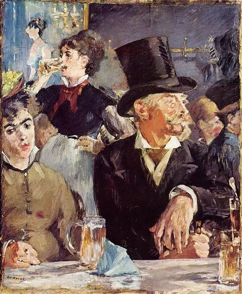

  

Edouard Manet，At the Cafe-Concert

  

富不过三代，这是规律性的总结，说明传承之难。阶层没有固化，因为下滑总是很容易的。

  

当然，准确一点说，应该是“富很难过三代”，也有极少数人能够做好传承。很多富一代身上具有可贵的品质与才能，可惜传承更多属于教育，是另一个领域的事。

  

多年前，看完《洛克菲勒自传》后，我随手给这本书打了分数，100分，完美。他白手起家的创业故事固然生动，主要分数却是给他的45篇教子通信，那是最出色的家书，演绎了如何将自己的一生所得传授给孩子的信心、耐心与技巧。事实证明，他做得很成功。

  

人有两种进化。一是基因的进化，这点速度慢，主观上可做的事极少，甚至下一代的资质可能不如上一代。二是知识的进化，这个速度极快，你提出一个好猜想，它能更好的解释疑问，它就会胜出。你获得一个好观念，你整个人就会重组一次。

  

在知识上无法进化，既不会吸纳好知识，也无法传递好知识，衰败就是必然的。洛克菲勒说，进入商界后，我更切实地感受到了读书的重要性。他16岁开始工作，受的教育并不多，后来能够写出真诚、生动、逻辑严密的自传，与他爱读书有关系。

  

一个不爱读书，不善读书的人，没有知识进化能力，成功是不可能的，即使他是富二代，也很快会败光财富。一个人品质与才能有缺陷，财富必然从这些缺陷中逃逸。所以，富很难过三代。

  

我的感想和洛克菲勒相同，从事商业活动后，我更爱读书了。每天都有问题，不靠读书进化的话，三年后的日子都会难过。读书后去做事，做完事再读书，在这双轮驱动下，人类的知识都是你的资源，再无匮乏之虞。把这本事教给孩子，他继承的，不仅仅是你的精神资产，而是全人类的精神资产。

  

今天推荐了《洛克菲勒自传》，我最爱的四大美国企业家传记，就集齐了，它们各有特色：

  

福特自传，他是通过产品改变世界的思想家；

  

沃尔顿自传，他是充满激情，不停提升效率，后发先至的典型；

  

卡内基自传，他是参透财富本质，全部回馈给社会的圣人；

  

而洛克菲勒自传，他是传承思想给孩子的教育家。

  

有这四大传记护身，路好走得多。

  

集齐四本书，就是这样一件小事，其实也不容易，花了很多人力与时间。得比较出最好的版本，有些得委托出版社加印，有些得自己大量采购，又牵扯到仓储客服，一堆事。其实也挣不了多少钱。不过，得牢记洛克菲勒的教诲：既然选择做好一件事，那就尽力而为，不给自己留下后悔的余地。
