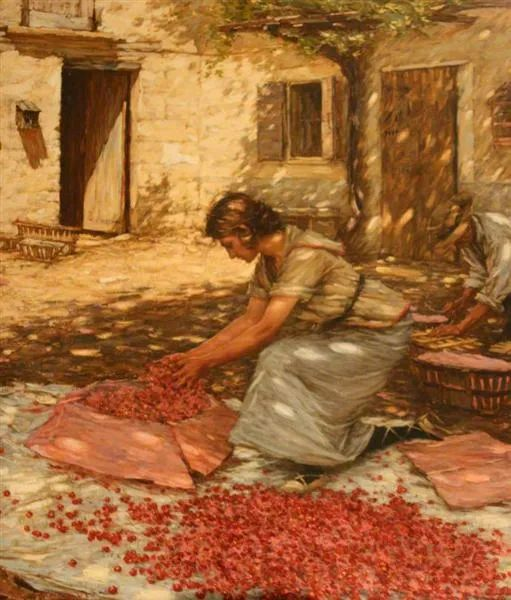
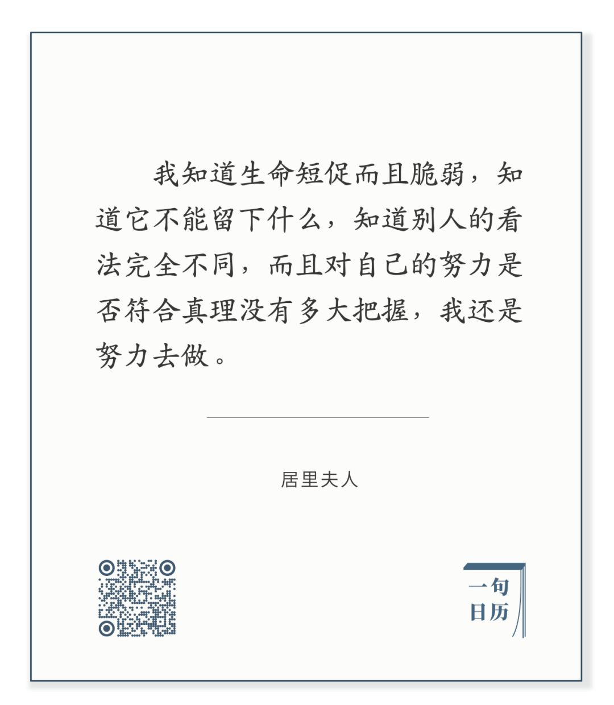

  

Henry Herbert La Thangue，Packing Cherries

  

  

 长按二维码可关注

  

人生最好的规划，我觉得分两步：

  

一是先照顾好自己爱的人。这基本等同于你的家人。这事当然有难度，做好不容易。不过，这不就是爱吗？有爱的人，生生世世，不从来如此吗？

  

爱需要及时回应，别拖延，别开空头支票，更不能克扣他们的时间与金钱，去取悦不相关的人，或者进行所谓的投资。你要想到，陌生人的赞扬像风一样易逝，而投资，也极可能失败。如果我爱的人，所得更多是承担我的失败后果，想起来不心碎，那怎么是人？

  

第一步做好了，接下来去实现自己的才华与梦想，这要花很长时间才有结果，甚至花光一生时间，也没有结果。所有的事情，终究为概率所控制，最后可能一无所获，两手空空，但是，努力去做过，也就没有遗憾了，努力本身就是一种美，就像花未必能变成果实，可是我们也喜欢花。

  
生而为花，努力绽放就是了。其他的，交给蜜蜂，交给蝴蝶。

  

今天是第134期“下周很重要”，写下你的绽放计划。

  

推荐：[当你真爱一个人，生命的意义就会慢慢呈现](http://mp.weixin.qq.com/s?__biz=MjM5NDU0Mjk2MQ==&mid=2651642780&idx=2&sn=ea14ca3f8ceeb84add553bbbfa301f4f&chksm=bd7e5f828a09d694ff0864711df23cf5932657d8719badc60acfa179180dd5f2958f8f6db737&scene=21#wechat_redirect)  

上文：[说说“特朗普政府正在考虑全面禁止中共党员及其家人前往美国”](http://mp.weixin.qq.com/s?__biz=MjM5NDU0Mjk2MQ==&mid=2651644295&idx=1&sn=78308fa6dc5f0b76a4a7dbe58ea4d057&chksm=bd7e65998a09ec8f722ed3bddfedb167db002d0c1ed417595605c1be6cf121b0e57a7a96cad0&scene=21#wechat_redirect)
