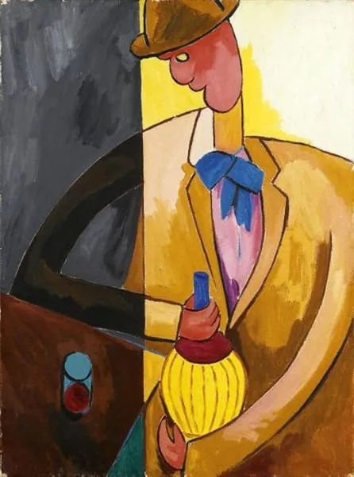
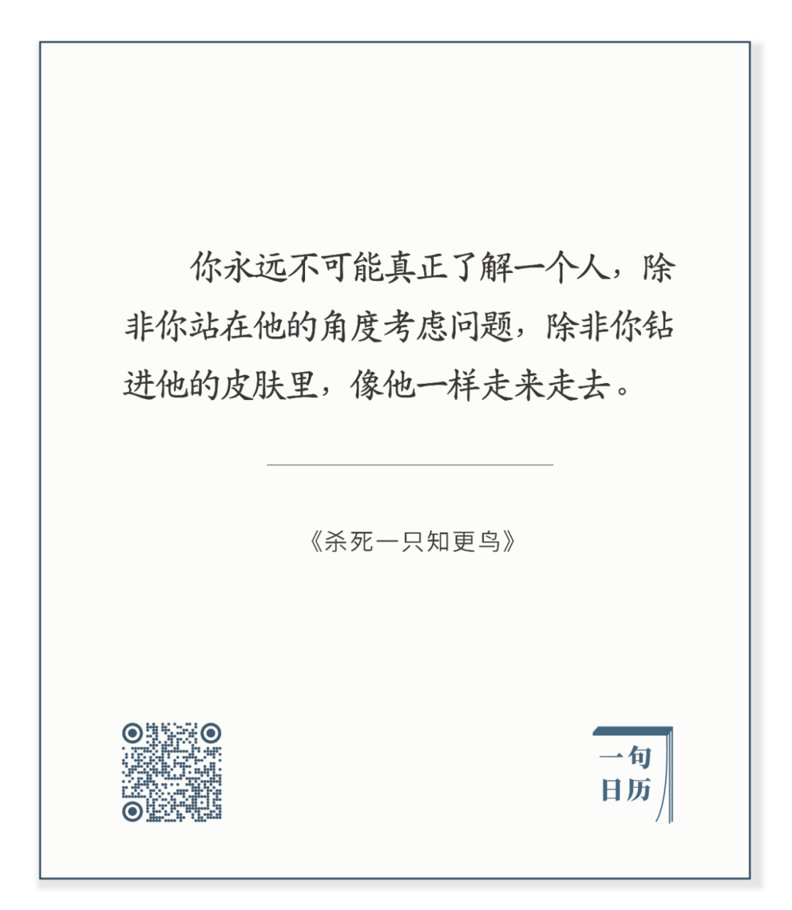

  

  

Alberto Magnelli，The Drunk Man

  

长按二维码可关注

  

说实话，就是钻进他人的皮肤里，走来走去，也未必能够真的认识一个人。

  

我们天生就在自己的皮肤里，一刻也没有钻出来过，但是，我们真的认识自己吗？

  

如果我们对自己的认识是错的，那钻进他人的皮肤里走来走去，能够认识他吗？只能对他形成错误的认识。

  

认识你自己。这是人一生的任务。这是人类永恒的任务。它一直在进行。只要想到我们令自己何等的困惑，我们给自己带来了多少麻烦，就可以推断出，认识他人是很难的事。  

  

这不是要走到无助的不可知论，而是要告诉自己，人很容易犯错。凡事谨慎一点，淡定一点，多观察，多听意见。这或许无法在第一时间表现自己的聪明与正义，可这并不是什么损失。你真是聪明的、正义的，你不急，也不会变得愚笨而非正义。反而是那些急急忙忙的人，聪明与正义很容易流失。  

  

《杀死一只知更鸟》告诉我们，理解一件事很难，理解不同族群很难，理解正义也很难，不是一天的事，不是打一架的事，不是诅咒宣泄情绪的事，它是隐忍，它是等候，它是让更多事实呈现。  

  

虽然很难，也不可能马上得到答案，有些难题，一代人，几代人也无法解答。但是只要守住善良，人就不会放纵自己，不至于因为自己的无知而伤害他人。就像人可以轻易杀死一只知更鸟，知更鸟永远没有反抗的本事。但善良的人绝不会做这种事，一只唱歌的、对你无害的知更鸟，杀了它，你会难受，所以，你会克制。  

  

一个善良的人，又愿意钻进他人的皮肤里，理解他人。这样的人，即使只是一个孩子，只是一个默默无闻的人，也能无障碍地认识自己，认识他人。  

  

今天是第132期“下周很重要”，订下计划，一点点实现，增加自己的定力。

  

推荐：[当你真爱一个人，生命的意义就会慢慢呈现](http://mp.weixin.qq.com/s?__biz=MjM5NDU0Mjk2MQ==&mid=2651642780&idx=2&sn=ea14ca3f8ceeb84add553bbbfa301f4f&chksm=bd7e5f828a09d694ff0864711df23cf5932657d8719badc60acfa179180dd5f2958f8f6db737&scene=21#wechat_redirect)  

上文：[硬扛](http://mp.weixin.qq.com/s?__biz=MjM5NDU0Mjk2MQ==&mid=2651643360&idx=1&sn=476eed1a94a99f50fea187530ee5831a&chksm=bd7e59fe8a09d0e89d24249338042cd4961718622d82625a985c404da47d1bf0f01ef20b10db&scene=21#wechat_redirect)
