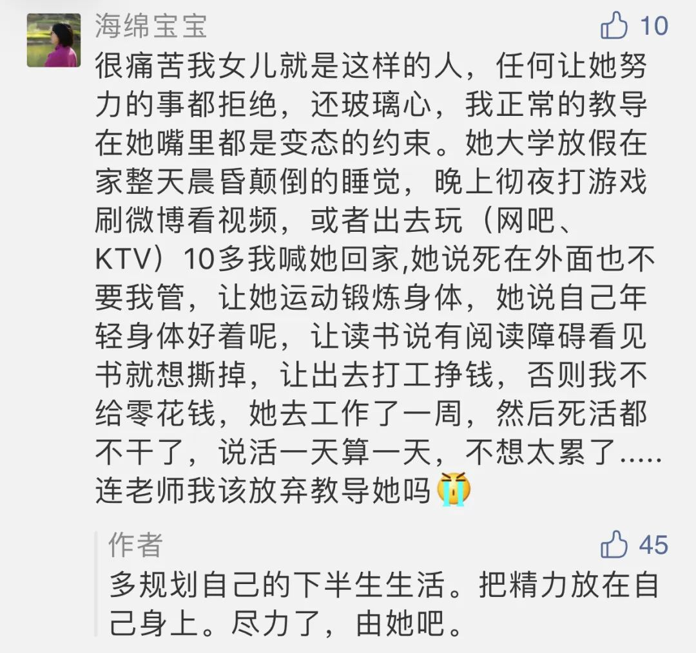

  

Gustave Loiseau，Mist Effect

  

这是一位家长的苦恼：

  

  

孩子在大学期间，尤其是毕业临近时，两代人的关系会面临一次考验。

  

此时，相看两厌。

  

在孩子眼里，父母不过普通人，成就不大，地位不高，给不了我好工作，给不了钱（父母给的生活费，他们一般不视为钱），只会唠叨些老套的道理，一听就烦躁。而辩论起来，孩子在大学，学过各种新理论新词语，抬杠耍赖的本事也更纯熟，父母基本不是对手。说又说不过，打又打不赢，这是父母纯吃瘪的阶段。

  

而父母眼里的孩子，不过是生活无法自理的家伙，更加担心他的前途。担心了，就更唠叨，唠叨得越多，吃瘪越多。难以抑制内心的悲凉：20来年的教育投入，就换来这么一个不成器的孩子？

  

此时的应对，分几步：

  

一、 不要慌张，以为孩子完蛋了。他们这往往是最后一次叛逆大爆发，眼还太高，手还太低，心里害怕，又不好意思承认，脾气就会变差。该说的说，天理人情，公序良俗，就是那么几句话，说了心里才有种子，时机合适就会萌芽。但话不过三，尤其是对方没有听的愿望时，更要适可而止。沟通也讲边际效应，说得过多，效果变差。

  

二、 展示决心，设置断供点。福利养懒人，大到国家，小到家庭，都适用。过度的福利，只会养出废人。父母要知道，孩子大学毕业后的10年，是成长的黄金窗口，一晃眼窗口就关了，以后再补课，难度大太多。但是那个年纪的孩子却不急迫，年轻人体内的生物钟快，觉得时间又长又多。只有外在的“强制”发生时，他才能真正成长。大学毕业，或研究生毕业，不能再迟了，设个断供点，从此自己养活自己，这样有工作任务的强制，有同事竞争的强制，有老板批评的强制。再后来，有培养孩子，照顾家庭的强制。一二十年之后，他突然发现，当初父母养自己不容易，成为一个尽责的人，已经是不小的成就。

  

三、规划自己的下半生。对孩子过度焦虑，那往往是自身缺乏价值感，只有孩子极度出色，人上人，才能满足自己。在断供点之后放手，让孩子承受的命运，挫折、疑问、痛苦，不能替劳，只有亲身体验，才有真成长。你更专注于自己的事业、爱好、甚至是爱情，你不会有失落感。此时，该完成的责任基本完成，你的人生才过一半，除了没办法再生一个孩子，什么事再来一遍时间都足够，刚好放飞自我。

  

在成长过程中，无论是对孩子，还是对自己，成器的标准应该务实一点。能成为杰出人物，万众瞩目，当然好。但是，一个人自食其力，受人尊重，就是成器了。在一个和平的、上升的时空，比如现在的中国，这不难，遵守公序良俗即可，不外乎礼貌，干净，诚信，敬业，都是普通人做得到的事。  

  

推荐：[这就是生活](http://mp.weixin.qq.com/s?__biz=MjM5NDU0Mjk2MQ==&mid=2651629733&idx=1&sn=6c271087bacf3b02cb816972827127fa&chksm=bd7e2cbb8a09a5ad4c1f4fd7026c19fc2b160affccd5ac4d0189f9f04cb6aa6eade68c2345b1&scene=21#wechat_redirect)  

上文：[为什么富不过三代？](http://mp.weixin.qq.com/s?__biz=MjM5NDU0Mjk2MQ==&mid=2651644604&idx=1&sn=f659528e839367b7f81a68904278cf0d&chksm=bd7e66a28a09efb4d3402d9ed4c598002ad267b9f97d444e420bf1c99659d8d0ba4058084a94&scene=21#wechat_redirect)
