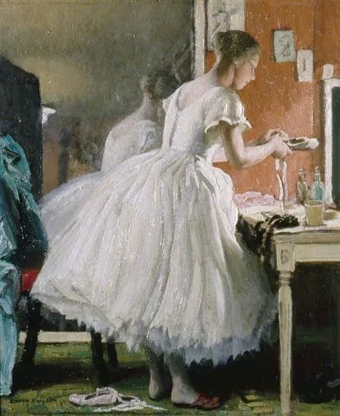

  

Laura Knight，The Ballet Shoe

  

杭州杀妻案后，有人表示对再婚恐惧，对婚姻恐惧。

  

这毫无必要。案件虽然惊悚，但它对婚姻其实没有指导意义。因为它就是一个小概率事件，就像被雷劈中一样。我们知道总有不幸的家伙被雷劈中，但是下雨打雷的天气，若以为自己一定会被雷劈，那也心理不太健康。被这种“可能的意外”吓破胆，不表示一个人有风险意识，而是太脆弱，会给周边的人带来无尽的麻烦，他太容易传播恐惧、压力与悲观。别人怎么安慰他，他总找得到小概率事件吓自己，吓大家，他就是一个黑洞，吸走一切能量，搞得人人沮丧。

  

卡尔·波普尔说过，保持乐观是我们的责任。乐观虽然有天性的成分，但更多是知识素养，你对世界的了解深刻到一定程度，你必然是乐观的。未来会有问题，还有一些我们想象不到的问题，但未来更会有办法，更有一些我们想象不到的办法。

  

20年前，人们怎么敢想大城市基本可以解决抢劫与盗窃问题？由于技术进步，这种人类社会的千年难题竟然基本消失了。20年前，杭州杀妻案这种凶手，可能就逍遥法外了，还可以装成好人活在人群中，说不定，又娶了一个妻子。现在，公共场合无处不在的摄像头，证明受害人没有离开过所住小区，破案有了明确的方向。现在比以前安全得多，未来又会比现在更安全，坏人越来越难伪装自己。

  

婚姻很美好。每个人想想自己，都是有这种毛病那种毛病的普通人，而竟然有人愿意陪伴自己一生，这不是很奇妙吗？不是证明世界对自己特别好吗？保有这份感激之心，你就能接受婚姻生活的艰难，一切美好都得要付出艰难的代价。美好的人生，无论你是单身，是婚姻，是再次婚姻，都离不开艰难。正像维持健康身体是艰难的，运动是艰难的，考上好大学是艰难的。得到任何高级一点的美好，都有艰难的过程。只想要美好的结果，不愿意付出代价，那他什么状态都恐惧，恐惧婚姻，也恐惧单身，恐惧生，更恐惧死。

  

保持乐观，不恐惧问题，你就更能解决问题。婚姻是对一个人好，真正的好，体现为完成一连串任务，温饱任务，安居任务，保持健康任务，人生实现任务。未来是现在选择的后果，问题出现一个，就解决一个，不逃避，不恐惧，你的未来一定更好。  

  

推荐：[卵巢彩票一代人的成长模版](http://mp.weixin.qq.com/s?__biz=MjM5NDU0Mjk2MQ==&mid=2651644723&idx=2&sn=ab8b7c236b663f775a6d01a4e7041ca1&chksm=bd7e672d8a09ee3b233c0000efaa65d651c2a6be0e283dee46b527fc9cf5eeca341b1fd9305b&scene=21#wechat_redirect)  

上文：[说说杭州杀妻案](http://mp.weixin.qq.com/s?__biz=MjM5NDU0Mjk2MQ==&mid=2651644984&idx=1&sn=987332e8f1935fbb0b1ae2448f0abcb9&chksm=bd7e60268a09e930650b699477768831d659e97c0dcbde19a66d4b0a70efd5d513b5722df7f7&scene=21#wechat_redirect)
