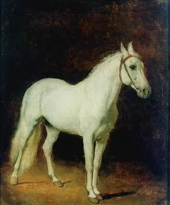

  

Alexander Ivanov，White horse

  

有人问，如果大学毕业生暂时找不到工作，我是否支持其当骑手？

  

我的答案是肯定的。只要工作符合两个特点，我都支持，一是为他人创造价值，二是无损自己声誉。比如当小偷，就不符合这两个特点。

  

有人不同意，说，如果只是当骑手，为什么要读大学？读完小学就行了。这意思很明显，大学毕业生，是无论如何也不能当骑手的，一定得等到理想中的工作。这种想法可能很普遍，所以在经济有压力，理想的工作减少时，很多大学毕业生一筹莫展，只能宅在家里苦等机会，这种状态，不为他人创造价值，也有损自己的声誉。

  

试想一下，你是雇主，手中有个理想的工作机会，面对两个应聘者，他们其他条件相当，只有一个区别，一个是之前宅在家里让父母供养，另一个是当骑手自食其力。愿意当骑手的这个，优势明显。

  

一个人接受过合格的大学教育，体现为几个更强：一是学习能力更强，当你的工作与人生需要学习新知识时（这是经常发生的），你能从ABC开始变成专家；二是意志力更强，危机发生时，你更有韧性；三是功能更强，更有普适性，你能做的事情更多。

  

经济有危机时，小学文化程度的人都有工作养活自己时，大学生却束手无策哀叹，这大学教育就不算合格，你不是更强了，是更弱了，连小学毕业生都竞争不过。

  

大学文化程度与小学文化程度，在工作上，体现为前者可以降维打击，前者可以做后者的活，后者却做不了前者的活。大学毕业生可以一边当骑手，一边物色更能发挥自己优势的工作，如果只有小学文化程度，那就没有更大的上升空间了。当需要你降维打击时，你不会，限制了自己的力量，不是很奇怪吗？

  

曾有人说，作家最好的兼职是出租车司机，可以得到很多一手素材丰富自己的写作。但是出租车司机却很难利用职业素材成为作家。有降维打击的思维，你能量越强，本事越大，你越懂得尊重所谓的“低端”工作。中国太多作家水平低，思维僵化，就是因为被养得太好了，我看，他们都去当一当网约车司机，可能病还有治。

  

很多基础的、无门槛的工作，简单，但却有大学问，只要能够提升效率，创新方法，前途无量。山姆·沃尔顿就是很好的例子，大学毕业后，自己心爱的姑娘只喜欢小镇，他就在只有几千人的小镇开杂货铺维生。逆城市化，毫无新意的平庸工作，也是小学文化程度就可以做的，似乎没有一点前途，但沃尔顿充满激情地提升效率，就把杂货铺变成全球最大的企业之一。

  

读完大学，还没办法自食其力，那是耻辱，有这个耻感，你就不会只想着当公务员，或在写字楼吹冷气，择业的面宽很多。读完大学，要知道世上现有的工作，都有提升的空间，你找到方法，完成小提升，你是出色的工作者，完成大提升，你能颠覆一个行业，开创自己的事业。

  

什么都能做，什么都能做好，这才是读完大学该有的样子。

  

推荐：[在小镇为心爱的姑娘征服全世界](http://mp.weixin.qq.com/s?__biz=MjM5NDU0Mjk2MQ==&mid=2651639127&idx=2&sn=8a7aed5911f2cad9c5784c53e7e3a23f&chksm=bd7e49498a09c05fb606b199263103513307270512521c37f4f23b8fde96495567f426687021&scene=21#wechat_redirect)  

上文：[疫情中左右为难的留学生，人修正错误的两大障碍](http://mp.weixin.qq.com/s?__biz=MjM5NDU0Mjk2MQ==&mid=2651644106&idx=1&sn=c4bf227d5a7b3121889106acf83a4ea5&chksm=bd7e64d48a09edc2c3a62a93083ab496835a642f66d1febbeba979e66d819d4caf0966891c22&scene=21#wechat_redirect)
