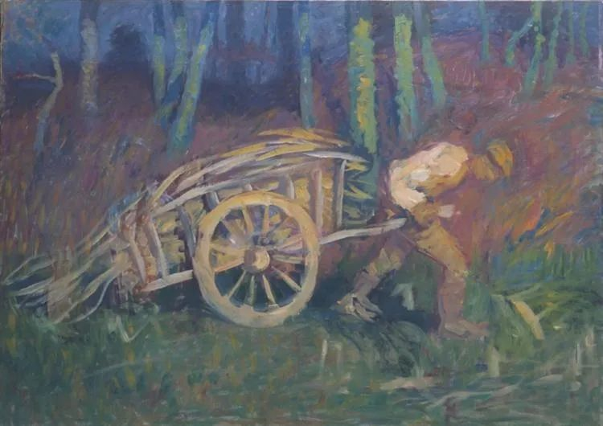

  

Ivan Grohar，The man with the cart

  

连叔您好，

  

关注您快一年了，每天阅读你的文章，我觉得您是一个很有智慧，很可靠的人。现在我遇到一个纠结很久的难题，想听听您的意见。

  

我和男朋友在一起10个月的时候，我意外发现了他是离过婚而且有一个6岁大的儿子，我很崩溃，我找他对质，他坦白了，说不敢告诉我，因为害怕失去我。最终我选择了原谅并且继续和他在一起。

  

和他继续在一起的原因一方面他是我的初恋，而且擅长音乐，是一名歌手(不出名，经常接一些小商演)，我本人又很喜欢唱歌，所以志趣相投。另一方面我们性格很搭，相处在一起很开心融洽。还有就是他工作很上进。

  

但是我又很纠结，担心未来的我会过的不好。我纠结的原因，一方面我俩经济条件都一般，而且我很介意他有个孩子：他大我9岁，我25他34，没房，存款不到10万，工作不稳定，婚后还要抚养他的儿子，肯定会影响我的生活质量，而且我根本不会当后妈，也不想当后妈，虽然他承诺我孩子由他爸妈抚养，不跟我们住在一起，但是我担心以后他父母生个病或者年龄大了，孩子最后还是要跟我们住在一起。另一方面不知道他离婚的真正原因是什么，害怕他对我还有隐瞒什么。最后一方面：我父母和亲人肯定不会同意我和他在一起，我不敢把他离过婚还有个小孩的事实告诉他们。

  

令我最纠结痛苦的还是因为他有一个小孩，我现在每天都处在幸福和纠结的挣扎状态。一方面设想我们结婚好好过日子，一方面又想离开他开始新的生活 (但是我舍不得，除去他儿子原因，我们相处很融洽)。

  

连叔请您帮帮我，我真的好痛苦，我到底该怎么办？

  

泪告白

  

* * *

  

泪告白：

  

你有个优点，就是在恋爱中会考虑一些现实的问题，他有没有钱，他有没有房，他是否有婚史。才25岁，又喜欢艺术，这样的姑娘，往往不具备这样的能力，一听到对方唱歌好听就嫁了，这样的婚姻就是撞大运，多数情况是惨淡收场。

  

当然，我并不是说没钱没房有婚史的人就不能嫁，人在年轻时，没钱没房也正常。人有这样那样的不足，所以才需要谈恋爱，有时间足够长的亲密接触，他无法隐瞒自己的综合能力，尤其你知道他的不足后，这时候得出的判断才足够理性。

  

决定和一个人结婚，是预估他的未来，他的性格、能力、责任感能否保证他给我，给孩子和家庭足够的、稳固的、长久的爱。答案是能，那现在没钱没房，将来会有钱有房。财富与地位，不过是一个人性格与能力的外化，该有时，一定会有。

  

一个人的性格与能力让人产生足够的信任感，那么，你可能就不会担心他的缺点。一个单亲爸爸，如果他能把自己的孩子照顾好，那体现的是青涩男人没有的成熟魅力，不再是劣势。一个人照顾好自己的家人，是自己最好的人品证明。

  

来说说你这个34岁的男朋友。

  

和他处了10个月，你不知道他有个6岁的儿子。这个年纪的孩子，很依恋父亲，你和他处10天，就必然知道，他不会隐瞒，也隐瞒不了，生活中到处有儿子的印记，天天要和儿子通话，至少周末要陪儿子玩。他能瞒10个月，如果不是意外，可能瞒到和你结婚以后。

  

你这个小女朋友不想当后妈，他的解决方案很干脆，我把儿子交给父母就是了，你不用操心他，他不会影响我们的婚姻。你似乎动了心，如果他的父母能够一直照顾他的儿子，是不是也是好办法呢？

  

你这个笨蛋，醒醒吧。他的解决方案不刚好证明他是一个连儿子都可以抛弃的人渣吗？

  

他抛弃儿子，他父母为他收拾烂摊子，嫁给他，你的结局好不到哪里。

  

祝开心。

  

连岳

  

推荐：[既温柔恭顺，又冷硬决断](http://mp.weixin.qq.com/s?__biz=MjM5NDU0Mjk2MQ==&mid=2651635237&idx=1&sn=9880c7645f4fd5ea5ec478b6718c00a4&chksm=bd7e3a3b8a09b32dd76d37592f0ebcc24990d8f6ac70e27e0c1af9d092149d600b7894495887&scene=21#wechat_redirect)  

上文：[请记住那些对你好的人](http://mp.weixin.qq.com/s?__biz=MjM5NDU0Mjk2MQ==&mid=2651644885&idx=1&sn=c61909d847a433bb0929f36be7caf0df&chksm=bd7e67cb8a09eedd4fc543804dbb901518e5e14b330438f9046fff7556687a4bb364d45c4e9c&scene=21#wechat_redirect)
