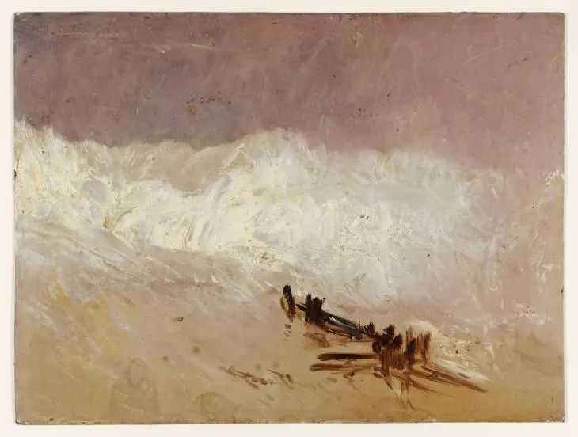

J.M.W. Turner，Waves and Breakwater

  

昨天有个读大二的孩子说，他想专升本，要报个20000多元的辅导班，而家里只靠父亲一人的收入支撑，还有弟弟在读书，钱很紧，不同意出这个钱，于是他和父母吵了一架。  

  

正在求学的小朋友，容易犯一个错误，以为资源是无限的。无论一个人想得到什么，都得付出成本，这成本就得耗费资源。资源最主要的体现方式就是钱。想象一下，如果一个人有无限多的钱，除了不能战胜死亡，做不到的事情少之又少，只有专科文凭也没有关系，大把花钱的话，什么文凭都有。

  

遗憾的是，人的钱都是有限的。马云马化腾的钱也是有限的。工薪阶层的钱，更是得算计着花。算计的原则就是钱要花得最重要的地方。

  

一个家庭，最重要的事情是什么？是生存。先满足基本的生活保障，不仅要考虑今天的生存，还有明天的，退休后的。钱到手就随便花光，甚至负债过日子，这都是不负责任的生活，家庭的风险大，没有未来。一个孩子明白家庭的生存高于自己的教育，这孩子就真的长大了。花20000元报个辅导班，代价是父母弟弟的生活出现危机。这种想法，根本就不可能出现，更别说去和父母吵了。

  

孩子可能会觉得委屈，吵架也蕴含了深层的指责：为什么我的家这么穷？为什么父母赚钱的能力这么差？别人家，随便能给20000元。其实，这也是在犯“无限资源”的错误，觉得自己只要有“更好的父母”，难题就迎刃而解，越想越生气。但是人一出生，父母就无法更改，接受这个有限性，怨气就少。接受不可改变之事，痛苦就少了一大半。孩子要接受不够强的父母，父母也得接受不够强的孩子。不然的话，孩子嫌父母拿不出20000元，父母嫌孩子考不上北大清华，双方都难受。

  

中国人非常重视教育，这是中国最大的竞争力。但一定要避免在教育上孤注一掷，不惜代价，这种赌博式的念头一起来，别说2万元，就是有2百万存款的家底，也能掏空。教育消费，无上限，2百万，在纽约伦敦东京，能花多久？世上很多大学，抓住中国人这个特点，以盈利为目的，钱交够了，给你一张文凭，你是不是有真本事，让雇主去判断吧。

  

没有真本事，漂亮的文凭也帮不了自己，一做事就露馅，工作都保不住。此时有了文凭这个面子，“低端”的活又不愿意做。消耗一个家庭的资源，换来一个绣花枕头，教育不仅无法完成进化与跃升的任务，反而成为退步与衰败的原因。

  

教育不能忘了孔夫子最重要的发现：因材施教。在资源投入之前，先得评估他是一块什么材料。材质太差，孔夫子也没办法，也会感叹：烂泥扶不上墙。

  

因材施教，也说明每个人的成长路径不同，认识自己，走适合自己的路，这才能发挥自己最大的潜力。现在是专科生，那建议你看看生活中那些专科文凭以下的、成功富足的人，他们的路对你更有启示。这不是说你不可以专升本，而是说，你的眼界会打开，知道幸福的路有万千条，别只盯着文凭。  

  

（另外，近来有读者反映有人在雪球App恶意冒名注册“连岳”，诱使用户交易。希望该平台早日处理。诸位不要上当。我没在任何财经类平台注册。）  

  

推荐：[贩卖焦虑的人那么多，你更不要过分焦虑](http://mp.weixin.qq.com/s?__biz=MjM5NDU0Mjk2MQ==&mid=2651630207&idx=1&sn=5c00609d36ef842da979beb363d44649&chksm=bd7e2e618a09a777afcbd73968e5097bd65ad62d87832a99b914fea54a778f7bed01e8c0d748&scene=21#wechat_redirect)  

上文：[谈谈填志愿，如何为工作做准备？](http://mp.weixin.qq.com/s?__biz=MjM5NDU0Mjk2MQ==&mid=2651643945&idx=1&sn=8768097794aaa4a3b7ed4fdf11bdfa08&chksm=bd7e64378a09ed213263e11b82370e0462112bc838ad0f95995b0642d92eff5f972882daffc4&scene=21#wechat_redirect)
